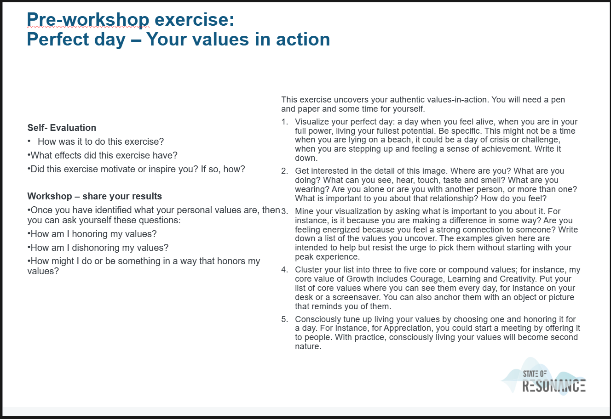

# [J P MORGAN WORKSHOP on 23-4-2024]

If you're looking for guidance on how to approach self-evaluation, motivation, inspiration, and living in alignment with your values. There's a breakdown of each aspect in Key-terms.

By integrating these elements into your life, you can foster personal growth, deepen your sense of purpose, and create a more fulfilling and authentic existence.

## Key-terms

1. **Self-Evaluation**: This involves reflecting on your strengths, weaknesses, accomplishments, and areas for growth. It's about assessing where you currently stand in various aspects of your life, such as personal development, career, relationships, etc. Self-evaluation helps you understand yourself better and identify areas where you can improve.

2. **Motivation**: Motivation can come from various sources, including personal goals, passion, purpose, and external encouragement. To stay motivated, it's important to set clear and achievable goals, break them down into smaller tasks, celebrate your progress, and remind yourself why you started in the first place. Additionally, surrounding yourself with supportive people and creating a positive environment can help sustain motivation.

3. **Inspiration**: Inspiration often stems from observing others' achievements, witnessing acts of kindness or bravery, connecting with nature, or engaging in creative activities. To cultivate inspiration, expose yourself to diverse experiences, seek out new perspectives, read books or watch movies that resonate with you, and spend time doing things that energize and uplift you.

4. **Honoring Values**: Your values are the guiding principles that shape your behavior and decisions. Honoring your values involves living in accordance with what matters most to you, even when faced with challenges or temptations to compromise. Regularly reflecting on your values, setting boundaries that align with them, and making choices that uphold them can help you lead a more meaningful and fulfilling life.

5. **Authentic Values-in-Action**: This concept emphasizes the importance of not only knowing your values but also actively demonstrating them through your actions. It's about walking the talk and embodying your values in your everyday interactions and decisions. Authenticity fosters trust, strengthens relationships, and enhances personal integrity.

6. **Core Values**: Core values are fundamental beliefs that are central to your identity and guide your behavior. They serve as a compass, helping you navigate life's complexities and make choices that align with your principles. Identifying your core values and prioritizing them can bring clarity and direction to your life.

7. **Resonance**: Resonance refers to a deep sense of connection or harmony with something or someone. It's when you feel aligned, understood, or deeply moved by an experience, idea, or relationship. Cultivating resonance involves being present, open, and authentic in your interactions, allowing yourself to connect on a deeper level with the world around you.

## Assignment

### Used sources

[Plaats hier de bronnen die je hebt gebruikt.]

### Encountered problems

[Geef een korte beschrijving van de problemen waar je tegenaan bent gelopen met je gevonden oplossing.]

# <u>Result</u>

This exercise uncovers your authentic values-in-action. You will need a pen and paper and some time for yourself. 

- **1]** Visualize your perfect day: a day when you feel alive, when you are in your full power, living your fullest potential. Be specific. This might not be a time when you are lying on a beach, it could be a day of crisis or challenge, when you are stepping up and feeling a sense of achievement. Write it down.
  
  - My perfect day would be when everyone is save and free from death , disease , pain , sadness , hate,  spiritual and physical imperfection , poverty , unrighteousness.
    
    IMAGINE how much potential we could use to really build eachother up and no longer use our potentials to kill destroy , hate or ruin eachother. Wouldn't the sky become a closer limit?
  
    

- **2]** Get interested in the detail of this image. Where are you? What are you doing? What can you see, hear, touch, taste and smell? What are you wearing? Are you alone or are you with another person, or more than one? What is important to you about that relationship? How do you feel? 
  
  - I am in Paradise or maybe even Heaven. I am learning , working , loving , caring , building , respecting.
  
  - I am wearing white clothes , completely clean and I am with millions of good people with the same mindset and motivation to honor this mindset.
  
  - It is important that everyone strifes to uphold  love , peace and righteousness in this relationship. 
  
  - I feel free , constructive , loved and loving .

- **3]** Mine your visualization by asking what is important to you about it. For instance, is it because you are making a difference in some way? Are you feeling energized because you feel a strong connection to someone? Write down a list of the values you uncover. The examples given here are intended to help but resist the urge to pick them without starting with your peak experience.
  
  - The importance is that the ruler of this all is an inifnite God. God is far beyond everyones cumulative power and imagination. He is a ruler with inifite characteristics , Like inifinite power , infinite wisdom , infinite existence , infiinit love.
     My love for him humbles me . Even knowing we will never ever understand or match him ; we are convinced there is no better one to follow, honor and worship.
  
  - Just knowing his existence , his name,  and have a human idea of the amount of power, love and righteousness he has ; allready gives us hope and beleive that everything will be all right.
  
  - List of values:
    
    Righteousness
    
    Power
    
    Love
    
    Truth
    
    Wisdom
    
    Infinity
    
    
    
    

- **4]** Cluster your list into three to five core or compound values; for instance, my core value of Growth includes Courage, Learning and Creativity. Put your list of core values where you can see them every day, for instance on your desk or a screensaver. You can also anchor them with an object or picture that reminds you of them. 

- **5]** Consciously tune up living your values by choosing one and honoring it for a day. For instance, for Appreciation, you could start a meeting by offering it to people. With practice, consciously living your values will become second nature.

**Self- Evaluation**

- How was it to do this exercise?

- What effects did this exercise have?

- Did this exercise motivate or inspire you? If so, how?

**Workshop – share your results**

- Once you have identified what your personal values are, then you can ask yourself these questions:
  
  - How am I honoring my values?
  
  - How am I dishonoring my values?
  
  - How might I do or be something in a way that honors my values