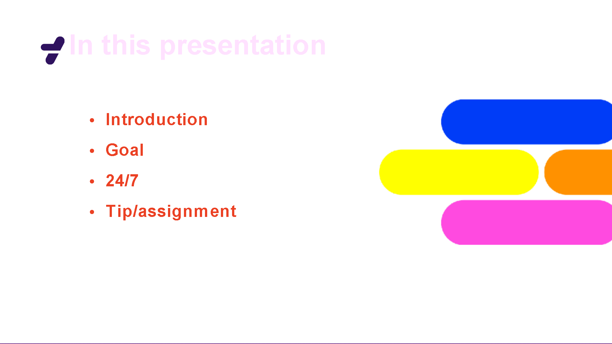
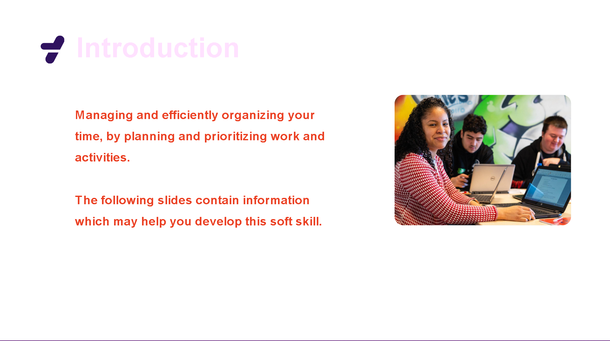
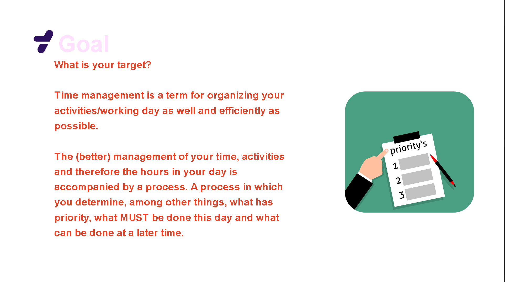
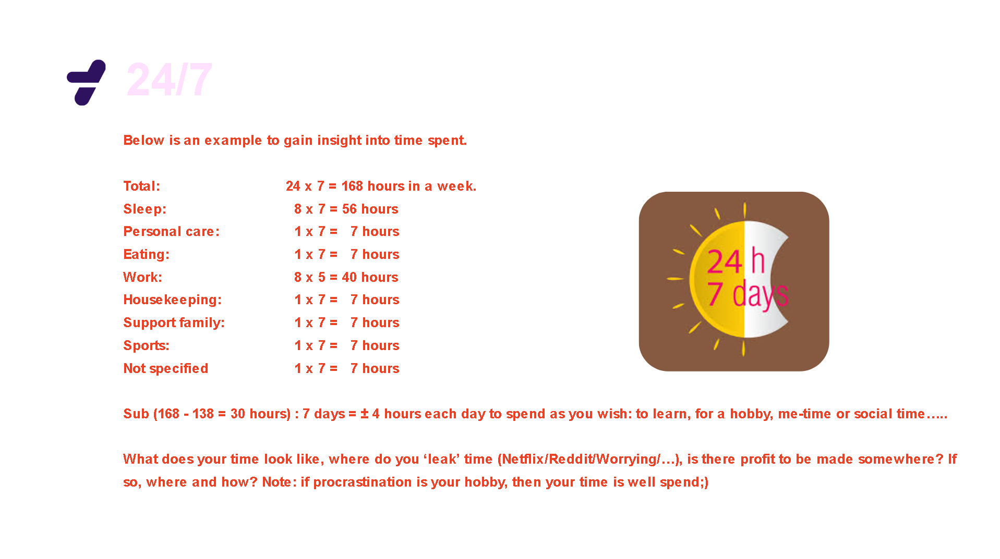
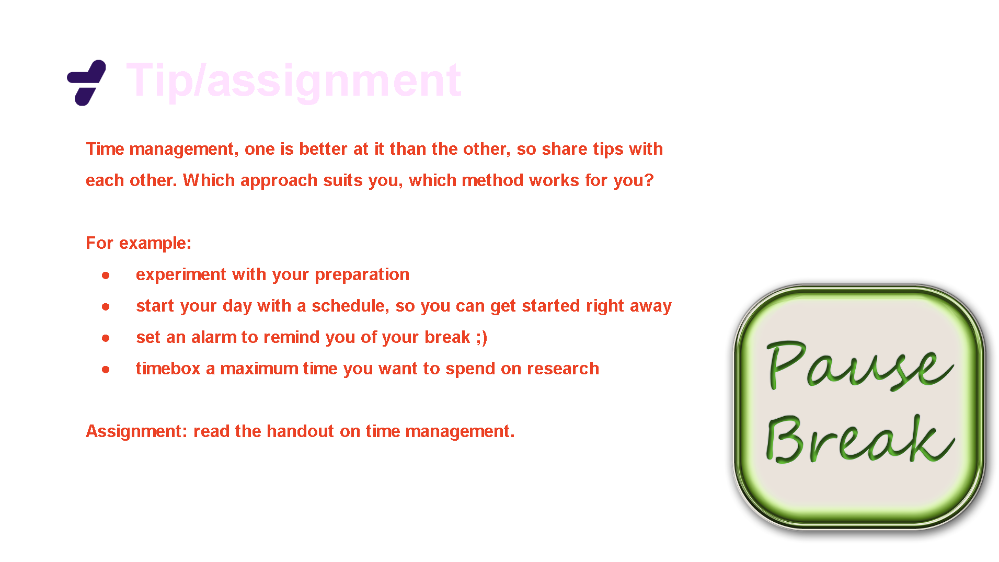
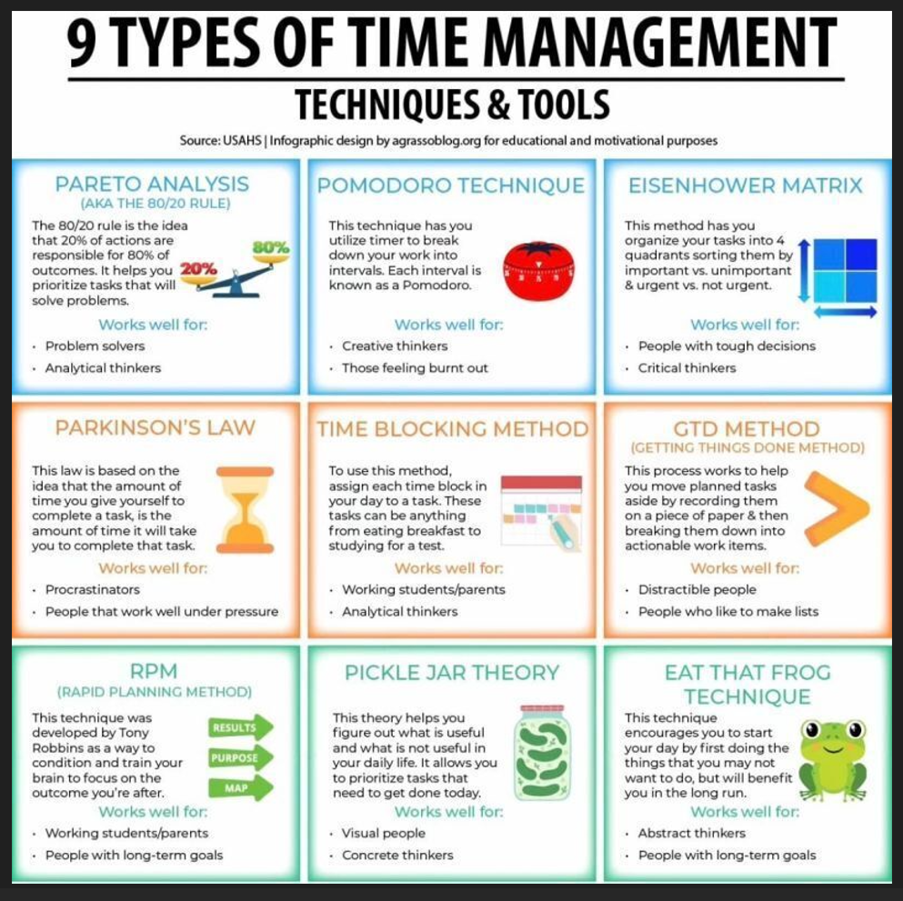

# [Soft Skills - Time Management]

Source :[Kopie van Micro_Presentatie_Time management - Google Presentaties](https://docs.google.com/presentation/d/1FOAO2bCH9mxC6T4WwZipjVRz_befRF_EM8jTbc5XjzY/edit#slide=id.g20f8b58b2c7_0_0)

Time management provides overview, productivity, quality and helps you
achieve your goals. In this handout we give you the essentials to perfect your
time management and take your career to the next level.

# Contents:

• What is time management?

• Why is time management such an important skill?

• Advantages of smart time management.

• How does one become better in time management?

• Pitfalls concerning time management.

• Questions on time management.

# What is time management?

Managing your attention, dealing with time effectively and efficiently. With
time management you set concrete and achievable goals, have a workable
schedule and create overview. A nice trait in work and life which prevents
you from bad habits and procrastination.

# Why is time management such an important skill?

If your attention is not fragmented, you work full focus on one task. This
results in higher quality!! If you perform your tasks one-by-one (in a logical
order), you use time more effectively. The time you gain can be used for
your self-development which brings you further into your career.
If you have a clear overview you can make smart choices. Knowing when to
say ‘yes’ to a project but too little time also means saying ‘no’. Time
management also creates peace and space in your head, allowing you to
work in a relaxed way.
If you do not have an overview it often leads to a rushed feeling and poor
concentration, which has negative consequences for your work.
Advantages of time management.
Realise your ambition. Effective leaders waste no time, have the right focus
and get things done. Maximum achievement in little time, clear picture of
when you are working on something for what reason.
An important part of time management is making the right choices.
Have the overview to set priorities and say “no” when necessary which leads
to less stress and more time.
If you do time management well, you will preform better. You will have
more time left to spend with your loved ones in addition to your ambitious
career.

# How does one become better in time management?

1) Set goals that are achievable and measurable. Use the SMART method
   when setting goals. In essence, make sure the goals are Specific,
   Measurable, Attainable, Relevant and Timely.

2) Prioritise tasks based on importance. Look at your daily tasks and
   determine which are important and urgent. Do tasks the right way:
   • Important but not urgent, decide when to do these tasks.
   • Urgent but not important, delegate these tasks if possible.
   • Not urgent and not important, set these aside to do later.

3) Setting time constraints for completing taks helps you be more
   focused and efficient. Making the small extra effort to decide on how much
   time you need to allot for tasks can help you to recognise potential problems
   before they arise. That way you can make plans for dealing with them.

4) When doing a lot of tasks without a break, it is harder to stay focused
   and motivated. Allow some downtime between tasks to clear your head and
   refresh yourself. Consider going for a short walk or meditate.

5) Utilise your calendar for more long-term time management. Write
   down the deadlines for a project or for tasks which are part of the project.
   Think about which days might be best to dedicate to specific tasks.

6) It is important to remove excess activities or tasks. Determine what is
   significant and what deserves your time. Removing non-essential tasks frees
   up more of your time to spent on genuinely important things.

7) Make sure you start the day with a clear idea what needs to be done.
   Consider making it a habit to, at the end of the day, go ahead and write out
   your ‘to-do’ list for the next workday. That way you can hit the ground
   running the next morning.
   
   # Pitfalls concerning time management.
   
   • Failing to keep a to-do list.
   • Not setting personal goals.
   • Not prioritising.
   • Failing to manage distractions.
   • Procrastination.
   • Taking on too much.
   • Thriving on “busy”.
   • Multitasking.
   • Not taking breaks.
   • Ineffectively scheduling tasks.
   
   # Questions on time management
1. How do you prioritise tasks?

2. How do you limit distractions?

3. How do you manage deadlines?

4. How do you balance work and personal life?

5. How do you manage stress at work?

------------------------------------------------------------------------------------------------------------------

Source: [Kopie van Micro_Presentatie_Time management - Google Presentaties](https://docs.google.com/presentation/d/1FOAO2bCH9mxC6T4WwZipjVRz_befRF_EM8jTbc5XjzY/edit#slide=id.g20f8b58b2c7_0_0)

--------------------------------------------------------------------------------

## Key-terms

- **Time Management**: The process of organizing and planning how to divide your time between specific activities to accomplish tasks effectively and efficiently.

- **Pareto Analysis (Pareto Principle)**: Also known as the 80/20 rule, it states that roughly 80% of the effects come from 20% of the causes. In practical terms, it suggests focusing efforts on the most significant factors that yield the greatest results.

- **Pomodoro Technique**: A time management method developed by Francesco Cirillo that involves breaking work into intervals, traditionally 25 minutes in length, separated by short breaks. This technique aims to improve focus and productivity by working in short bursts with regular breaks.

- **Eisenhower Matrix**: A decision-making framework that helps prioritize tasks by categorizing them based on their urgency and importance. It consists of four quadrants: tasks that are urgent and important, important but not urgent, urgent but not important, and neither urgent nor important.

- **Parkinson's Law**: The adage that work expands to fill the time available for its completion. It suggests that if you allocate more time for a task than necessary, it will often take longer to complete.

- **Time Blocking Method**: A time management technique that involves dividing your day into blocks of time dedicated to specific tasks or activities. It helps minimize distractions and ensures focused work on priority tasks.

- **GTD Method (Getting Things Done)**: A productivity methodology developed by David Allen, which emphasizes capturing all tasks and ideas into an external system, organizing them, and regularly reviewing and prioritizing them to achieve a clear mind and effective task management.

- **RPM (Results, Purpose, Massive Action)**: A time management system created by Tony Robbins, focusing on clarifying goals, understanding their purpose, and taking massive action to achieve them.

- **Pickle Jar Theory**: An analogy suggesting that one should prioritize tasks based on their significance, akin to filling a jar with large rocks (important tasks) first, then smaller pebbles (less important tasks), and finally sand (minor tasks) to fill any remaining space.

- **Eat That Frog Technique**: Coined by Brian Tracy, it's based on the idea of tackling the most challenging or unpleasant task (the "frog") first in the day, as completing it early can increase productivity and reduce procrastination.

## Assignment

### Used sources

- https://docs.google.com/presentation/d/1FOAO2bCH9mxC6T4WwZipjVRz_befRF_EM8jTbc5XjzY/edit#slide=id.g20f8b58b2c7_0_0

- https://drive.google.com/drive/folders/1z55cDHaRlhgYSSM2qTdBtrLN-GsZIpSS

- 

### Encountered problems

[Geef een korte beschrijving van de problemen waar je tegenaan bent gelopen met je gevonden oplossing.]

### Result

Questions on time management

1.How do you prioritise tasks?

a/ Most CRITICAL task  
b/ Most Urgent task  
c/ Most awkward and blocking task  
d/ Most valuable knowledge and experience providing task  
e/ Most Fun task2. 

2.How do you limit distractions?  
a/ set a timer to focus on work as long as the timer is not going off  
b/ TURN OFF all notifications on my phone and computer  
c/ Have a TIDY workspace  
d/ Take good care of my health and basic needs. 

3.How do you manage deadlines?  
a/ Agendize them with multiple alerts  
b/

4.How do you balance work and personal life?  
a/ setting a timer on work and take breaks  
b/ not ONLY wanting a 100% , perfect result

5.How do you manage stress at work?  
a/  talk about my stress with my fellow employees  
b/ communicate  with the team  , about what the team thinks that needs to be done first  
c/ set goals and priorities together with the team/employees (edited)