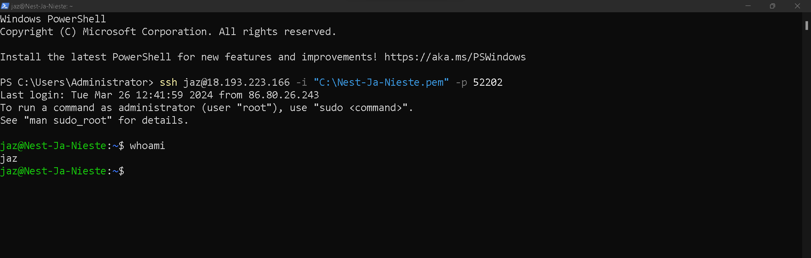

# [3- Setting Up]

During this course we will run a Linux distribution called Ubuntu. In the background there is a VM running on AWS. Within that VM we have created a container for every student. This container acts like a clean instance of Ubuntu. There is no GUI installed, so you will have to use the CLI.

The VM is Located in Frankfurt, so you will need to create a remote connection to your machine. Remote connections to a Linux machine are usually done using the Secure Shell (SSH) protocol.

## Key-terms

- Ubuntu

- AWS

- VM

- CLI

- (no) GUI

- SSH Protocol (Secure Shell)

## Opdracht

Exercise:

- Make an SSH-connection to your virtual machine. SSH requires the key file to have specific permissions, so you might need to change those.
- When the connection is successful, type whoami in the terminal. This command should show your username.

### Gebruikte bronnen

[Plaats hier de bronnen die je hebt gebruikt.]

### Ervaren problemen

[Geef een korte beschrijving van de problemen waar je tegenaan bent gelopen met je gevonden oplossing.]

### Resultaat

Exercise:

- Make an SSH-connection to your virtual machine. SSH requires the key file to have specific permissions, so you might need to change those.

- When the connection is successful, type whoami in the terminal. This command should show your username.
  
  
