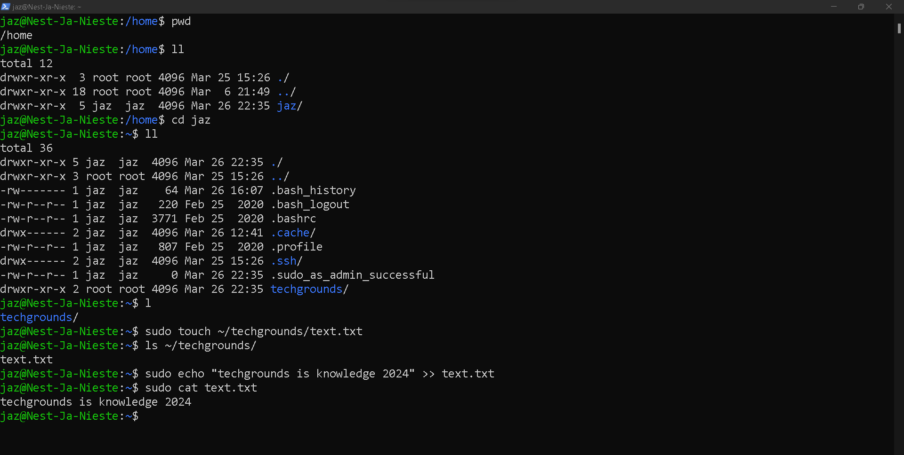

# [4- Files & Directories]

Linux uses files and folders, like you’re used to with any OS you’ve used. Folders in Linux are called directories, so use that word when looking for commands or information.

Whenever you open a terminal, you’ll start working from your home directory. From there you can move to any directory in the entire system using just a couple of commands.

The Linux filesystem starts at the root directory, represented by a slash (/). All files and directories in Linux are represented by their path, starting from root.

The tilde (~) is used as an alias for your home directory.

## Key-terms

[Schrijf hier een lijst met belangrijke termen met eventueel een korte uitleg.]

## Opdracht

Exercise:

- Find out your current working directory.
- Make a listing of all files and directories in your home directory.
- Within your home directory, create a new directory named ‘techgrounds’.
- Within the techgrounds directory, create a file containing some text.
- Move around your directory tree using both absolute and relative paths.

### Gebruikte bronnen

[How to Create a Folder in Ubuntu Command Line](https://learnubuntu.com/create-folder/)

[How to Delete (Directories) Folders in Ubuntu Command Line](https://learnubuntu.com/delete-folders/)

### Ervaren problemen

[Geef een korte beschrijving van de problemen waar je tegenaan bent gelopen met je gevonden oplossing.]

### Resultaat

Exercise:

- Find out your current working directory.
- Make a listing of all files and directories in your home directory.
- Within your home directory, create a new directory named ‘techgrounds’.
- Within the techgrounds directory, create a file containing some text.
- Move around your directory tree using both absolute and relative paths.

Result of these exercises:

