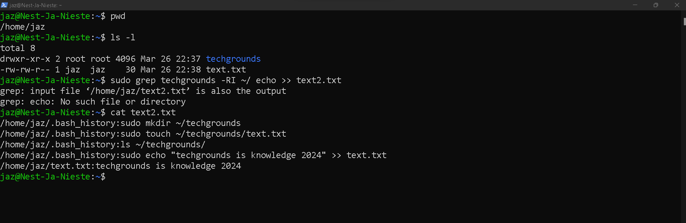
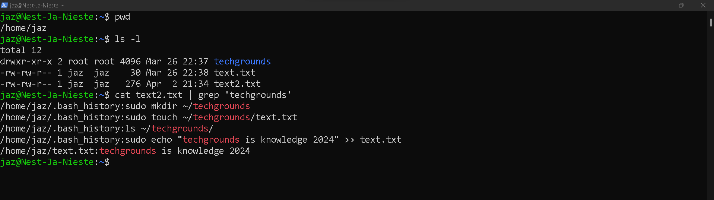
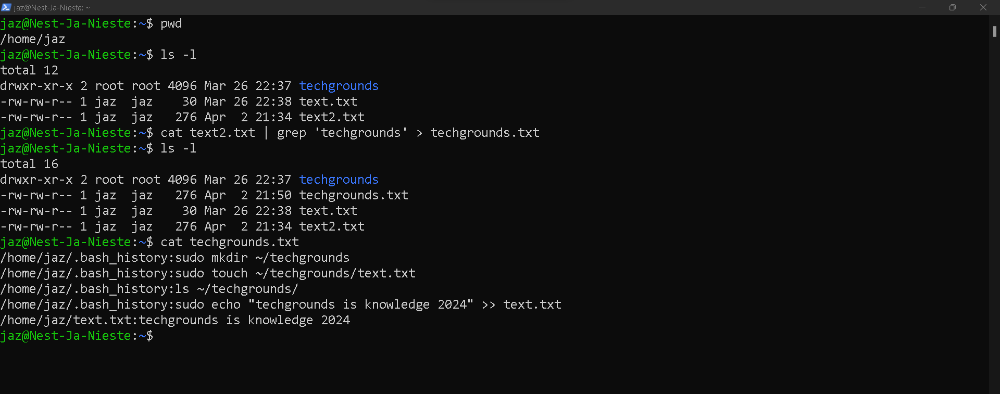

# [5- Working with text (CLI)]

Every command in Linux has a standard input and output.

The standard input (stdin) is the keyboard. If I run ‘mkdir myfolder’, the mkdir command will know what folder to create, because I typed ‘myfolder’ using my keyboard.

The standard output (stdout) is the terminal. The command ‘echo hello’ will write ‘hello’ in the terminal.

Both the input and output can be redirected to a file instead of the default. This is called input redirection and output redirection.

A pipe can be used to have the output of one command be the input of another command.

## Key-terms

- grep 
  
  In Ubuntu (and other Unix-like operating systems), `grep` is a command-line utility for searching plain-text data sets for lines that match a regular expression pattern. It stands for "Global Regular Expression Print". `grep` searches for the pattern in each line of a file and prints the lines that contain it.
  
  
  
  Here's the basic syntax of `grep`:
  
  `grep [options] pattern [file...]`
  
  - `[options]`: Optional parameters to modify `grep`'s behavior.
  - `pattern`: The regular expression pattern to search for.
  - `[file...]`: Optional file(s) to search in. If not provided, `grep` reads from standard input (e.g., piped output from other commands).
  
  For example, to search for the word "example" in a file named `file.txt`, you would use:
  
  `grep 'example' file.txt`
  
  `grep` is a powerful tool for text processing and is widely used in command-line environments for various tasks like filtering logs, searching for specific content in files, and more.

## Opdracht

Exercise:

- Use the echo command and output redirection to write a new sentence into your text file using the command line. The new sentence should contain the word ‘techgrounds’.
- Use a command to write the contents of your text file to the terminal. Make use of a command to filter the output so that only the sentence containing ‘techgrounds’ appears.
- Read your text file with the command used in the second step, once again filtering for the word ‘techgrounds’. This time, redirect the output to a new file called ‘techgrounds.txt’.

### Gebruikte bronnen

- https://www.youtube.com/watch?v=iSKncMygQDs 
  How to use grep command to find a file in Linux | Linux in a Minute
  
  `grep -RI Techgrounds ~/`  ( does a recursive search in HOME folder for the word Techgrounds in non binary files )

- [linux - How to redirect output to a file and stdout - Stack Overflow](https://stackoverflow.com/questions/418896/how-to-redirect-output-to-a-file-and-stdout)

### Ervaren problemen

[Geef een korte beschrijving van de problemen waar je tegenaan bent gelopen met je gevonden oplossing.]

### Resultaat

Exercise:

- Use the echo command and output redirection to write a new sentence into your text file using the command line. The new sentence should contain the word ‘techgrounds’.
  
  

- Use a command to write the contents of your text file to the terminal. Make use of a command to filter the output so that only the sentence containing ‘techgrounds’ appears.
  
  
  
  

- Read your text file with the command used in the second step, once again filtering for the word ‘techgrounds’. This time, redirect the output to a new file called ‘techgrounds.txt’.
  
  
