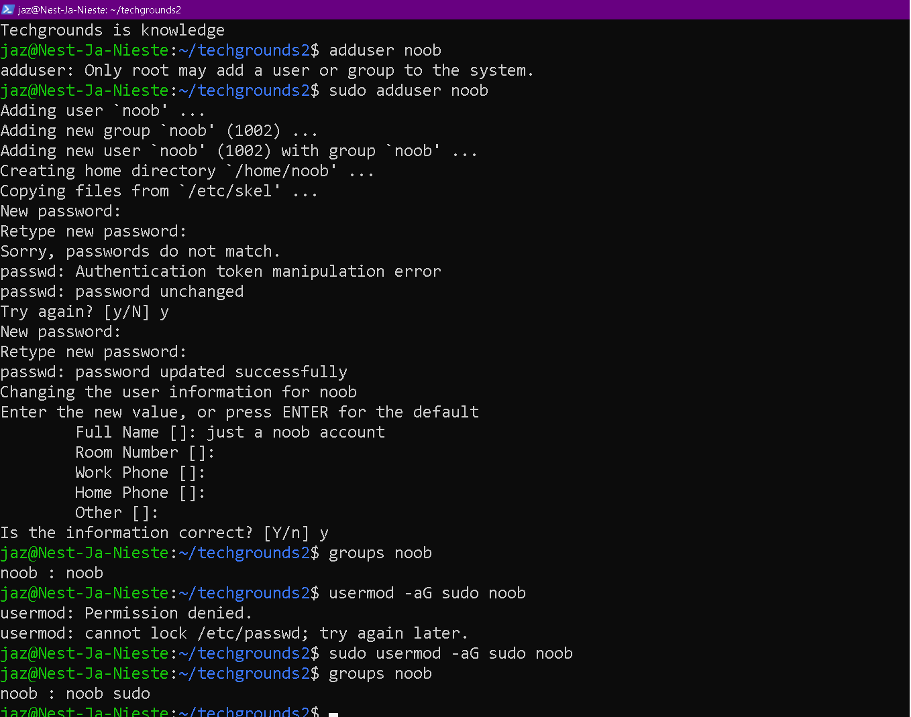

# [6- Users & Groups]

[Geef een korte beschrijving van het onderwerp]

## Key-terms


- ```
  ls -l /path/to/file
  ```

- ```
  stat /path/to/file
  ```

- ```
  stat -c "%U %G" /path/to/file
  ```

## Opdracht

 Exercise:

- Create a new user in your VM.
  
  - The new user should be part of an admin group.
  
  - The new user should have a password.
  
  - The new user should be able to use ‘sudo’

- Locate the files that store users, passwords, and groups. Find your newly created user’s data in there.

### Gebruikte bronnen

https://www.redhat.com/sysadmin/manage-permissions

https://askubuntu.com/questions/175054/how-to-find-owner-and-group-of-a-directory

### Ervaren problemen

[Geef een korte beschrijving van de problemen waar je tegenaan bent gelopen met je gevonden oplossing.]

### Resultaat



[Omschrijf hoe je weet dat je opdracht gelukt is (gebruik screenshots waar nodig).]
