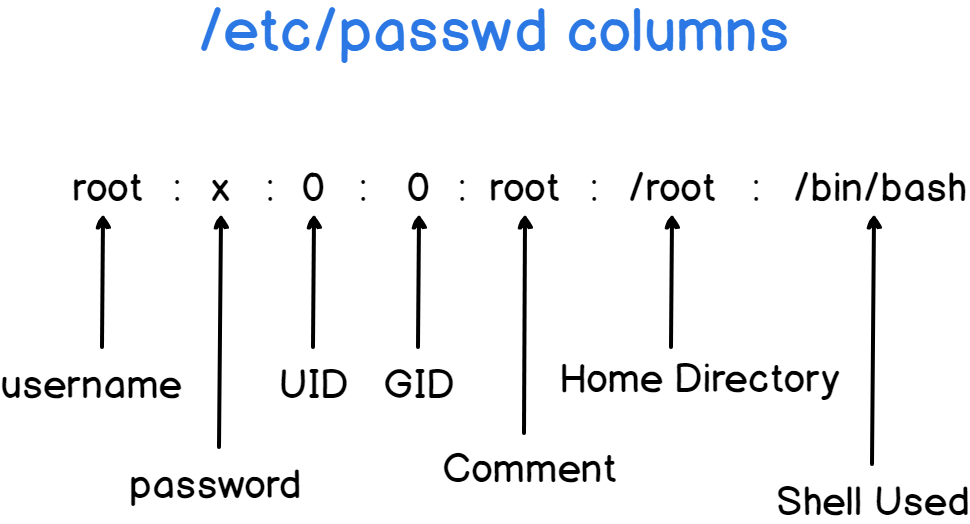
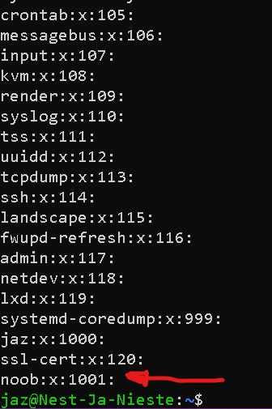

# [6\ Users & Groups]

Linux has users, similar to accounts on Windows and MacOS. Every user has their own home directory. Users can also be part of groups.

There is a special user called ‘root’. Root is allowed to do anything.

To gain temporary root permissions, you can type ‘sudo’ in front of a command, but that only works if you’re allowed to do that.

Some actions require specific permissions like root permissions.

Users, passwords, and groups are all stored in different files across the system.

## Key-terms

- etc/passwd



- ```
  ls -l /path/to/file
  ```

- ```
  stat /path/to/file
  ```

- ```
  stat -c "%U %G" /path/to/file
  ```

## Opdracht

 Exercise:

- Create a new user in your VM.
  
  - The new user should be part of an admin group.
  
  - The new user should have a password.
  
  - The new user should be able to use ‘sudo’

- Locate the files that store users, passwords, and groups. Find your newly created user’s data in there.

### Gebruikte bronnen

https://www.redhat.com/sysadmin/manage-permissions

https://askubuntu.com/questions/175054/how-to-find-owner-and-group-of-a-directory

### Ervaren problemen

[Geef een korte beschrijving van de problemen waar je tegenaan bent gelopen met je gevonden oplossing.]

### Resultaat

Exercise:

- Create a new user in your VM.
  
  - The new user should be part of an admin group.
    
    `sudo adduser newusername` (noob)
  
  - The new user should have a password.
    
    `sudo passwd newusername` (noob)
  
  - The new user should be able to use ‘sudo’
    
    `sudo usermod -aG sudo newusername` (noob)
    
    

- Locate the files that store users, passwords, and groups. Find your newly created user’s data in there.

In Ubuntu, user account information, including usernames, passwords (encrypted), and group memberships, is typically stored in several system files located in the `/etc` directory. Here are the main files relevant to user accounts:

1. `/etc/passwd`: This file contains basic information about each user account, such as username, user ID (UID), group ID (GID), home directory, and shell.

2. `/etc/shadow`: This file contains encrypted passwords and password-related information for user accounts.

3. `/etc/group`: This file contains information about groups, including group name, group ID (GID), and a list of usernames that belong to each group.
   
   
