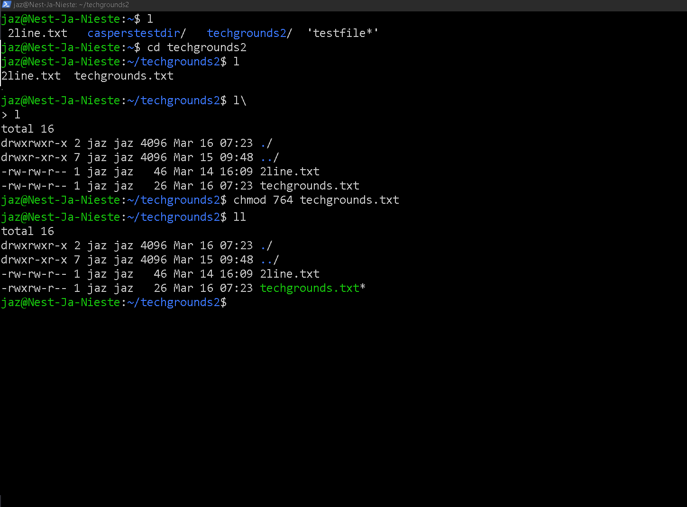

# [7- File Permissions]

[Geef een korte beschrijving van het onderwerp]

## Key-terms

[Schrijf hier een lijst met belangrijke termen met eventueel een korte uitleg.]

## Opdracht

Exercise:

- Create a text file.

- Make a long listing to view the file’s permissions. Who is the file’s owner and group? What kind of permissions does the file have?

- Make the file executable by adding the execute permission (x).

- Remove the read and write permissions (rw) from the file for the group and everyone else, but not for the owner. Can you still read it?

- Change the owner of the file to a different user. If everything went well, you shouldn’t be able to read the file unless you assume root privileges with ‘sudo’.

- Change the group ownership of the file to a different group.

### Gebruikte bronnen

[command line - How do file permissions work? - Ask Ubuntu](https://askubuntu.com/questions/83/how-do-file-permissions-work)
[system - Where are passwords saved? - Ask Ubuntu

[linux - How do I change the group ownership of a file in Ubuntu? - Stack Overflow](https://stackoverflow.com/questions/21865940/how-do-i-change-the-group-ownership-of-a-file-in-ubuntu)]
https://stackoverflow.com/questions/21865940/how-do-i-change-the-group-ownership-of-a-file-in-ubuntu

### Ervaren problemen

### Resultaat

