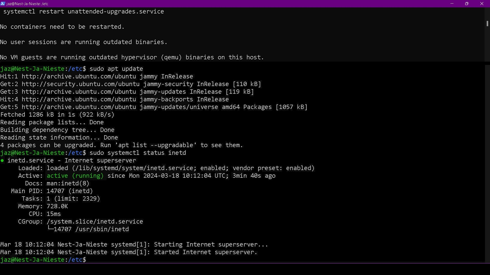
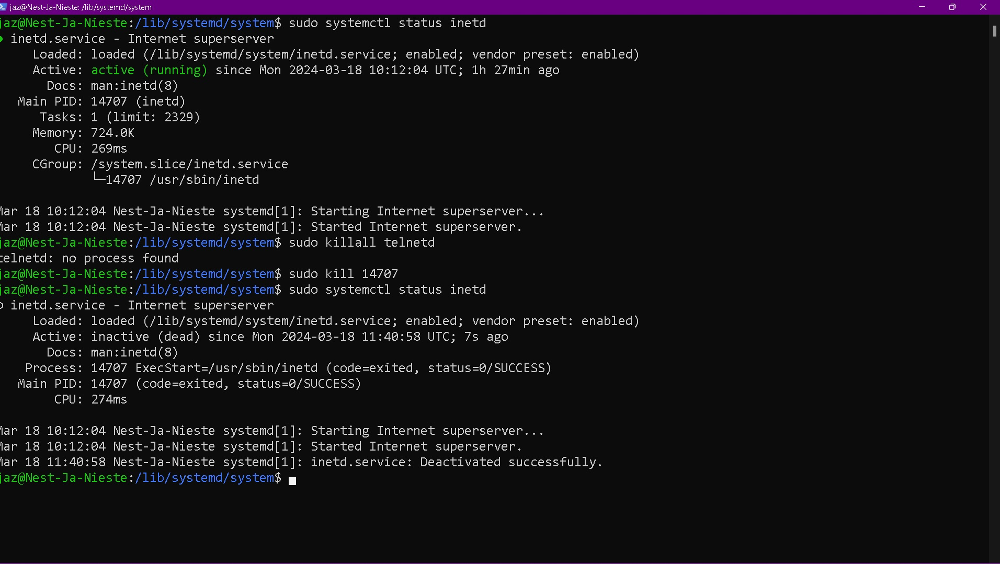

# [8- Processes]

- ## Key-terms

[Schrijf hier een lijst met belangrijke termen met eventueel een korte uitleg.]

## Opdracht

- Start the telnet daemon.
- Find out the PID of the telnet daemon.
- Find out how much memory telnet daemon is using.
- Stop or kill the telnet daemon process

### Gebruikte bronnen

[IBM Documentation # telnetd Daemon](https://www.ibm.com/docs/en/aix/7.3?topic=t-telnetd-daemon)
https://www.howtoforge.com/how-to-install-and-use-telnet-on-ubuntu/

### Ervaren problemen

[Geef een korte beschrijving van de problemen waar je tegenaan bent gelopen met je gevonden oplossing.]

### Resultaat

- Start the telnet daemon.
  

- Find out the PID of the telnet daemon.
  see above image

- Find out how much memory telnet daemon is using.
  
  see above image

- Stop or kill the telnet daemon process
    
