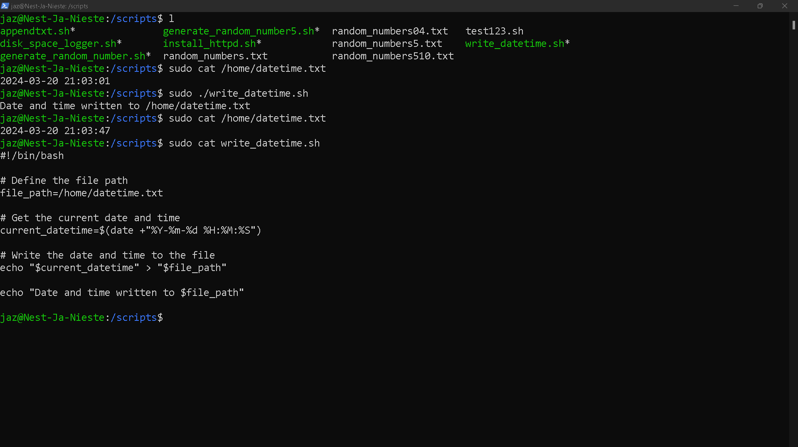

# [CRON JOBS]

In Ubuntu (and other Unix-like operating systems), a cronjob is a scheduled task that runs at specified intervals. These tasks are managed by a utility called cron, which runs in the background and executes commands or scripts according to a predefined schedule.

A cronjob is defined by a cron expression, which consists of five fields `` * * * * *``  :

First `*` = Minute (0-59)

Second `*`= Hour (0-23)

Third `*`= Day of the month (1-31)

Fourth `*`= Month (1-12 or names)

Fifth `*`= Day of the week (0-7 or names, where 0 and 7 represent Sunday)

Each field can contain a single value, a comma-separated list of values, a range of values (specified using a hyphen(`-`)), or an asterisk (`*`) to indicate "every" value. Additionally, you can use special characters such as slashes (`/`) to specify intervals.

| `  * * * * *  ` | Time Value       | (Range)                                        |
| --------------- | ---------------- | ---------------------------------------------- |
| First `*`       | Minute           | (0-59)                                         |
| Second `**`     | Hour             | (0-23)                                         |
| Third `***`     | Day of the Month | (1-31)                                         |
| Fourth`****`    | Month            | (1-12 or names)                                |
| Fifth `*****`   | Day of the Week  | (0-7 or names, where 0 and 7 represent Sunday) |

Here's an example of a cron expression:

```
* * * * * /path/to/your/script.sh
```

   This expression indicates that the script located at ```/path/to/your/script.sh``` will be executed every minute, as each field is set to ``*`` (`*`   = every possible value).

Cronjobs are typically managed using the ``` crontab -e``` command, which allows users to view, edit, and remove their scheduled tasks. Each user on the system can have their own crontab file, which contains their individual scheduled tasks. Additionally, system-wide cronjobs can be defined in /etc/crontab and in the /etc/cron.d/ directory.

Cronjobs are commonly used for tasks such as:

Regular backups
System maintenance tasks (e.g., cleaning up temporary files)
Running periodic scripts (e.g., fetching updates, generating reports)
Monitoring system health.

Overall, cronjobs are a convenient way to automate repetitive tasks on Unix-like systems like Ubuntu.

## Key-terms

CRON : The name "cron" comes from the Greek word for time, "chronos". It allows users to automate repetitive tasks, such as backups, system maintenance, and administrative tasks, without the need for manual intervention.


CRONJOB: Cron jobs are defined in a file called the "crontab" (short for "cron table"). Each user on the system can have their own crontab file, which lists the commands or scripts to be executed, along with the schedule for when they should run.

The syntax for defining cron jobs in a crontab file follows a specific format, specifying the minute, hour, day of month, month, and day of week when the task should be executed.


CRONTAB : In Ubuntu and other Unix-like operating systems, the "crontab" is a file that contains a list of cron jobs. Each user can have their own crontab file, which defines the tasks they want to schedule for execution at specific times or intervals.

The crontab file is managed using the `crontab` command-line utility. Users can view, edit, and manage their crontab files using this utility. 

## Opdracht

**Exercise:**

- Create a Bash script that writes the current date and time to a file in your home directory.

- Register the script in your crontab so that it runs every minute.

- Create a script that writes available disk space to a log file in ‘/var/logs’. Use a cron job so that it runs weekly.

### Gebruikte bronnen

https://phoenixnap.com/kb/set-up-cron-job-linux

[How to Run Cron Jobs Every 5, 10, or 15 Minutes | Linuxize](https://linuxize.com/post/cron-jobs-every-5-10-15-minutes/)

CHAT_GPT  

### Ervaren problemen

[Geef een korte beschrijving van de problemen waar je tegenaan bent gelopen met je gevonden oplossing.]

### Resultaat

**Exercise:**

- Create a Bash script that writes the current date and time to a file in your home directory.

1/ We will make `write_datetime.sh`

```
touch /scripts/write_datetime.sh
```

2/ Add the following coding in `write_datetime.sh` :

```
#!/bin/bash


# Define the file path

file_path=/home/datetime.txt

# Get the current date and time

current_datetime=$(date +"%Y-%m-%d %H:%M:%S")

# Write the date and time to the file

echo "$current_datetime" > "$file_path"
echo "Date and time written to $file_path"
```

3/ Now when we run the script , with `/scripts/write_datetime.sh` , we get the following result written in `datetime.txt` (seen on following screenshot):

<u>RESULT</u>


- Register the script in your crontab so that it runs every minute.

1/ We open the crontab
  ```crontab -e```

2/ We add the following line `*/1 * * * * ./scripts/write-datetime.sh` in the crontab (on the bottom, as seen in following screenshot)  :


```
*/1 * * * * ./scripts/write-datetime.sh
```

3/ Save and close the crontab

4/ To see the result ,we typ : `sudo cat /var/log/datetime.txt`

5/ repeat step 4 after a minute,  to see and proof that the `datetime.txt` has changed.

RESULT


- Create a script that writes available disk space to a log file in ‘/var/logs’. Use a cron job so that it runs weekly.

Here's a script that retrieves the available disk space and writes it to a log file in ``/var/log``. We named this script `disk_space_logger.sh` :

1/ We will make `disk_space_logger.sh`

```
touch /scripts/disk_space_logger.sh
```

2/ Add the following coding in `disk_space_logger.sh` :

```
#!/bin/bash
# Define log file path

log_file="/var/log/disk_space.log"

# Get current date and time

current_date=$(date +"%Y-%m-%d %H:%M:%S")

# Get available disk space and append it to log file

df -h >> "$log_file"

# Add a timestamp to the log entry

echo "Disk space checked at $current_date" >> "$log_file"
echo "Disk space logged at $log_file"
```


3/ Save this script with the name ``disk_space_logger.sh`` and make it executable using `chmod +x disk_space_logger.sh `

4/ Next, we'll set up a cron job to run this script weekly. To do this, follow these steps:

-Open  crontab file for editing by typing:

```
crontab -e
```

5/ Add the following line to the (bottom of) crontab file, to schedule the script to run weekly:

```
0 0 * * 0 /path/to/disk_space_logger.sh
```

This line will run the script at midnight (00:00) every Sunday (day of the week 0).

-Replace`/path/to/disk_space_logger.sh` with the <u>actual</u> path to your `disk_space_logger.sh` script if needed. But in this case `/scripts/disk_space_logger.sh` was used.

6/ Save and close the crontab file.

With this setup, your script will run weekly, logging the available disk space to the specified log file in `/var/log/disk_space.log`


