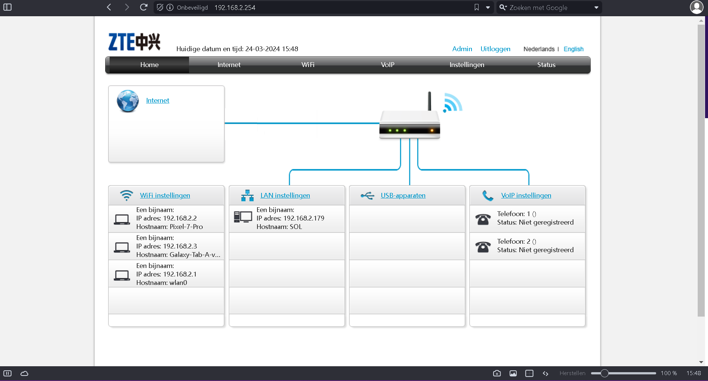
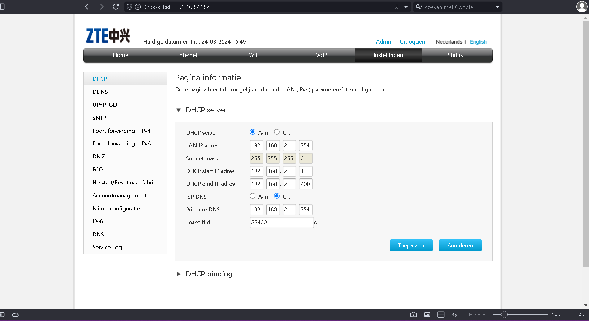

# [Networking devices]

[Geef een korte beschrijving van het onderwerp]

## Key-terms

[Schrijf hier een lijst met belangrijke termen met eventueel een korte uitleg.]

## Opdracht

- Benoem en beschrijf de functies van veelvoorkomende netwerkapparatuur

- De meeste routers hebben een overzicht van alle verbonden apparaten, vind deze lijst.

- Welke andere informatie heeft de router over aangesloten apparatuur?
  Waar staat je DHCP server op jouw netwerk? Wat zijn de configuraties hiervan?

### Gebruikte bronnen

- Tutorial: Access Point (AP) Setup https://www.youtube.com/watch?v=640ux4wQgXE
- [Hub, Switch, &amp; Router Explained - What&#39;s the difference? - YouTube](https://www.youtube.com/watch?v=1z0ULvg_pW8)
- [Routers vs. Switches vs. Access Points - And More - YouTube](https://www.youtube.com/watch?v=Vc16CCAAz7Q)

### Ervaren problemen

[Geef een korte beschrijving van de problemen waar je tegenaan bent gelopen met je gevonden oplossing.]

### Resultaat

- Benoem en beschrijf de functies van veelvoorkomende netwerkapparatuur

Hier zijn enkele veelvoorkomende netwerkapparaten en hun functies:

Router:

Een router verbindt verschillende netwerken en stuurt gegevenspakketten tussen hen door.
Het bepaalt de beste route voor gegevens om van de bron naar de bestemming te reizen.
Kan NAT (Network Address Translation) uitvoeren om privé-IP-adressen om te zetten naar openbare IP-adressen voor internetcommunicatie.
Biedt meestal firewall-functionaliteit voor netwerkbeveiliging.
Switch:

Een switch verbindt apparaten binnen een lokaal netwerk (LAN) en stuurt gegevens rechtstreeks van de bron naar de bestemming.
Het leert MAC-adressen van aangesloten apparaten en bouwt een tabel op om efficiënt gegevens door te sturen.
Vergroot de bandbreedte van het netwerk door verschillende apparaten tegelijkertijd met elkaar te laten communiceren.
Access Point (AP):

Een access point verbindt draadloze apparaten met een bekabeld netwerk (LAN) om toegang tot bronnen en internet te bieden.
Het zendt draadloze signalen uit en ontvangt signalen van draadloze apparaten, waardoor draadloze connectiviteit mogelijk is.
Modem:

Een modem (modulator-demodulator) converteert digitale gegevens van een netwerk naar een vorm die via de telefoonlijn (DSL-modem) of kabel (kabelmodem) kan worden verzonden en omgekeerd.
Het biedt toegang tot internet via internetproviders (ISP's).
Firewall:

Een firewall controleert het verkeer tussen het interne netwerk en externe netwerken, zoals het internet.
Het handhaaft beveiligingsregels om ongeautoriseerde toegang tot of van het netwerk te voorkomen.
Kan pakketinspectie, stateful packet filtering, proxy's en andere technieken gebruiken om het netwerk te beschermen tegen bedreigingen.
Repeater:

Een repeater versterkt het signaal van een draadloos netwerk om de dekking uit te breiden.
Het ontvangt draadloze signalen, versterkt ze en zendt ze opnieuw uit om het bereik van het draadloze netwerk te vergroten.
Bridge:

Een bridge verbindt twee verschillende netwerken op hetzelfde protocolniveau (meestal het datalinkniveau) en laat ze samenwerken alsof ze één netwerk zijn.
Het kan worden gebruikt om segmenten van een netwerk te verbinden, wat de prestaties en beveiliging kan verbeteren.
Proxyserver:

Een proxyserver fungeert als een tussenpersoon tussen clientcomputers en internet.
Het kan verzoeken van clients ontvangen, deze verifiëren, cachet, wijzigen en doorsturen naar het internet, waardoor de prestaties en beveiliging worden verbeterd.
Deze apparaten vormen de basis van een netwerkinfrastructuur en werken samen om connectiviteit, prestaties en beveiliging te bieden voor zowel lokale als externe communicatie.

- De meeste routers hebben een overzicht van alle verbonden apparaten, vind deze lijst.
  
  

- Welke andere informatie heeft de router over aangesloten apparatuur?
  Waar staat je DHCP server op jouw netwerk? Wat zijn de configuraties hiervan?

