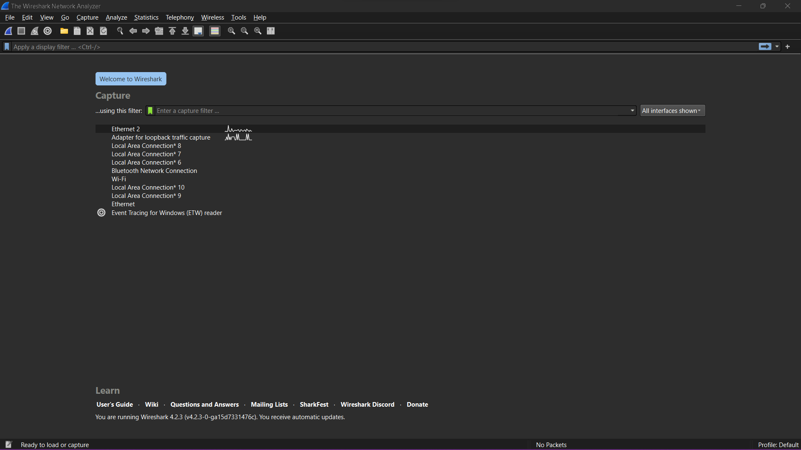
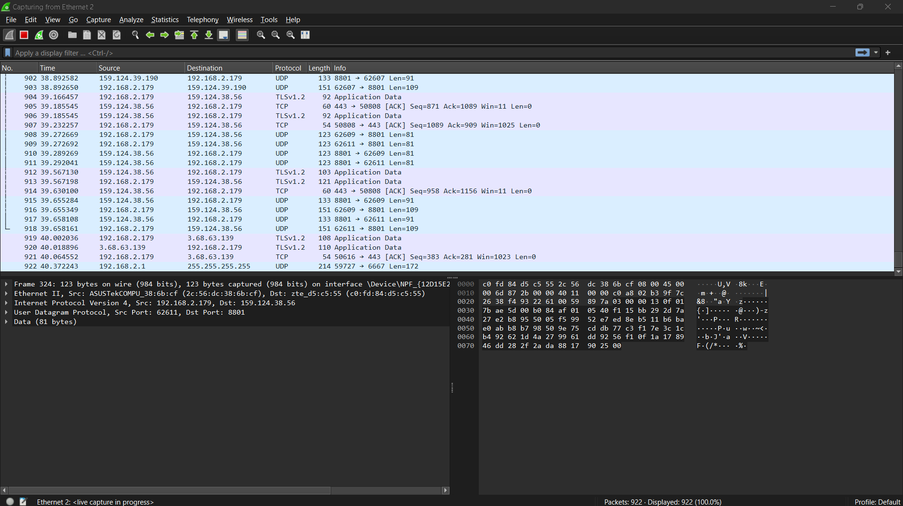
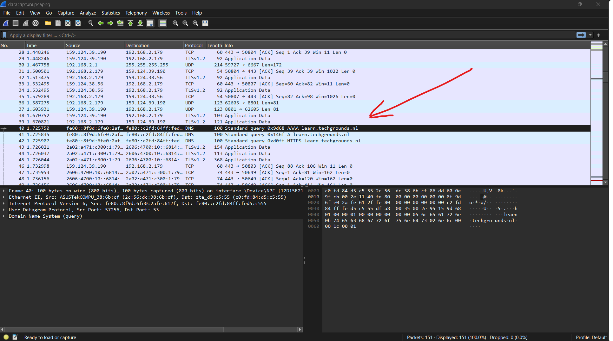

# [1/ Protocols]

Protocols are a set of rules and conventions that govern the way in which data is transmitted and received over a network. They define the format, timing, sequencing, and error control mechanisms for data communication between devices. Protocols enable devices to communicate and interact with each other in a standardized manner, ensuring compatibility and interoperability across different systems and platforms.

## Key-terms

- Protocol
  
  Protocols can operate at various layers of the OSI (Open Systems Interconnection) model, which is a conceptual framework used to understand and standardize the communication functions of a telecommunication or computing system. Each layer of the OSI model corresponds to specific tasks and responsibilities in the process of transmitting data over a network, and protocols are designed to fulfill those tasks within their respective layers.
  
  Some common types of protocols include:
1. **Network Protocols:** These protocols define how devices communicate and exchange data within a network. Examples include the Internet Protocol (IP) for logical addressing and routing, and the Address Resolution Protocol (ARP) for mapping IP addresses to MAC addresses.

2. **Transport Protocols:** Transport protocols govern the transmission of data between devices and provide mechanisms for error detection, flow control, and retransmission. Examples include the Transmission Control Protocol (TCP) for reliable, connection-oriented communication, and the User Datagram Protocol (UDP) for connectionless communication with reduced overhead.

3. **Application Protocols:** Application protocols facilitate communication between software applications and services running on networked devices. Examples include the Hypertext Transfer Protocol (HTTP) for transferring web pages over the World Wide Web, the Simple Mail Transfer Protocol (SMTP) for sending email messages, and the File Transfer Protocol (FTP) for transferring files between computers.

4. **Data Link Protocols:** Data link protocols define how data is formatted, transmitted, and received over a physical medium, such as Ethernet for wired LANs or Wi-Fi for wireless networks. These protocols ensure reliable and efficient communication between directly connected devices.
   
   Overall, protocols are essential components of network communication, providing the rules and standards necessary for devices to exchange data effectively and reliably across networks of varying sizes and complexities.
- Wireshark
  
  Wireshark is a popular open-source network protocol analyzer. It allows you to capture and interactively browse the traffic running on a computer network. Originally known as Ethereal, it was renamed Wireshark in 2006. Wireshark lets you inspect the data from a live network or from a capture file on disk, and it supports hundreds of protocols, making it a powerful tool for network troubleshooting, analysis, software and protocol development, and education. With Wireshark, you can analyze the details of network protocols, view packet headers and payloads, and identify and diagnose network problems. It is available for various operating systems, including Windows, macOS, and Linux.

## Opdracht

Exercise :

- Identify several other protocols and their associated OSI layer. Name at least one for each layer.
- Figure out who determines what protocols we use and what is needed to introduce your own protocol.
- Look into wireshark and install this program. Try and capture a bit of your own network data. Search for a protocol you know and try to understand how it functions.

### Gebruikte bronnen

- CHAT GPT

- https://www.wireshark.org

- https://www.youtube.com/watch?v=lb1Dw0elw0Q
  
  Learn Wireshark in 10 minutes - Wireshark Tutorial for Beginners

### Ervaren problemen

[Geef een korte beschrijving van de problemen waar je tegenaan bent gelopen met je gevonden oplossing.]

### Resultaat

Exercise :

- Identify several other protocols and their associated OSI layer. Name at least one for each layer.
  
  1. **Layer 1 (Physical Layer):**
     
     - Ethernet: This protocol defines the physical connections between devices and the transmission of raw data bits over a physical medium, such as copper cables or fiber optics.
  
  2. **Layer 2 (Data Link Layer):**
     
     - Address Resolution Protocol (ARP): ARP maps IP addresses to MAC addresses in local networks, enabling communication between devices within the same network segment.
  
  3. **Layer 3 (Network Layer):**
     
     - Internet Protocol (IP): IP is responsible for logical addressing and routing of packets between different networks. It enables devices to communicate across interconnected networks.
  
  4. **Layer 4 (Transport Layer):**
     
     - Transmission Control Protocol (TCP): TCP provides reliable, connection-oriented communication between applications. It handles data segmentation, flow control, and error correction.
  
  5. **Layer 5 (Session Layer):**
     
     - Session Initiation Protocol (SIP): SIP is a signaling protocol used for initiating, maintaining, and terminating real-time sessions, such as voice and video calls over IP networks.
  
  6. **Layer 6 (Presentation Layer):**
     
     - Hypertext Transfer Protocol (HTTP): HTTP is used for transmitting hypertext documents on the World Wide Web. It facilitates the presentation and formatting of web pages.
  
  7. **Layer 7 (Application Layer):**
     
     - Simple Mail Transfer Protocol (SMTP): SMTP is a protocol used for sending and receiving email messages between servers. It operates at the application layer and handles the transfer of emails.

- A/ Figure out who determines what protocols we use, 
- B/ and what is needed to introduce your own protocol.

A/ Figure out who determines what protocols we use,

The determination of which protocols are used typically involves various stakeholders, including standards organizations, industry consortiums, regulatory bodies, and the technology community as a whole. Here's a breakdown of key players:

1. **Standards Organizations:** Organizations such as the International Organization for Standardization (ISO), the Institute of Electrical and Electronics Engineers (IEEE), and the Internet Engineering Task Force (IETF) play significant roles in developing and standardizing protocols. They often coordinate efforts to define and maintain standards for communication protocols across different layers of the OSI model.

2. **Industry Consortiums:** Many industries have their own consortiums or associations that develop and promote specific protocols tailored to their needs. For example, the Wi-Fi Alliance develops standards and protocols for wireless networking, while the GSM Association oversees standards for mobile telecommunications.

3. **Regulatory Bodies:** In some cases, government regulatory agencies may mandate or influence the adoption of certain protocols, particularly in sectors such as telecommunications and data privacy. These bodies may set requirements or guidelines that impact which protocols can be used.

4. **Technology Community:** Developers, engineers, researchers, and other members of the technology community contribute to the evolution of protocols by proposing new ideas, participating in standardization efforts, and implementing protocols in software and hardware.

- B/ and what is needed to introduce your own protocol.

Introducing a new protocol involves several steps and considerations:

1. **Identifying a Need:** The first step is to identify a specific problem or requirement that existing protocols do not adequately address. This could involve improving performance, enhancing security, enabling new functionalities, or addressing emerging use cases.

2. **Design and Specification:** Once the need is identified, designers and engineers work on conceptualizing and designing the new protocol. This involves defining the protocol's structure, message formats, behavior, and interactions with other protocols.

3. **Prototyping and Testing:** Prototyping the protocol involves implementing it in software or hardware to assess its feasibility and effectiveness. Testing is conducted to evaluate the protocol's performance, scalability, interoperability, and resilience to various conditions and scenarios.

4. **Standardization:** If the protocol is intended for widespread adoption, it may undergo standardization through relevant standards organizations or industry consortia. This process involves submitting the protocol for review, gathering feedback, and revising it based on consensus among stakeholders.

5. **Deployment and Adoption:** Once standardized, the protocol can be deployed in real-world systems and applications. Adoption may occur gradually as vendors implement support for the protocol in their products, and users begin to incorporate it into their networks and systems.

6. **Maintenance and Evolution:** Protocols require ongoing maintenance to address issues, accommodate changes in technology and usage patterns, and ensure compatibility with other protocols. This involves releasing updates, patches, and new versions as needed to keep the protocol relevant and effective.
- Look into wireshark and install this program. Try and capture a bit of your own network data. Search for a protocol you know and try to understand how it functions.
  
  
  - In the following example you see what the DNS protocol does , It provides the name of the website . In this case `learn.techgrounds.nl`
- 
