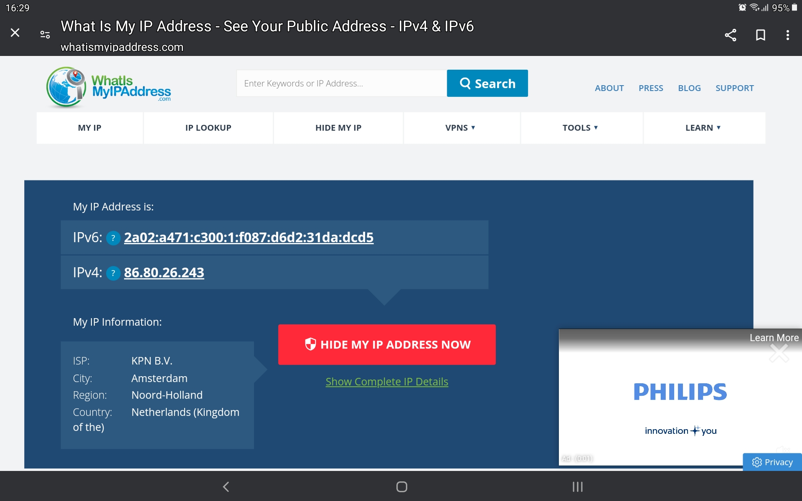
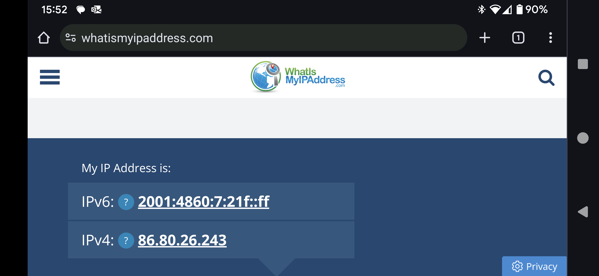
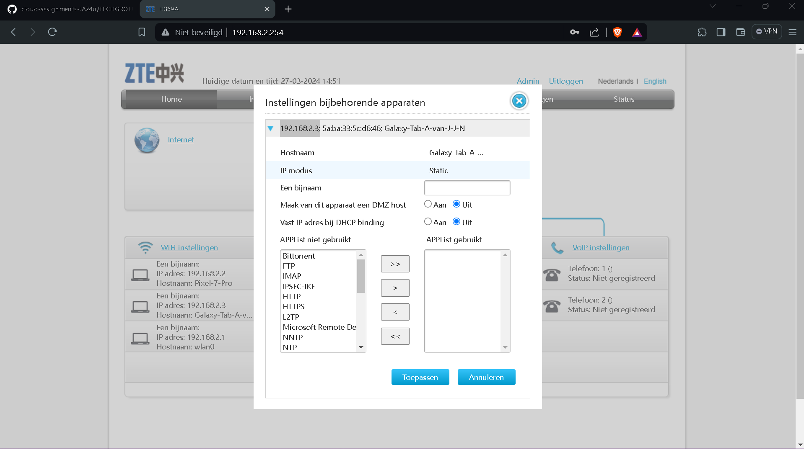
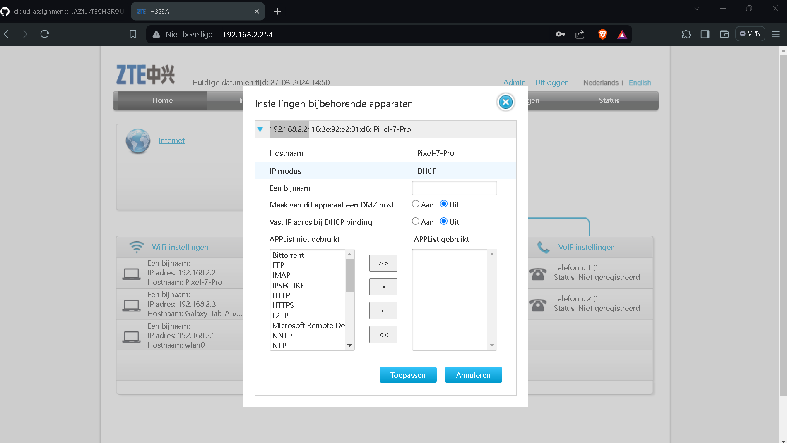
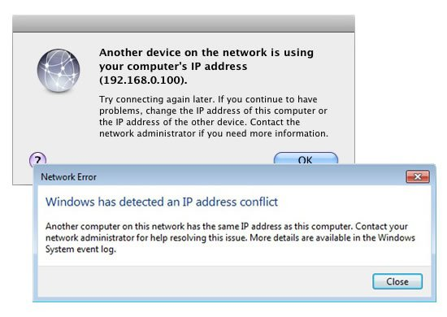

# [3/ IP Addressing]

Een IP adres is een logisch adres dat aan een netwerkapparaat toegewezen kan worden. De netwerkapparaten kunnen dan vervolgens met dit IP adres elkaar vinden op het netwerk.

Een IPv4 adres heeft 32 bits (4 bytes), en is meestal geschreven in decimalen (bijvoorbeeld: 132.88.142.5)

Er zijn 3 IP adres bereiken gereserveerd voor privé netwerken. Iedereen gebruikt één van deze netwerken thuis of op werk. Deze zijn:

```
- 192.168.0.0 - 192.168.255.255
- 172.16.0.0 - 172.31.255.255
- 10.0.0.0 - 10.255.255.255
```

Een andere oplossing is IPv6. IPv6 adressen bevatten 128 bits, en is vaak geschreven in hexadecimalen. Het aantal adressen dat mogelijk is met IPv6 zo groot, dat je "iedere korrel zand op alle stranden van onze aarde 3 IPv6 adressen kan geven"

## Key-terms

- IPv4
- IPv6
- Prive Netwerk
- Prive IP 
- Public IP

## Opdracht

Bestudeer:

- IP adressen
- IPv4 en IPv6
- Public en Private IPs
- NAT
- Statische en dynamische adressen

Opdracht:

- Ontdek wat je publieke IP adres is van je laptop en mobiel op wifi.
  - Zijn de adressen hetzelfde of niet? Leg uit waarom.
- Ontdek wat je privé IP adres is van je laptop en mobiel op wifi.
  - Zijn de adressen hetzelfde of niet? Leg uit waarom.
- Verander het privé IP adres van je mobiel naar dat van je laptop. Wat gebeurt er dan?
- Probeer het privé IP adres van je mobiel te veranderen naar een adres buiten je netwerk. Wat gebeurt er dan?

### Gebruikte bronnen

- CHAT GPT
- [How to find your IP address - The Verge](https://www.theverge.com/23351435/ip-address-how-to-find-macos-windows-ios-android-iphone)
- https://whatismyipaddress.com/
- [How to Change IP Address on Android Devices - PureVPN Blog](https://www.purevpn.com/blog/change-ip-address-android-devices/#How_to_Change_Your_IP_Address_of_Android_Phone)

### Ervaren problemen

[Geef een korte beschrijving van de problemen waar je tegenaan bent gelopen met je gevonden oplossing.]

### Resultaat

Bestudeer:

- IP adressen

- IPv4 en IPv6

- Public en Private IPs
  
  A public IP address and a private IP address are two types of IP addresses used in computer networking, and they serve different purposes:
  
  1. **Public IP Address:**
     
     - A public IP address is assigned to a device by its Internet Service Provider (ISP) and is unique across the internet.
     - It serves as the identifier for a device or network on the internet, allowing communication between that device/network and other devices/networks on the internet.
     - Public IP addresses are globally routable, meaning they can be accessed from anywhere on the internet.
     - They are typically used by servers, websites, and other devices that need to be accessed from outside their local network.
  
  2. **Private IP Address:**
     
     - A private IP address is assigned to a device within a local network (e.g., home or office network) by a router or server.
     - These addresses are not globally unique and can be reused in different private networks without conflict.
     - Private IP addresses are used for internal communication within a local network and are not directly accessible from the internet.
     - They provide a way for devices within the same network to communicate with each other without needing a unique public IP address for each device.
  
  **Key Differences:**
  
  - Public IP addresses are unique across the internet and used for communication between devices on different networks, while private IP addresses are used within a local network.
  - Public IP addresses are assigned by ISPs and are globally routable, whereas private IP addresses are assigned locally within a network.
  - Public IP addresses are accessible from anywhere on the internet, while private IP addresses are not directly accessible from outside the local network.
  
  In summary, public IP addresses facilitate communication over the internet, while private IP addresses enable communication within a local network.

- NAT
  
  NAT stands for Network Address Translation. It's a process used in computer networking to translate between IP addresses used within a private network and those used on the public internet. NAT enables multiple devices within a local network to share a single public IP address for internet communication.
  
  Here's how NAT works:
  
  1. **Private Network:** Devices within a private network are assigned private IP addresses (e.g., IP addresses in the ranges defined in RFC 1918 - 10.0.0.0/8, 172.16.0.0/12, and 192.168.0.0/16).
  
  2. **Router:** The router within the local network acts as a gateway to the internet. It has a public IP address assigned by the ISP for communication with devices on the internet.
  
  3. **Translation:** When a device within the private network initiates communication with a device on the internet, NAT translates the private IP address of the originating device to the public IP address of the router.
  
  4. **Packet Forwarding:** The router sends the packet to the destination device on the internet. When the response is received, the router uses NAT to translate the public IP address back to the private IP address of the original device and forwards the response packet to it.
  
  NAT serves several purposes:
  
  - **Address Conservation:** NAT allows multiple devices within a private network to share a single public IP address, which helps conserve IPv4 addresses.
  - **Security:** By hiding the private IP addresses of devices within a network, NAT adds a layer of security by preventing direct access to devices from the internet. Only the router's public IP address is visible externally.
  - **Simplifies Network Configuration:** With NAT, devices within a private network can use private IP addresses without worrying about conflicts with IP addresses used on the public internet.
  
  NAT comes in different forms, including:
  
  - **Static NAT:** Maps a private IP address to a specific public IP address.
  - **Dynamic NAT:** Assigns a public IP address from a pool of available addresses to devices within the private network dynamically as needed.
  - **PAT (Port Address Translation):** Maps multiple private IP addresses to a single public IP address using different port numbers to distinguish between connections.
  
  Overall, NAT plays a crucial role in enabling communication between devices within private networks and the internet while providing address conservation and security benefits.

- Statische en dynamische adressen
  
  Opdracht:

- Ontdek wat je publieke IP adres is van je laptop en mobiel op wifi.
  
  Public IP on : Tablet
  
  

Public IP on : Phone



- Zijn de adressen hetzelfde of niet? Leg uit waarom.
  
  Ja , deze zijn voor beide apparaten hetzelfde , omdat het het verkregen ISP ipv4 adress  (heeft de router ) een public IPv4 is : 86.80.26.243

- Ontdek wat je privé IP adres is van je laptop en mobiel op wifi.
  
  IP Tablet :(192.168.2.3)
  
  
  
  IP Phone : (192.168.2.254)
  
  
  
  - Zijn de adressen hetzelfde of niet? Leg uit waarom.
    
    Nee , want deze private Ip adressen zijn verkregen door de router en zijn neit publiek bekend.

- Verander het privé IP adres van je mobiel naar dat van je laptop. Wat gebeurt er dan?
  
  Dan is er geen unieke route, en zal netwerkverkeer niet aankomen bij de juiste gebruiker/pc.
  
  

- Probeer het privé IP adres van je mobiel te veranderen naar een adres buiten je netwerk. Wat gebeurt er dan?
  
  - " As long its on the same subnet. If your router was 192.168.1.1 you would want to keep the 192.168.1.X. Im pretty sure changing the subnet can make problems.
  
  - Als je het privé-IP-adres van je mobiele apparaat verandert naar een adres buiten je lokale netwerk, zou dit normaal gesproken niet werken, omdat privé-IP-adressen buiten je lokale netwerk niet geldig zijn voor directe communicatie over het internet.
    
    Hier is wat er zou kunnen gebeuren:
    
    1. **Niet-Functionele Communicatie:** Als je een privé-IP-adres van buiten je lokale netwerk probeert te gebruiken, zal het apparaat waarschijnlijk geen functionele netwerkverbinding hebben. Dit komt doordat privé-IP-adressen zijn gereserveerd voor intern gebruik binnen een netwerk en niet worden gerouteerd via het openbare internet.
    
    2. **Onbereikbaarheid:** Apparaten en servers op internet zouden niet in staat zijn om rechtstreeks te communiceren met het apparaat met het ongeldige privé-IP-adres. Het verkeer zou waarschijnlijk worden verworpen door de routers op internet, omdat het afkomstig lijkt te zijn van een niet-toegewezen of ongeldig IP-adresbereik.
    
    3. **Natuurlijke Firewall:** Het apparaat zelf zou kunnen fungeren als een soort 'firewall', waarbij inkomend verkeer dat is gericht op een privé-IP-adres van buiten het lokale netwerk wordt verworpen vanwege het ongeldige adres.
    
    Over het algemeen is het niet mogelijk om een privé-IP-adres van buiten het lokale netwerk te gebruiken voor directe communicatie over het internet. Als je externe toegang tot je mobiele apparaat nodig hebt, zou je in plaats daarvan moeten kijken naar technieken zoals port forwarding, VPN (Virtual Private Network), of andere methoden voor externe toegang, afhankelijk van je specifieke behoeften.

            
