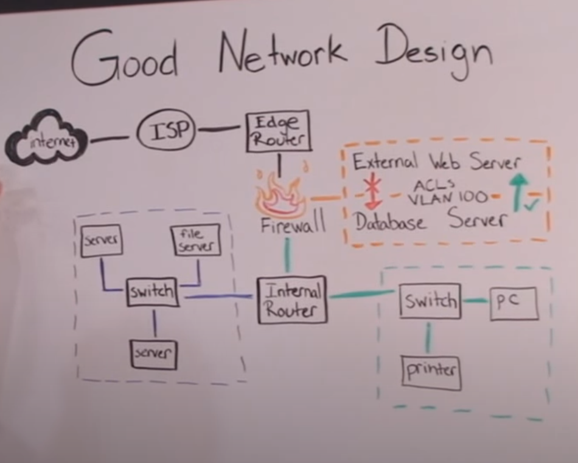

# [5\ Networking_case_study]

CASE STUDY:
Case studies are a little different from the regular exercises you do here at Techgrounds. Up until now every exercise has introduced a new topic, where you had to figure out how to make it work. In a case study we combine your previously learned knowledge with a real life example (or a fictional example closely resembling a real life situation).

In this case study you take the role of a network administrator setting up a network in the new office of a small e-commerce company. Of course there are multiple ways to go about this problem, but this company has specifically said that network security is extremely important to them.

The office contains the following devices:

- A web server where our webshop is hosted
- A database with login credentials for users on the webshop
- 5 workstations for the office workers
- A printer
- An AD server
- A file server containing internal documents

As a network administrator you get to choose which networking devices get used.

## Key-terms

- https://app.diagrams.net/
  
  [https://app.diagrams.net/](https://app.diagrams.net/) is a web-based application for creating diagrams and flowcharts. Formerly known as Draw.io, it provides a user-friendly interface for designing various types of diagrams, including flowcharts, network diagrams, organizational charts, UML diagrams, and more.
  
  Here are some key features of diagrams.net:
  
  1. **Ease of Use:** The application offers a simple and intuitive interface, making it easy for users to create diagrams without extensive training or experience.
  
  2. **Wide Range of Diagram Types:** diagrams.net supports a variety of diagram types, catering to different needs and purposes. Users can choose from templates or start from scratch to create diagrams suited to their specific requirements.
  
  3. **Collaboration:** Users can collaborate on diagrams in real-time by sharing diagrams with others and working together on the same document simultaneously. Changes made by one user are instantly visible to others, facilitating teamwork and communication.
  
  4. **Integration:** diagrams.net integrates with various cloud storage services such as Google Drive, OneDrive, Dropbox, and GitHub, allowing users to save and access their diagrams seamlessly across different platforms and devices.
  
  5. **Customization:** The application offers extensive customization options, including the ability to change colors, fonts, shapes, and styles to match the user's preferences or corporate branding.
  
  6. **Export and Import:** Users can export diagrams in various formats, including PNG, JPEG, SVG, PDF, and XML. Additionally, diagrams created in other applications can be imported into diagrams.net for further editing or collaboration.
  
  Overall, diagrams.net is a versatile and user-friendly tool for creating diagrams and flowcharts, suitable for individuals, teams, and organizations across different industries and domains.

- 

## Opdracht

Exercise

- Design a network architecture for the above use case.
- Explain your design decisions

### Gebruikte bronnen

- https://www.youtube.com/watch?v=oopkClg1kxM
  
  Beer:30 - Network Architecture Review

### Ervaren problemen

[Geef een korte beschrijving van de problemen waar je tegenaan bent gelopen met je gevonden oplossing.]

# Resultaat

 Exercise

- Design a network architecture for the above use case.
- Explain your design decisions
