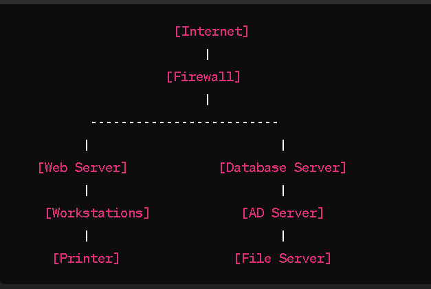
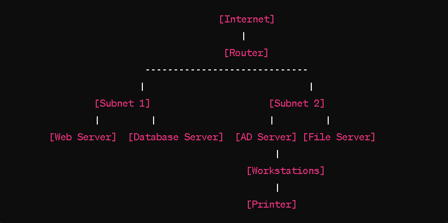

# [5\ Networking_case_study]

CASE STUDY:

Case studies are a little different from the regular exercises you do here at Techgrounds. Up until now every exercise has introduced a new topic, where you had to figure out how to make it work. In a case study we combine your previously learned knowledge with a real life example (or a fictional example closely resembling a real life situation).

In this case study you take the role of a network administrator setting up a network in the new office of a small e-commerce company. Of course there are multiple ways to go about this problem, but this company has specifically said that network security is extremely important to them.

The office contains the following devices:

- A web server where our webshop is hosted
- A database with login credentials for users on the webshop
- 5 workstations for the office workers
- A printer
- An AD server
- A file server containing internal documents

As a network administrator you get to choose which networking devices get used.

## Key-terms

- https://app.diagrams.net/
  
  [https://app.diagrams.net/](https://app.diagrams.net/) is a web-based application for creating diagrams and flowcharts. Formerly known as Draw.io, it provides a user-friendly interface for designing various types of diagrams, including flowcharts, network diagrams, organizational charts, UML diagrams, and more.
  
  Here are some key features of diagrams.net:
  
  1. **Ease of Use:** The application offers a simple and intuitive interface, making it easy for users to create diagrams without extensive training or experience.
  
  2. **Wide Range of Diagram Types:** diagrams.net supports a variety of diagram types, catering to different needs and purposes. Users can choose from templates or start from scratch to create diagrams suited to their specific requirements.
  
  3. **Collaboration:** Users can collaborate on diagrams in real-time by sharing diagrams with others and working together on the same document simultaneously. Changes made by one user are instantly visible to others, facilitating teamwork and communication.
  
  4. **Integration:** diagrams.net integrates with various cloud storage services such as Google Drive, OneDrive, Dropbox, and GitHub, allowing users to save and access their diagrams seamlessly across different platforms and devices.
  
  5. **Customization:** The application offers extensive customization options, including the ability to change colors, fonts, shapes, and styles to match the user's preferences or corporate branding.
  
  6. **Export and Import:** Users can export diagrams in various formats, including PNG, JPEG, SVG, PDF, and XML. Additionally, diagrams created in other applications can be imported into diagrams.net for further editing or collaboration.
  
  Overall, diagrams.net is a versatile and user-friendly tool for creating diagrams and flowcharts, suitable for individuals, teams, and organizations across different industries and domains.

- Network Case Study
  
  A network case study is an in-depth analysis of a specific networking scenario or implementation. It typically involves examining real-world examples of network design, deployment, troubleshooting, or optimization to understand the challenges, solutions, and outcomes involved.
  
  Here's what a network case study may include:
  
  1. **Background Information:** This section provides context for the case study, including details about the organization or environment in which the network operates. It may describe the organization's size, industry, network infrastructure, goals, challenges, and any relevant constraints.
  
  2. **Problem Statement:** The case study outlines the specific network-related problem or issue that prompted the need for analysis. This could involve issues such as network downtime, performance degradation, security breaches, scalability concerns, or inefficiencies in network design.
  
  3. **Solution Implementation:** It describes the steps taken to address the problem, including the design, deployment, and configuration of network solutions or technologies. This may involve hardware (routers, switches, firewalls), software (network management systems, security tools), or architectural changes (subnetting, VLAN implementation).
  
  4. **Challenges and Considerations:** The case study discusses any challenges or obstacles encountered during the implementation process. This could include technical complexities, budget constraints, compatibility issues, stakeholder buy-in, or unforeseen complications.
  
  5. **Results and Outcomes:** It evaluates the effectiveness of the implemented solution in addressing the initial problem or issue. This may involve quantitative metrics (e.g., network uptime, throughput, latency) as well as qualitative assessments (user feedback, operational improvements).
  
  6. **Lessons Learned:** The case study concludes with reflections on key takeaways and lessons learned from the experience. This may include insights into best practices, areas for improvement, recommendations for future projects, or strategies for mitigating similar challenges in the future.
  
  Examples of network case studies could include:
  
  - Migration from a traditional on-premises network to a cloud-based network infrastructure.
  - Implementation of a software-defined networking (SDN) solution to improve network agility and scalability.
  - Deployment of a wireless network in a large enterprise environment.
  - Network optimization for a high-traffic e-commerce website to improve performance and reliability.
  - Security enhancements for a network infrastructure to protect against cyber threats and data breaches.
  
  Overall, network case studies provide valuable insights into real-world networking scenarios, helping practitioners and organizations learn from both successes and failures in network design and management.

- Edge Router
  
  An edge router is a specialized network device located at the boundary or edge of a network, where a local network connects to external networks such as the internet or other wide area networks (WANs). Edge routers play a critical role in routing traffic between the local network and external networks, serving as the entry and exit points for data entering or leaving the network.
  
  Here are key aspects of edge routers:
  
  1. **Boundary Device:** Edge routers are positioned at the perimeter or boundary of a network, serving as the interface between the internal network infrastructure and external networks. They typically connect to internet service providers (ISPs) or other WAN connections.
  
  2. **Routing Functionality:** Edge routers perform the core function of routing, which involves forwarding data packets between networks based on IP addresses and routing tables. They make decisions about the optimal paths for data to travel, directing traffic to its destination efficiently.
  
  3. **Network Address Translation (NAT):** Edge routers often include NAT functionality, which allows them to translate between private IP addresses used within the local network and public IP addresses used on the internet. NAT helps conserve public IP addresses and adds a layer of security by hiding internal network addresses from external networks.
  
  4. **Firewall and Security Features:** Edge routers may incorporate firewall capabilities to enforce security policies and filter incoming and outgoing traffic. They can block unauthorized access attempts, prevent malicious traffic, and protect the internal network from external threats.
  
  5. **Quality of Service (QoS):** Some edge routers support QoS features, allowing administrators to prioritize certain types of traffic over others based on defined criteria. This ensures that critical applications or services receive sufficient bandwidth and network resources to operate effectively.
  
  6. **VPN Connectivity:** Edge routers often support virtual private network (VPN) functionality, allowing remote users or branch offices to securely connect to the corporate network over the internet. They establish encrypted tunnels to protect data transmission and provide secure remote access to network resources.
  
  7. **Load Balancing and Redundancy:** In high-availability environments, edge routers may include features for load balancing and redundancy to ensure continuous network operation. They can distribute traffic across multiple WAN links or paths and automatically failover to backup connections in case of link failures.
  
  Overall, edge routers are essential components of network infrastructure, serving as the gateway between internal and external networks while providing essential routing, security, and connectivity features. They play a crucial role in ensuring the reliability, performance, and security of network communications for organizations of all sizes.

- Firewall
  
  A firewall is a network security device or software application that monitors and controls incoming and outgoing network traffic based on predetermined security rules. Firewalls act as a barrier between a trusted internal network and untrusted external networks (such as the internet), inspecting each packet of data passing through and determining whether to allow or block it based on defined criteria.
  
  Here are key aspects of firewalls:
  
  1. **Packet Filtering:** Firewalls examine packets of data as they pass through the network and compare them against a set of rules or criteria. These criteria typically include attributes such as source and destination IP addresses, port numbers, and protocols (e.g., TCP, UDP).
  
  2. **Stateful Inspection:** Modern firewalls often incorporate stateful inspection, which tracks the state of active connections and makes decisions based on the context of the traffic flow. This approach helps identify and block unauthorized or malicious traffic more effectively.
  
  3. **Access Control:** Firewalls enforce access control policies that determine which types of traffic are allowed to enter or exit the network. This allows organizations to restrict access to sensitive resources and services, protecting against unauthorized access and potential security threats.
  
  4. **Application Layer Filtering:** Some advanced firewalls perform deep packet inspection (DPI) at the application layer, allowing them to analyze the contents of network packets and make decisions based on specific application protocols or payloads. This enables more granular control over traffic and helps detect and prevent advanced threats.
  
  5. **Network Segmentation:** Firewalls are commonly used to segment networks into security zones or segments, separating different parts of the network and controlling traffic flow between them. This helps contain security breaches and minimize the impact of potential security incidents.
  
  6. **VPN and Remote Access:** Firewalls often include features for virtual private network (VPN) connectivity and remote access. They can securely connect remote users or branch offices to the corporate network over the internet while encrypting traffic to ensure confidentiality and integrity.
  
  7. **Intrusion Prevention:** Some firewalls integrate intrusion prevention system (IPS) capabilities to actively detect and block suspicious or malicious traffic patterns in real-time. This adds an extra layer of defense against network-based attacks and exploits.
  
  Firewalls are a fundamental component of network security architecture, serving as the first line of defense against external threats and unauthorized access attempts. They play a crucial role in protecting the confidentiality, integrity, and availability of network resources and data.

- ACL
  
  An ACL, or Access Control List, is a set of rules or configurations that control and filter network traffic based on defined criteria. ACLs are commonly used in network devices such as routers, switches, and firewalls to enforce security policies and regulate access to network resources.
  
  Here are some key aspects of ACLs:
  
  1. **Filtering Criteria:** ACLs use various criteria to filter traffic, including source and destination IP addresses, protocols (such as TCP, UDP, or ICMP), port numbers, and other packet attributes like VLAN tags or DSCP markings.
  
  2. **Rule Structure:** ACLs consist of individual rules, also known as access control entries (ACEs), that specify conditions for permitting or denying traffic. Each rule defines a particular set of criteria (such as source IP address range and destination port) and an action to take (permit or deny) when traffic matches those criteria.
  
  3. **Order of Processing:** ACL rules are typically processed in order, with traffic being compared against each rule sequentially until a match is found. Once a match is found, the corresponding action specified in the rule is applied, and further processing of the ACL stops. It's essential to consider the order of ACL rules to ensure that more specific rules precede more general ones.
  
  4. **Implicit Deny:** Many ACL implementations include an implicit "deny all" rule at the end of the ACL. This means that if traffic doesn't match any of the explicitly defined rules in the ACL, it is automatically denied by default. It's crucial to be mindful of this implicit deny rule when configuring ACLs to avoid inadvertently blocking desired traffic.
  
  5. **Directionality:** ACLs can be applied in different directions on a network interface, such as inbound or outbound on a router interface or ingress or egress on a switch port. The directionality determines whether the ACL applies to traffic entering or exiting the network interface.
  
  6. **Use Cases:** ACLs are used for various purposes, including network security, traffic filtering, access control, quality of service (QoS) enforcement, and network optimization. They help organizations enforce security policies, restrict access to sensitive resources, and manage network traffic effectively.
  
  Overall, ACLs play a critical role in network security and traffic management by allowing organizations to control and filter network traffic based on predefined criteria, thereby enhancing security, performance, and compliance with organizational policies.

- Network Architecture
  
  Network architecture refers to the design and structure of a computer network, encompassing its components, layout, protocols, and technologies. It defines how different devices and systems within the network are organized and connected to enable communication and data exchange.
  
  Key components of network architecture include:
1. **Topology:** Network topology refers to the physical or logical layout of network devices and connections. Common topologies include star, bus, ring, mesh, and hybrid configurations, each with its own advantages and limitations in terms of scalability, fault tolerance, and performance.

2. **Components:** Network architecture includes various hardware and software components such as routers, switches, firewalls, access points, servers, endpoints (e.g., computers, printers), cables, and networking devices. These components work together to facilitate communication and data transfer across the network.

3. **Protocols:** Network protocols define the rules and standards for communication between devices on a network. This includes protocols at different layers of the OSI (Open Systems Interconnection) model, such as TCP/IP, Ethernet, Wi-Fi (802.11), DNS (Domain Name System), DHCP (Dynamic Host Configuration Protocol), and others.

4. **Layers:** Network architecture often follows a layered approach, such as the OSI model or the TCP/IP model, to organize and standardize network functionality. Each layer addresses specific aspects of communication, such as physical transmission, addressing, routing, and application services.

5. **Scalability:** Network architecture must be designed to accommodate growth and scalability, allowing for the addition of new devices, users, and services without significant disruption or degradation in performance. Scalability considerations include network bandwidth, addressing schemes, and capacity planning.

6. **Security:** Security is a critical aspect of network architecture, involving measures to protect network resources, data, and communications from unauthorized access, tampering, or disruption. This includes implementing firewalls, intrusion detection/prevention systems, access control mechanisms, encryption, and security policies.

7. **Reliability and Redundancy:** Network architecture should incorporate redundancy and fault tolerance mechanisms to ensure high availability and reliability. This may include redundant hardware components, backup links, failover configurations, and disaster recovery plans to minimize downtime and data loss.

8. **Management and Monitoring:** Effective network architecture includes provisions for network management and monitoring, allowing administrators to configure, troubleshoot, and optimize network performance. This may involve network management tools, monitoring systems, logging, and performance analysis.
   
   Overall, network architecture plays a fundamental role in defining the structure, operation, and performance of computer networks. A well-designed architecture enables efficient communication, enhances security, supports scalability, and ensures the reliability of network services for organizations and users.
- VLAN
  
  A VLAN, or Virtual Local Area Network, is a technology used in computer networking to logically divide a single physical network into multiple broadcast domains. This segmentation allows network administrators to create isolated networks within the same physical infrastructure, providing improved security, performance, and manageability.
  
  Here are some key points about VLANs:
1. **Logical Segmentation:** VLANs create virtual LANs by grouping together devices based on criteria such as department, function, or security requirements, regardless of their physical location within the network.

2. **Broadcast Control:** By dividing the network into multiple VLANs, broadcast traffic is contained within each VLAN, reducing network congestion and improving overall network performance.

3. **Enhanced Security:** VLANs provide security benefits by isolating traffic between different segments of the network. Devices within one VLAN typically cannot communicate directly with devices in another VLAN without the use of routing or firewall rules.

4. **Flexibility and Scalability:** VLANs offer flexibility in network design and allow for easy reconfiguration as network requirements change. They also enable efficient use of network resources and facilitate network expansion without the need for physical reconfiguration.

5. **Simplifies Network Management:** VLANs simplify network management by allowing administrators to apply consistent policies and configurations across groups of devices within a VLAN. This centralized management approach enhances network administration and troubleshooting.

6. **Inter-VLAN Communication:** While VLANs isolate traffic within their own broadcast domain, communication between VLANs requires routing or Layer 3 devices such as routers or Layer 3 switches. This allows for controlled communication between different segments of the network while maintaining segmentation for security purposes.
   
   Overall, VLANs provide a powerful tool for network segmentation, enabling organizations to optimize network performance, enhance security, and streamline network management. They are widely used in enterprise environments, data centers, and service provider networks to create scalable and secure network architectures.

## Opdracht

Exercise

- Design a network architecture for the above use case.
- Explain your design decisions

### Gebruikte bronnen

- [https://app.diagrams.net/](https://app.diagrams.net/)

- https://www.youtube.com/watch?v=oopkClg1kxM
  
  Beer:30 - Network Architecture Review

### Ervaren problemen

[Geef een korte beschrijving van de problemen waar je tegenaan bent gelopen met je gevonden oplossing.]

# Resultaat

 Exercise

- 1/Design a network architecture for the above use case.

- 2/Explain your design decisions
  
  1. **Web Server**: Hosts the webshop. It should be connected to the internet via a firewall for security. Access to this server should be restricted to necessary ports (like 80 for HTTP and 443 for HTTPS).
  
  2. **Database Server**: Stores login credentials for users on the webshop. This server should be securely configured, with access restricted to authorized users and encrypted connections.
  
  3. **Workstations (5)**: These are the computers used by office workers. They should be connected to the internal network and configured with appropriate security measures such as antivirus software, firewalls, and regular software updates.
  
  4. **Printer**: Connected to the network to allow printing from any of the workstations. Access to the printer should be controlled to prevent unauthorized use.
  
  5. **Active Directory (AD) Server**: Manages user accounts, permissions, and access to network resources. It centralizes network administration and provides authentication and authorization services.
  
  6. **File Server**: Stores internal documents and files shared among office workers. Access to different folders/files should be controlled based on user permissions managed by the AD server.
  
  Here's a basic diagram illustrating the setup:
  
  
  
                                   [Internet]                   
                                           |                   
                                   [Firewall]                     
                                           |      
                               ---------------------------
                               |                         |    
                    1  [Web Server]         2   [Database Server]       
                               |                         |     
                    3  [5* Workstations]    4   [AD Server]
                               |                         |
                    5  [Printer]            6  [File Server]
  
  This network setup provides a foundation for your webshop operations, ensuring security, accessibility, and centralized management of resources. Make sure to implement appropriate security measures, such as encryption, access controls, and regular backups, to protect your data and network from potential threats. Additionally, consider consulting with IT professionals to ensure proper configuration and maintenance of your network infrastructure.

OR

  with 2 subnets and a router:

- 1/Design a network architecture for the above use case.

- 2/Explain your design decisions

Here's a network setup with multiple subnets:

1. **Router**:
   
   - Purpose: Connects different subnets and manages data traffic between them.
   - Configuration: Provides routing functionality to direct traffic between subnets and between the internal network and external networks.

2. **Subnet 1**:
   
   - **Web Server**:
     - Purpose: Hosts your webshop for online transactions.
     - Configuration: Connected to Subnet 1 and accessible from the internet. Configured with security measures such as SSL/TLS encryption and regular updates.
   - **Database Server**:
     - Purpose: Stores login credentials and other data for the webshop users.
     - Configuration: Connected to Subnet 1 and internal network. Secured with access controls and encryption.

3. **Subnet 2**:
   
   - **AD Server**:
     - Purpose: Manages user accounts, group policies, and network resources.
     - Configuration: Connected to Subnet 2. Centralizes user authentication and authorization.
   - **File Server**:
     - Purpose: Stores internal documents and files shared among office workers.
     - Configuration: Connected to Subnet 2. Access controlled by permissions managed through Active Directory.

4. **Workstations** (Connected to both Subnets):
   
   - Purpose: Used by office workers for business tasks.
   - Configuration: Connected to both Subnet 1 and Subnet 2. Equipped with security software like antivirus programs and firewalls.

5. **Printer** (Connected to Subnet 2):
   
   - Purpose: Allows printing of documents for office workers.
   - Configuration: Connected to Subnet 2. Access controlled through network permissions.

Here's a simplified diagram illustrating the network setup:

                           [Internet]
                               |
                            [Router]
                                -----------------------------                   
                               |                             | 
                            [Subnet 1]                     [Subnet 2]
                           |         |                    |         |
                    [Web Server]  [Database Server]  [AD Server] [File Server]
                                     | 
                                     [Workstations]              
                                     |
                                     [Printer]

This network design with multiple subnets provides segmentation to isolate different types of traffic and enhance security. It also allows for more efficient management of network resources. The router facilitates communication between the subnets while controlling the flow of traffic to and from the internet.
