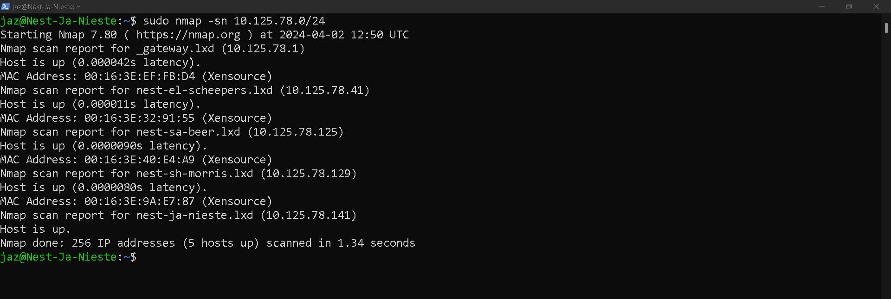
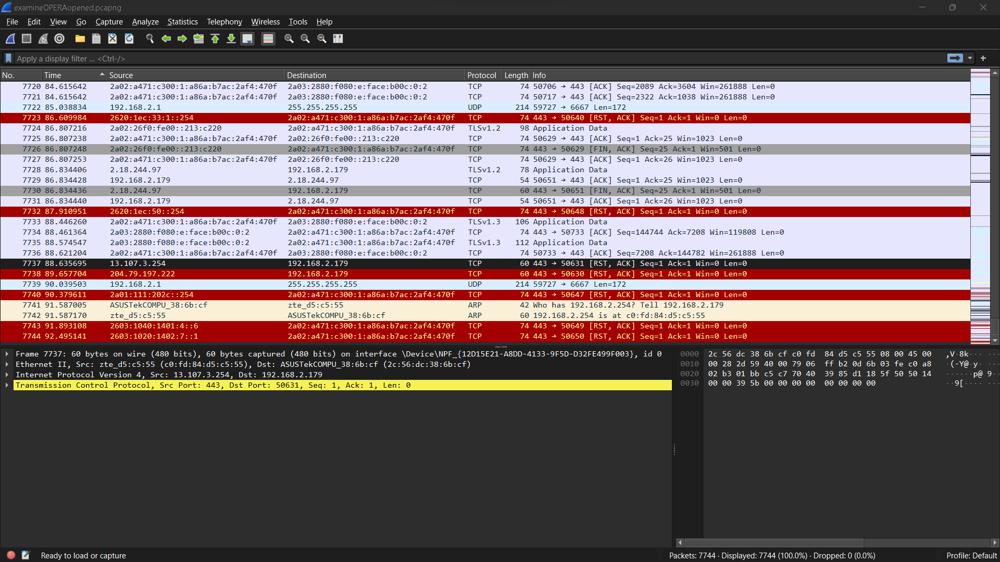

# [1/ Network detection]

<mark>In order to prevent or stop attacks on a network, you must be able to analyse your network.</mark>

There are many tools available to do this, but this exercise will focus on two very popular ones: nmap and Wireshark.

Nmap (Network Mapper) is a tool that scans a network to find information about it. For example, what ports are open in a host in your network. Wireshark is a protocol analyzer. It looks at network traffic and shows information about packets like protocol and destination (among other things).

## Key-terms

- nmap (Network Mapper)
  
  Nmap, short for "Network Mapper," is a powerful open-source tool used for network discovery and security auditing. It is designed to scan networks, identify hosts, services, and their characteristics, and detect potential vulnerabilities.
  
  Key features of Nmap include:
  
  1. **Host Discovery**: Nmap can determine which hosts are active on a network, using techniques like ICMP echo requests, TCP SYN scans, and ARP requests.
  
  2. **Port Scanning**: It can scan for open ports on target systems to determine which services are running. Nmap supports various scan types, including TCP connect scans, SYN scans, UDP scans, and more.
  
  3. **Service Version Detection**: Nmap can identify the versions of services running on open ports, helping to assess potential vulnerabilities associated with specific software versions.
  
  4. **Operating System Detection**: By analyzing network responses, Nmap can often infer the operating system running on a target host.
  
  5. **Scripting Engine**: Nmap includes a scripting engine (NSE - Nmap Scripting Engine) that allows users to write and execute scripts to automate a wide variety of tasks, including vulnerability detection, service enumeration, and more.
  
  6. **Output Formats**: Nmap can generate output in various formats, including plain text, XML, and grep-able formats, making it flexible for different use cases and integrations with other tools.
  
  Nmap is widely used by network administrators, security professionals, and ethical hackers to assess the security posture of networks, perform security audits, and troubleshoot network issues. However, it's essential to use Nmap responsibly and with proper authorization, as it can be used for both legitimate security purposes and malicious activities.

- network attacks
  
  Network attacks refer to malicious activities or unauthorized actions aimed at disrupting, exploiting, or compromising the security of computer networks, their components, or the data transmitted over them. These attacks can target various layers of the network stack, including physical, data link, network, transport, session, presentation, and application layers. Here are some common types of network attacks:
  
  1. **Denial-of-Service (DoS) and Distributed Denial-of-Service (DDoS) Attacks**: These attacks overwhelm a network, system, or service with a flood of traffic, rendering it inaccessible to legitimate users. DDoS attacks involve multiple compromised devices coordinated to attack a target simultaneously.
  
  2. **Man-in-the-Middle (MitM) Attack**: In this attack, an attacker intercepts and possibly alters communication between two parties without their knowledge. This allows the attacker to eavesdrop on sensitive information or manipulate data exchanged between the parties.
  
  3. **Packet Sniffing**: Attackers use packet sniffers or network monitoring tools to intercept and analyze data packets transmitted over a network. This allows them to capture sensitive information such as usernames, passwords, or other confidential data.
  
  4. **Packet Spoofing**: In this attack, an attacker forges the source IP address of packets to impersonate another user or system. This can be used to conduct MitM attacks, evade detection, or launch other types of attacks.
  
  5. **Port Scanning and Enumeration**: Attackers use port scanning tools like Nmap to discover open ports and services on a target system. This information can be used to identify potential vulnerabilities and plan further attacks.
  
  6. **DNS Spoofing**: Also known as DNS cache poisoning, this attack involves corrupting the DNS cache of a DNS server to redirect users to malicious websites or servers.
  
  7. **ARP Spoofing/Poisoning**: Attackers manipulate the Address Resolution Protocol (ARP) to associate their MAC address with the IP address of a legitimate network device. This allows them to intercept traffic meant for the targeted device or launch other attacks.
  
  8. **Phishing and Spear Phishing**: These attacks involve tricking users into revealing sensitive information or downloading malware through deceptive emails, messages, or websites.
  
  9. **Botnet Attacks**: Attackers use networks of compromised computers (botnets) to carry out various malicious activities, including DDoS attacks, spamming, and data theft.
  
  10. **Exploitation of Vulnerabilities**: Attackers exploit security vulnerabilities in network devices, servers, or applications to gain unauthorized access, escalate privileges, or execute arbitrary code.
  
  These are just a few examples of network attacks, and attackers continuously evolve their techniques to bypass security measures and exploit new vulnerabilities. To defend against such attacks, organizations deploy various security measures, including firewalls, intrusion detection/prevention systems, encryption, access control, and regular security audits and updates.

- protocal analyser
  
  A protocol analyzer, also known as a packet analyzer or network analyzer, is a tool used to capture, analyze, and interpret the traffic flowing through a computer network. It allows users to inspect the individual packets of data transmitted over the network in real-time or from recorded packet captures.
  
  Key features of protocol analyzers include:
  
  1. **Packet Capture**: Protocol analyzers can capture network traffic passing through a specific interface or network segment. They store this data for analysis.
  
  2. **Packet Analysis**: Once captured, the tool can dissect the captured packets to display detailed information about each packet, including its source and destination addresses, protocol type, packet size, timing information, and payload data.
  
  3. **Protocol Decoding**: Protocol analyzers can interpret various network protocols, such as TCP/IP, UDP, HTTP, DNS, FTP, and many others. They can decode the data encapsulated within these protocols, allowing users to understand the content of network communications.
  
  4. **Filtering and Search**: Users can filter captured packets based on various criteria, such as protocol type, source or destination IP addresses, port numbers, or packet content. This helps focus the analysis on specific traffic of interest.
  
  5. **Real-Time Monitoring**: Protocol analyzers can provide real-time monitoring of network traffic, allowing users to observe ongoing network activities and quickly identify abnormal behavior or potential security threats.
  
  6. **Statistics and Reporting**: These tools often include features to generate statistical summaries and reports based on the captured network traffic. This can help identify patterns, trends, or anomalies in network behavior.
  
  7. **Troubleshooting**: Protocol analyzers are valuable for diagnosing network performance issues, troubleshooting connectivity problems, identifying misconfigurations, and detecting network security breaches or attacks.
  
  8. **Packet Injection**: Some advanced protocol analyzers support packet injection capabilities, allowing users to simulate network traffic or send custom packets for testing purposes.
  
  Protocol analyzers are essential tools for network administrators, security professionals, and developers involved in network troubleshooting, performance optimization, and security analysis. They are used across various industries to ensure the reliability, security, and efficiency of computer networks. Popular examples of protocol analyzers include Wireshark, tcpdump, and Microsoft Network Monitor.

- Wireshark
  
  **Wireshark** is a popular open-source network protocol analyzer used for network troubleshooting, analysis, software and communications protocol development, and education. Here are some key points about Wireshark:
  
  - **Packet Analysis**: Wireshark captures and analyzes the data traveling back and forth on a network in real-time. It allows users to see the individual packets that make up the data flowing between computers, servers, and other network devices.
  
  - **Network Troubleshooting**: It helps network administrators and security professionals diagnose and resolve network issues by examining packet data. Users can identify network anomalies, performance problems, security breaches, and other issues.
  
  - **Protocol Support**: Wireshark supports hundreds of protocols, allowing users to dissect and analyze a wide range of network communications, including TCP/IP, HTTP, DNS, DHCP, SSL/TLS, and many others.
  
  - **User-Friendly Interface**: The software provides a user-friendly interface with powerful filtering, search, and display capabilities. Users can apply filters to focus on specific packets of interest, search for keywords, and customize the display of packet information.
  
  - **Live Capture and Offline Analysis**: Wireshark can capture live data from a network interface or read captured data from files for offline analysis. This flexibility allows users to analyze network traffic in real-time or review saved captures later.
  
  - **Cross-Platform Compatibility**: Wireshark is available for various operating systems, including Windows, macOS, and Linux, making it accessible to a wide range of users.
  
  - **Community Support**: Wireshark has an active user community that contributes to its development, provides support, and shares knowledge about network analysis and troubleshooting techniques.
  
  Overall, Wireshark is a powerful tool for network professionals, security analysts, developers, and anyone interested in understanding network communications at a granular level. It can help with diagnosing network problems, optimizing performance, and investigating security incidents by examining the data packets flowing through a network.

- network packets
  
  Network packets are fundamental units of data transmitted over a computer network. They consist of structured pieces of information organized according to a specific protocol, typically layered within the OSI (Open Systems Interconnection) model or the TCP/IP (Transmission Control Protocol/Internet Protocol) suite.
  
  Here's an overview of the components typically found within a network packet:
  
  1. **Header**: The header contains control information necessary for the transmission and routing of the packet. This includes details such as the source and destination addresses (IP addresses or MAC addresses), packet length, protocol type, and various flags or control bits.
  
  2. **Payload**: The payload is the actual data being transmitted over the network. It can include application data, such as a web page, email message, file, or any other type of information intended to be communicated between devices.
  
  3. **Trailer**: Some protocols may include a trailer at the end of the packet, containing additional information such as error-checking codes (e.g., CRC - Cyclic Redundancy Check) for detecting transmission errors.
  
  Network packets are designed to be modular and independent units, allowing them to traverse different types of network infrastructure, including local area networks (LANs), wide area networks (WANs), and the internet. As packets travel through the network, they are routed from one device to another based on their destination address, with each intermediate device (such as routers and switches) making forwarding decisions based on the information in the packet headers.
  
  When a packet reaches its destination, it is typically reassembled into its original form before being delivered to the receiving application or device. This process involves extracting the payload from the packet and passing it up the network stack to the appropriate higher-layer protocol (e.g., TCP, UDP, HTTP) for further processing.
  
  Understanding network packets is essential for network administrators, developers, and security professionals, as it enables them to analyze and troubleshoot network traffic, optimize network performance, and implement effective security measures to protect against various threats and attacks.

## Assignment

Study:

- Scan the network of your Linux machine using nmap. What do you find?
- Open Wireshark in Windows/MacOS Machine. Analyse what happens when you open an internet browser. (Tip: you will find that Zoom is constantly sending packets over the network. You can either turn off Zoom for a minute, or look for the packets sent by the browser between the packets sent by Zoom.)

### Used sources

- [Penetration Testing with Nmap: A Comprehensive Tutorial - YouTube](https://www.youtube.com/watch?v=wlqUO09J-nw)

- 

### Encountered problems

- I needed to install `sudo apt install net-tools` to find my ip adress and network of my Linux virtual machine

- I needed to understand that with `ifconfig` I can see network (interface) information on my Linux VM.

### Result

Study:

- Scan the network of your Linux machine using nmap. What do you find?
  
      
  
      I did this:
  
  - install nmap : `sudo apt install net-tools`
  
  - `sudo nmap -sn 10.125.78.0/24`
  
  Result:
  
  

- Open Wireshark in Windows/MacOS Machine. Analyse what happens when you open an internet browser. (Tip: you will find that Zoom is constantly sending packets over the network. You can either turn off Zoom for a minute, or look for the packets sent by the browser between the packets sent by Zoom.)

- This is what happened when I started OPERA internet browser. I closed ZOOM first.
  
  My analysis: I see all kind of packets sent over TCP and UDP and TLSv1.2(or 1.3). 
  The info of the packets is for example : handshake , application data, protected payload
  
  