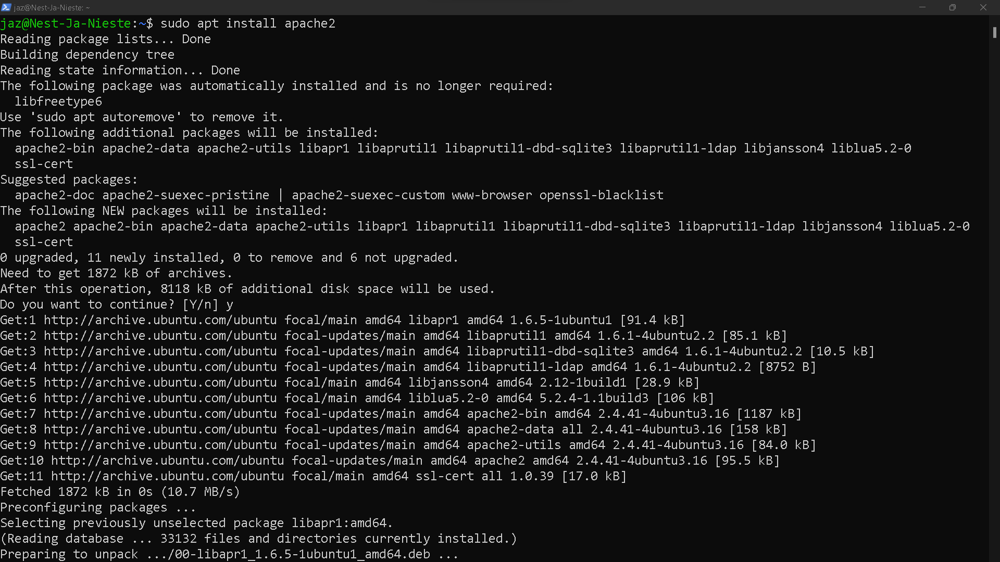

# [2/ Firewalls]

Firewalls zijn software die netwerkverkeer filteren. Een firewall kan dit verkeer filteren op protocol, poortnummer, bron en bestemming van een pakket. Meer geavanceerdere firewalls kunnen ook de inhoud inspecteren om eventuele gevaren te blokkeren.

CentOS en RHEL hebben een standaard firewall daemon (firewalld) geïnstalleerd. Voor Ubuntu is de standaard firewall ufw. Een oudere nog veel voorkomende firewall in Linux is iptables.

Firewalls kunnen stateful of stateless zijn. Stateful firewalls onthouden de verschillende states van vertrouwde actieve sessies. Hierbij hoeft een stateful firewall niet elke pakketje te scannen voor deze verbindingen.

In een cloud omgeving zal je firewalls veel tegenkomen als een van de vele verdedigingslinies tegen het publieke internet.

## Key-terms

- Firewall
  
  A firewall is an essential component of a good and secure network infrastructure. Here are some key points about firewalls:
  
  - Firewalls act as a barrier between your internal network and the internet, helping to block unauthorized access.
  - They monitor and control incoming and outgoing network traffic based on predetermined security rules.
  - Firewalls can prevent unauthorized access to your network by blocking certain ports or IP addresses.
  - They can also detect and block malicious traffic, such as malware or hacking attempts.
  - Firewalls can be implemented as hardware devices or software programs.
  - They are often configured to allow or deny specific types of traffic based on rules set by network administrators.
  - Firewalls can be customized to meet the specific security needs of your network.
  - Regular updates and patches should be applied to firewalls to ensure they are up to date with the latest security measures.
  - Firewalls are an important layer of defense in protecting your network from cyber threats.

- CentOS
  
  **CentOS** stands for Community Enterprise Operating System. Here are some key points about CentOS:
  
  - CentOS is a Linux distribution that aims to provide a free, open-source, community-supported computing platform derived from the sources of Red Hat Enterprise Linux (RHEL).
  - It is known for its stability, reliability, and long-term support, making it a popular choice for servers and enterprise environments.
  - CentOS is designed to be compatible with RHEL, which means that software packages developed for RHEL can usually run on CentOS without modification.
  - The CentOS Project is a community-driven effort that maintains and updates the CentOS operating system, ensuring security patches and updates are provided to users.
  - CentOS is widely used for web hosting, server management, and other business applications where a stable and secure operating system is required.
  - CentOS is available for free and can be downloaded and installed on servers and desktop computers.
  - CentOS follows the upstream vendor's release cycle, which means that updates are provided for a long period, typically around 10 years for major versions.
  - CentOS is known for its strong focus on stability and reliability, making it a popular choice for organizations that require a robust operating system for their infrastructure.
  
  Overall, CentOS is a powerful and versatile Linux distribution that offers a stable platform for various computing needs, especially in server environments where reliability and long-term support are crucial.

- RHEL
  
  RHEL stands for Red Hat Enterprise Linux. It is a distribution of the Linux operating system developed and maintained by Red Hat, Inc., a leading provider of open-source software solutions. RHEL is designed primarily for use in enterprise environments, offering features such as stability, security, scalability, and long-term support.
  
  Key features of Red Hat Enterprise Linux include:
  
  1. **Stability and Reliability**: RHEL is known for its stability and reliability, making it suitable for mission-critical workloads and enterprise applications.
  
  2. **Security**: Red Hat places a strong emphasis on security, providing robust security features, regular security updates, and vulnerability management to help protect systems and data.
  
  3. **Scalability**: RHEL is scalable, allowing it to run on a wide range of hardware platforms, from individual servers to large-scale data center deployments.
  
  4. **Performance**: Red Hat continually optimizes RHEL for performance, ensuring efficient resource utilization and high-performance computing capabilities.
  
  5. **Support**: Red Hat offers comprehensive support services for RHEL, including technical support, software updates, patches, and documentation, to help customers maintain and manage their RHEL deployments effectively.
  
  6. **Ecosystem**: RHEL benefits from a rich ecosystem of third-party software vendors, developers, and partners, providing a wide range of applications, tools, and services that are certified to work seamlessly with the operating system.
  
  7. **Subscription Model**: RHEL follows a subscription-based model, where customers pay for access to software updates, patches, and support services. This model provides customers with ongoing value, security, and innovation.
  
  Red Hat Enterprise Linux is widely used in industries such as finance, healthcare, government, telecommunications, and education, where reliability, security, and performance are paramount. It serves as a foundation for building enterprise IT infrastructure, running business-critical applications, and supporting modern cloud-native technologies.

- ufw
  
  UFW stands for Uncomplicated Firewall. It is a user-friendly command-line interface (CLI) firewall management tool for Linux distributions, particularly those based on Debian and Ubuntu.
  
  UFW provides a simplified way to configure and manage firewall rules without requiring in-depth knowledge of iptables, the traditional firewall administration tool on Linux systems. It aims to make firewall configuration accessible to users who may not have extensive experience with network security.
  
  Key features of UFW include:
  
  1. **Simplified Syntax**: UFW uses a straightforward syntax for configuring firewall rules, making it easy to define rules for allowing or blocking specific network traffic based on various criteria such as source and destination IP addresses, port numbers, and protocols.
  
  2. **Default Policies**: UFW allows users to set default policies for incoming, outgoing, and forwarded traffic (such as allowing all traffic by default or denying all traffic by default), simplifying the initial configuration of the firewall.
  
  3. **Application Profiles**: UFW supports application profiles, which allow users to define firewall rules based on predefined sets of rules for common services and applications, such as SSH, HTTP, HTTPS, and others.
  
  4. **Logging**: UFW can log firewall activity, providing visibility into network traffic and potential security events. Users can configure logging options to specify which types of events to log and where to store log files.
  
  5. **Integration with iptables**: Underneath its simplified interface, UFW interacts with the underlying iptables firewall mechanism, translating user-defined rules into iptables commands. This allows users to leverage the power and flexibility of iptables while benefiting from UFW's ease of use.
  
  6. **Status and Monitoring**: UFW provides commands to check the status of the firewall, view active rules, and monitor firewall activity, helping users verify that the firewall is configured correctly and functioning as intended.
  
  Overall, UFW is a valuable tool for managing firewall rules on Linux systems, offering a balance between simplicity and functionality for users who need to secure their systems and networks without delving into the complexities of iptables configuration.

- statefull firewall
  
  A **stateful firewall** is a type of firewall that keeps track of the state of active connections and uses this information to determine which network packets to allow through the firewall. Here are some key points about stateful firewalls:
  
  - Stateful firewalls monitor the state of active connections by keeping track of the source and destination IP addresses, ports, and sequence numbers of the packets.
  - They maintain a state table that records information about established connections, such as TCP handshake information, connection status, and session details.
  - Stateful firewalls can make more informed decisions about which packets to allow through based on the context of the connection, rather than just filtering based on individual packet attributes.
  - They can differentiate between legitimate incoming packets related to an established connection and potentially malicious packets that do not match any existing connection state.
  - Stateful firewalls provide an additional layer of security by inspecting packet headers and payload content to ensure that they comply with the rules and policies set by the firewall administrator.
  - Stateful inspection allows stateful firewalls to make decisions based on the entire context of a connection, helping to prevent various types of network attacks, such as spoofing, session hijacking, and denial-of-service attacks.
  - Stateful firewalls are commonly used in modern network security architectures to provide enhanced protection and improve the efficiency of traffic filtering and monitoring.
  
  Overall, stateful firewalls play a crucial role in network security by tracking the state of connections and making intelligent decisions about which network traffic to allow or block based on the context of the communication.

- stateless firewall
  
  A stateless firewall, also known as a packet-filtering firewall, is a network security device that filters incoming and outgoing network traffic based on the information contained in individual packets. This type of firewall examines each packet in isolation and makes filtering decisions based on factors such as source and destination IP addresses, port numbers, and protocol types.
  
   Characteristics of a Stateless Firewall:
  
  1. **Packet-Level Filtering**: Stateless firewalls make decisions on a per-packet basis without considering the context of the traffic flow.
  
  2. **Efficiency**: They are known for their efficiency as they can process a large volume of traffic quickly.
  
  3. **Simplicity**: These firewalls are relatively simple and easy to configure.
  
  4. **Limited Security**: They provide basic security by inspecting individual packets but may not be as effective in preventing certain types of advanced threats or attacks.
     
     Limitations of a Stateless Firewall:
  - Inability to track the state of connections, which makes them vulnerable to certain types of attacks such as IP spoofing and session hijacking.
  
  - Lack of awareness about the state of network connections, making it challenging to enforce more complex security policies.
    
    Use Cases:
  
  - Stateless firewalls are commonly used in scenarios where basic traffic filtering is required, such as at the perimeter of a network to enforce simple access control policies.
  
  - They are also used in conjunction with other security measures to provide layered protection.
  
  In summary, a stateless firewall operates at the packet level, making filtering decisions based on individual packets without considering the overall state of network connections. While they are efficient and simple, they have limitations in terms of advanced threat protection and complex security policy enforcement.

- Hardware firewall / Software Firewall
  
  Hardware and software firewalls are two types of firewall implementations that provide network security, but they differ in terms of their deployment, functionality, and management.
  
  1. **Deployment**:
     
     - **Hardware Firewall**: A hardware firewall is a physical device typically installed between a local network (LAN) and the internet connection. It is often integrated into network routers, switches, or dedicated firewall appliances.
     - **Software Firewall**: A software firewall is a piece of software installed on a computer or server to control inbound and outbound network traffic. It can run on various operating systems, including Windows, macOS, and Linux.
  
  2. **Functionality**:
     
     - **Hardware Firewall**: Hardware firewalls are designed to protect an entire network by filtering traffic as it passes through the network device. They typically offer features such as packet filtering, stateful inspection, VPN support, and intrusion prevention capabilities.
     - **Software Firewall**: Software firewalls primarily protect individual computers or devices by monitoring and controlling network traffic on the host system. They can filter traffic based on port numbers, IP addresses, and application protocols, providing a layer of defense against unauthorized access and malware.
  
  3. **Scalability and Flexibility**:
     
     - **Hardware Firewall**: Hardware firewalls are scalable and can protect multiple devices within a network simultaneously. They are suitable for larger networks with multiple users and devices.
     - **Software Firewall**: Software firewalls are more flexible and can be tailored to the specific security requirements of individual computers or servers. They can be easily deployed and managed on a per-device basis.
  
  4. **Management**:
     
     - **Hardware Firewall**: Hardware firewalls typically have dedicated management interfaces, web-based consoles, or command-line interfaces (CLIs) for configuration and monitoring. They may require specialized training or expertise to manage effectively.
     - **Software Firewall**: Software firewalls are managed through graphical user interfaces (GUIs) or command-line tools directly on the host system. They offer more granular control over firewall rules and settings and can be managed by system administrators or end-users.
  
  5. **Cost**:
     
     - **Hardware Firewall**: Hardware firewalls often involve upfront costs for purchasing the physical appliance or dedicated network device. Additionally, there may be ongoing maintenance and support fees.
     - **Software Firewall**: Software firewalls are typically more cost-effective, as they can be installed on existing hardware without requiring additional hardware purchases. They may also offer free or open-source options for basic firewall functionality.
  
  In summary, hardware firewalls provide network-wide protection and are suitable for larger networks, while software firewalls offer individual device protection and are more flexible and cost-effective for smaller environments or specific use cases. Organizations often use a combination of both hardware and software firewalls to create layered security defenses.

## Assignment

Bestudeer:

- De verschillende types firewall

- stateful / stateless

- hardware / software

Opdracht: 

- Installeer een webserver op je VM.
- Bekijk de standaardpagina die met de webserver geïnstalleerd is via je browser op je pc/laptop.
- Stel de firewall zo in dat je webverkeer blokkeert, maar wel ssh-verkeer toelaat.
- Controleer of de firewall zijn werk doet.

### Used sources

[Plaats hier de bronnen die je hebt gebruikt.]

### Encountered problems

- I needed to install Apache `sudo apt install apache2`

- I did not know how to verify apache status `sudo service apache2 status`

### Result

Bestudeer:

- De verschillende types firewall

- stateful / stateless

- hardware / software

Opdracht:

- Installeer een webserver op je VM.
  
  `sudo apt install apache2`
  
  

- Bekijk de standaardpagina die met de webserver geïnstalleerd is via je browser op je pc/laptop.

- Stel de firewall zo in dat je webverkeer blokkeert, maar wel ssh-verkeer toelaat.

- Controleer of de firewall zijn werk doet.