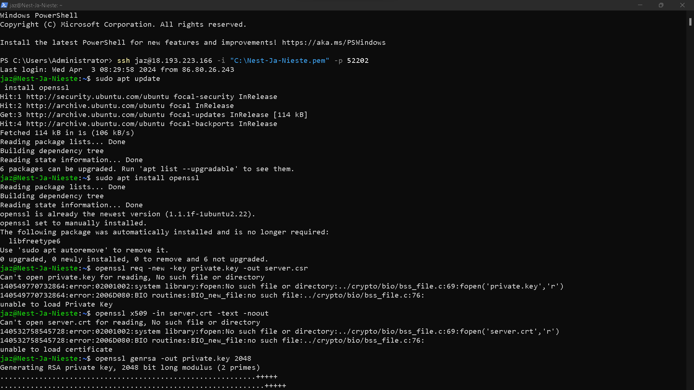
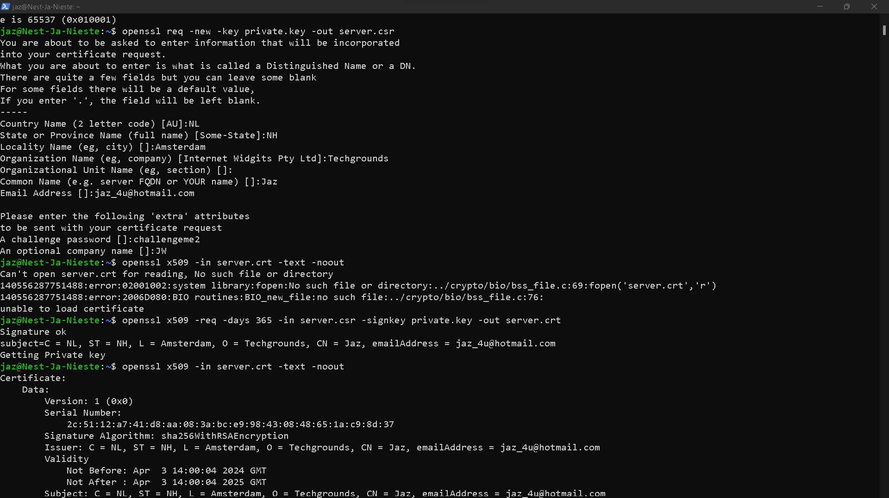
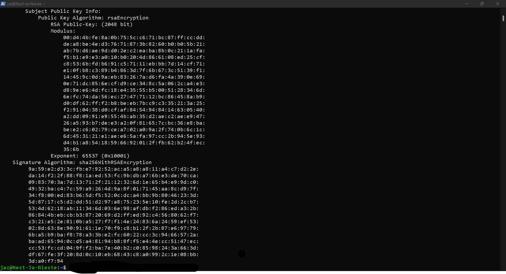
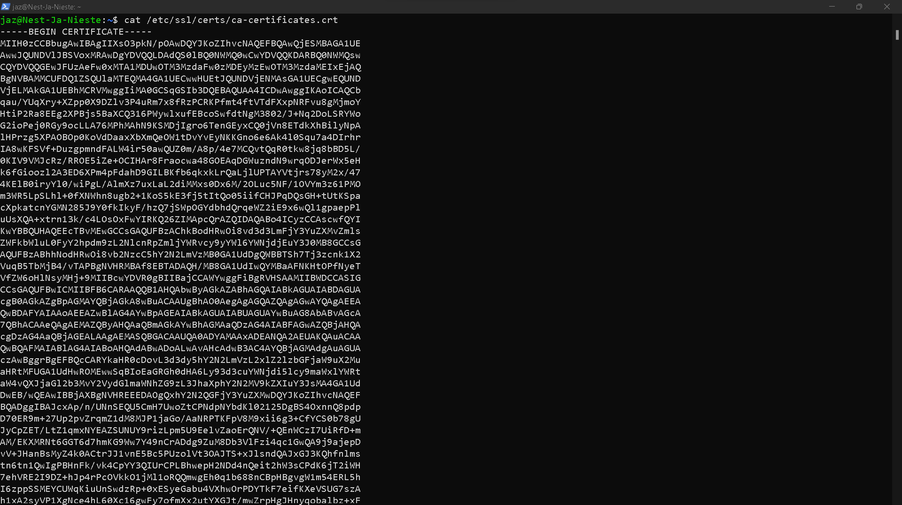
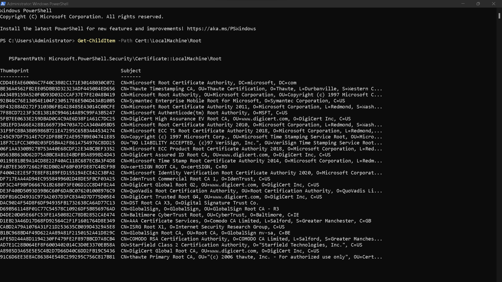

# [6/ Public key infrastructure]

Public Key Infrastructure (PKI) is a set of roles, policies, hardware, software and procedures needed to create, manage, distribute, use, store and revoke digital certificates and manage public-key encryption.

It consists of three entities that assure you can communicate securely over an insecure network like the public internet.

X.509 is the standard which defines the process in which a PKI should function. There are many ways of implementing a PKI, not all of them comply with the X.509 standard.

## Key-terms

- Public Key Infrastructure (PKI)
  
  Public Key Infrastructure (PKI) is a comprehensive system for managing digital certificates, public-key encryption, and other cryptographic services in a secure and organized manner. PKI provides the framework and protocols necessary for establishing and maintaining trust in the digital world.
  
  Key components of a PKI system include:
  
  1. **Certificate Authority (CA)**: The Certificate Authority is a trusted entity responsible for issuing digital certificates. These certificates bind public keys to entities (such as individuals, organizations, or devices) and verify their authenticity. CAs can be hierarchical, with root CAs at the top of the hierarchy, intermediate CAs below them, and end-entity CAs at the bottom.
  
  2. **Digital Certificates**: Digital certificates are electronic documents that contain information about an entity (such as its name, public key, and expiration date) and are signed by a trusted CA. They serve as a form of digital identification and are used for authentication, encryption, and digital signatures.
  
  3. **Public and Private Key Pairs**: Public and private key pairs are cryptographic keys used in asymmetric encryption systems. Public keys are included in digital certificates and are freely distributed, while private keys are kept secret and known only to the key owner.
  
  4. **Certificate Revocation**: PKI systems support mechanisms for revoking digital certificates that are no longer valid (e.g., due to compromise or expiration). Certificate Revocation Lists (CRLs) and Online Certificate Status Protocol (OCSP) are commonly used methods for checking the revocation status of certificates.
  
  5. **Certificate Policies and Practices**: PKI systems define policies and practices governing the issuance, management, and use of digital certificates. These policies ensure consistency, security, and interoperability across different PKI implementations.
  
  6. **Trust Infrastructure**: PKI relies on trust relationships between entities within the system. Trust is established through the hierarchical structure of CAs, digital signatures, and certificate validation processes.
  
  PKI is used in a wide range of applications, including secure email communication, web browsing, online transactions, virtual private networks (VPNs), and digital signatures. It enables secure and trusted interactions in the digital domain by providing mechanisms for authentication, confidentiality, integrity, and non-repudiation.

- X.509
  
  X.509 is a standard format for digital certificates defined by the International Telecommunication Union Telecommunication Standardization Sector (ITU-T). It specifies the structure and encoding rules for digital certificates used in public key infrastructure (PKI) systems.
  
  Key features of X.509 certificates include:
  
  1. **Standardized Format**: X.509 defines a standardized format for digital certificates, ensuring interoperability between different PKI implementations and systems.
  
  2. **Certificate Fields**: X.509 specifies a set of fields that can be included in a digital certificate, such as the subject name (identity of the certificate holder), issuer name (identity of the certificate authority that issued the certificate), validity period, public key, digital signature, and extensions.
  
  3. **Encoding Rules**: X.509 defines encoding rules for representing digital certificates in a compact, binary format that can be transmitted over networks and stored in digital files. The most commonly used encoding format for X.509 certificates is Abstract Syntax Notation One (ASN.1) encoded using Distinguished Encoding Rules (DER).
  
  4. **Versioning**: X.509 supports different versions of certificates, including version 1, version 2, and version 3. Each version introduces additional features and extensions to the certificate format.
  
  5. **Extensions**: X.509 allows for the inclusion of extensions in digital certificates, which provide additional information and functionality beyond the basic certificate fields. Extensions can be used to specify key usage purposes, certificate policies, subject alternative names, and other attributes.
  
  X.509 certificates are widely used in various applications, including:
  
  - **Secure Communication**: X.509 certificates are used to establish secure communication channels, such as SSL/TLS encrypted connections for web browsing, email encryption (S/MIME), and secure messaging protocols.
  
  - **Authentication**: X.509 certificates are used to authenticate users, devices, and servers in authentication protocols like SSL/TLS, SSH, and VPNs. Users present their X.509 certificates as proof of identity during the authentication process.
  
  - **Digital Signatures**: X.509 certificates are used to create and verify digital signatures, providing non-repudiation and ensuring the integrity of digital documents, transactions, and messages.
  
  Overall, X.509 plays a crucial role in standardizing the format and structure of digital certificates, enabling secure and trusted interactions in the digital domain through public key infrastructure (PKI) systems.

- Digital certificates
  
  Digital certificates are electronic documents used to authenticate the identity of individuals, organizations, or devices in the digital world. They serve as a form of digital identification, providing assurance of the entity's identity and facilitating secure communication, encryption, and digital signatures.
  
  Key components of a digital certificate include:
  
  1. **Identity Information**: Digital certificates contain information about the entity to which the certificate is issued. This information typically includes the entity's name, email address, organization name, and other identifying details.
  
  2. **Public Key**: Digital certificates include a public key that is associated with the entity's identity. This public key is used for encryption, authentication, and verifying digital signatures.
  
  3. **Issuer Information**: Digital certificates also contain information about the Certificate Authority (CA) that issued the certificate. This information includes the CA's name, digital signature, and public key, which can be used to verify the authenticity of the certificate.
  
  4. **Validity Period**: Digital certificates have a validity period, specifying the duration during which the certificate is considered valid. After the expiration date, the certificate is no longer trusted for authentication or encryption.
  
  5. **Digital Signature**: To ensure the integrity and authenticity of the certificate, it is digitally signed by the issuing CA using its private key. Recipients can verify the signature using the CA's public key to ensure that the certificate has not been tampered with or forged.
  
  Digital certificates are commonly used in various applications, including:
  
  - **Secure Communication**: Digital certificates are used to establish secure communication channels, such as SSL/TLS encrypted connections for web browsing, email encryption (S/MIME), and secure messaging protocols.
  
  - **Authentication**: Digital certificates are used to authenticate users, devices, and servers in authentication protocols like SSL/TLS, SSH, and VPNs. Users present their digital certificates as proof of identity during the authentication process.
  
  - **Digital Signatures**: Digital certificates are used to create and verify digital signatures, providing non-repudiation and ensuring the integrity of digital documents, transactions, and messages.
  
  Overall, digital certificates play a crucial role in enabling secure and trusted interactions in the digital domain by providing mechanisms for authentication, confidentiality, integrity, and non-repudiation.

## Assignment

- Create a self-signed certificate on your VM.
- Analyze some certification paths of known websites (ex. techgrounds.nl / google.com / ing.nl).
- Find the list of trusted certificate roots on your pc/laptop (bonus points if you also find it in your VM).

### Used sources

- [Online AES Encryption / Decryption | Anycript](https://anycript.com/crypto)
- [RSA Encryption, Decryption And Key Generator Online | Devglan](https://www.devglan.com/online-tools/rsa-encryption-decryption)
- 

### Encountered problems

[Geef een korte beschrijving van de problemen waar je tegenaan bent gelopen met je gevonden oplossing.]

### Result

- Create a self-signed certificate on your VM.
  
  To create a self-signed SSL certificate on an Ubuntu VM, you can use OpenSSL, which is a widely used tool for generating and managing certificates. Here's a step-by-step guide:
  
  1. **Install OpenSSL**:
     If you don't have OpenSSL installed, you can install it using the following command:
     
     
     
     `sudo apt update sudo apt install openssl`
  
  2. **Generate the Private Key**:
     Use OpenSSL to generate a private key. You can choose the key length according to your requirements. Here, we'll generate a 2048-bit key:
     
     
     
     `openssl genrsa -out private.key 2048`
  
  3. **Generate the Certificate Signing Request (CSR)**:
     Use the private key to generate a CSR. This CSR will contain the information you want to include in the certificate, such as the domain name, organization details, etc.:
     
     
     
     `openssl req -new -key private.key -out server.csr`
     
     Follow the prompts to fill in the required information.
  
  4. **Generate the Self-Signed Certificate**:
     Once you have the CSR, you can use it to generate the self-signed certificate:
     
     
     
     `openssl x509 -req -days 365 -in server.csr -signkey private.key -out server.crt`
     
     Adjust the `-days` parameter as needed to set the validity period of the certificate.
  
  5. **Verify the Certificate**:
     You can verify the contents of the certificate using the following command:
     
     
     
     `openssl x509 -in server.crt -text -noout`
     
     This will display detailed information about the certificate.
  
  Now, you have generated a self-signed SSL certificate (`server.crt`) and its corresponding private key (`private.key`). You can use these files in your web server configuration or any other application that requires SSL/TLS encryption.
  
  Remember that self-signed certificates are not trusted by default in web browsers, so you may encounter warnings when accessing a website using such a certificate. They are primarily useful for testing purposes or for internal services where you control the client configuration. For production use or public-facing websites, it's recommended to use certificates signed by a trusted Certificate Authority (CA).
  
  
  
  
  
  

- Analyze some certification paths of known websites (ex. techgrounds.nl / google.com / ing.nl).
  
  1. **techgrounds.nl**:
     When analyzing the certification path of techgrounds.nl, we typically find a chain of certificates leading back to a trusted root CA. The certification path may look something like this:
     
     - Leaf Certificate (techgrounds.nl)
     - Intermediate Certificate (Issued by a CA)
     - Root Certificate (Trusted by browsers)
     
     The leaf certificate contains the public key and domain information for techgrounds.nl, while the intermediate certificate is typically issued by a CA like Let's Encrypt, Sectigo (formerly Comodo), or another trusted CA. The root certificate belongs to the CA itself and is included in the trust store of web browsers.
  
  2. **google.com**:
     Google uses a complex certification path due to its scale and security requirements. The certification path for google.com may include multiple intermediate certificates, and it is likely to be signed by one of Google's own intermediate CAs, such as Google Trust Services. The path typically includes:
     
     - Leaf Certificate (google.com)
     - Intermediate Certificates (Issued by Google's Intermediate CAs)
     - Root Certificate (Trusted by browsers)
     
     Google's root certificates are included in most browsers' trust stores, ensuring that certificates issued by Google's intermediate CAs are trusted.
  
  3. **ing.nl**:
     ING, a large bank, also uses a sophisticated certification path to secure its website. Similar to Google, the certification path for ing.nl may include multiple intermediate certificates, and it is likely to be signed by an intermediate CA owned by ING or another trusted CA. The path might look like this:
     
     - Leaf Certificate (ing.nl)
     - Intermediate Certificates (Issued by ING's Intermediate CAs or another trusted CA)
     - Root Certificate (Trusted by browsers)
     
     ING likely operates its own intermediate CAs to issue certificates for its various web services. These intermediate certificates are then cross-signed by trusted root CAs to establish trust in web browsers.
  
  Analyzing the certification paths of these websites shows that they all rely on a chain of trust, where intermediate certificates are issued by trusted root CAs, and leaf certificates are issued by intermediate CAs. This ensures that the SSL/TLS certificates presented by these websites are trusted by web browsers.

- Find the list of trusted certificate roots on your pc/laptop (bonus points if you also find it in your VM).
  
  - On VM=
  
  `cat /etc/ssl/certs/ca-certificates.crt`
  
  
  
  - On Windows(in powershell)=
    
    `Get-ChildItem -Path Cert:\LocalMachine\Root`
    
    