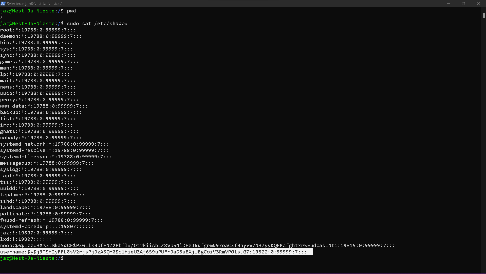

# [1/ Passwords]

In terms of factors of authentication, passwords fall into the ‘something you know’ category.

On the front-end, passwords can be guessed. This can be made harder with the following strategies:

- Not using common passwords
- Using longer passwords
- Using special characters like @,*,%, etc.
- Using a mixture of CAPITAL and small letters
- Not using easily deducible passwords like birthdates or pet names
- Using a different password for every login
- Using a passphrase

Of course, these strategies make it harder to remember your own passwords. Password managers were created to solve this problem.

On the back-end, passwords need to be stored securely. If your database (or /etc/shadow file in Linux) gets leaked or stolen, you don’t want anyone to just be able to read passwords in plaintext. This is why most stored passwords are hashed. Hackers will try to use a Rainbow Table to crack hashed passwords.

## Key-terms

- Hashing
  
  Hashing is a process used in cryptography to transform data (such as passwords or messages) into a fixed-size string of characters, typically a hexadecimal number, which represents the original data in a way that is more secure and efficient.
  
  Here's how hashing works:
  
  1. **Input**: Any data, such as a password or a message, can be used as input for the hashing algorithm.
  
  2. **Hash Function**: A hash function takes the input data and performs a series of mathematical operations on it to produce a fixed-size output, known as the hash value or hash digest.
  
  3. **Fixed Length Output**: The hash function always produces an output of fixed length, regardless of the size of the input data. For example, SHA-256 always produces a 256-bit (32-byte) hash value.
  
  4. **Deterministic**: For the same input data, a hash function always produces the same hash value. This property ensures that the hash can be used to verify data integrity or authenticate users.
  
  5. **One-Way**: Hashing is a one-way function, meaning it's computationally infeasible to reverse the process and obtain the original input data from the hash value. This property is essential for securely storing passwords, as even if the hash value is compromised, the original password cannot be easily recovered.
  
  Hashing is used in various cryptographic applications, including:
  
  - **Password Storage**: Hashing passwords before storing them in a database helps protect them from being exposed in the event of a data breach. When a user logs in, their entered password is hashed and compared with the stored hash value for authentication.
  
  - **Data Integrity**: Hashing can be used to verify the integrity of data by generating a hash value for the original data and comparing it with the hash value of the received or stored data. If the hash values match, it indicates that the data has not been tampered with.
  
  - **Digital Signatures**: Hash functions are used in digital signatures to generate a unique hash value for a message or document. The hash value is then encrypted with the sender's private key to create the digital signature, which can be verified by anyone with access to the sender's public key.
  
  Overall, hashing plays a crucial role in ensuring the security and integrity of data in various cryptographic applications.

- SHA-256 
  
  SHA-256 stands for Secure Hash Algorithm 256-bit. It's one of the cryptographic hash functions in the SHA-2 (Secure Hash Algorithm 2) family, designed by the National Security Agency (NSA) in the United States. 
  
  Here's how SHA-256 works:
  
  1. **Input**: SHA-256 takes an input message of arbitrary length and processes it in fixed-size blocks, padding the message as necessary to ensure it's a multiple of the block size.
  
  2. **Processing**: The algorithm then processes each block of the message through a series of rounds involving bitwise operations, such as bitwise AND, XOR, and rotations, along with modular additions. These operations scramble the input data in a way that produces a fixed-size output regardless of the input size.
  
  3. **Compression**: Each block is compressed into a fixed-size output known as the hash value. The compression process involves combining the current block of data with the hash value obtained from the previous block, creating a new hash value.
  
  4. **Output**: After processing all the blocks, the final hash value, typically represented as a 256-bit hexadecimal number, is produced.
  
  SHA-256 is widely used in various cryptographic applications and protocols for generating digital signatures, message authentication codes (MACs), and in password hashing. It's known for its cryptographic strength and resistance to collision attacks (where two different inputs produce the same hash output) when used properly. However, it's important to note that SHA-256 is a one-way function, meaning it's computationally infeasible to reverse the hashing process and obtain the original input from the hash value.

- bcrypt
  
  bcrypt is a password hashing function designed to be slow and computationally intensive. It's specifically designed for securely hashing passwords, with the primary goal of making brute-force attacks and dictionary attacks more difficult and time-consuming for attackers.
  
  Here are some key features of bcrypt:
  
  1. **Adaptive Work Factor**: bcrypt uses an adaptive work factor, which means the time it takes to compute the hash can be adjusted by increasing or decreasing the number of iterations performed during hashing. This work factor is denoted as a cost parameter, which determines the computational effort required to compute the hash.
  
  2. **Salted Hashes**: Similar to other secure hashing algorithms, bcrypt incorporates salts to prevent the same password from hashing to the same value. Each password hashed with bcrypt has its unique salt.
  
  3. **Resistance to Hardware Acceleration**: bcrypt is designed to be computationally intensive, which makes it resistant to brute-force attacks using hardware acceleration such as GPUs (Graphics Processing Units) and ASICs (Application-Specific Integrated Circuits).
  
  4. **Scalability**: bcrypt can be easily scaled by increasing the work factor as hardware capabilities evolve. This ensures that the computational effort required to hash passwords remains significant over time.
  
  bcrypt is widely used in various applications and frameworks to securely hash passwords, including web applications, operating systems, and database systems. It's considered one of the most secure options for hashing passwords due to its resistance to brute-force attacks and its adaptive nature, which allows it to remain effective over time as hardware capabilities improve.

- Salting
  
  Salting is a technique used in cryptography to strengthen password hashing algorithms. It involves adding a unique, randomly generated value (known as a "salt") to each password before hashing it. The salt is then stored along with the hashed password.
  
  Here's how salting works:
  
  1. **Generating a Salt**: When a user creates or updates their password, a random salt is generated. This salt is typically a long, randomly generated string of characters.
  
  2. **Combining with Password**: The salt is then concatenated (i.e., appended) to the user's password before hashing. This means that the original password is modified by adding the salt to it.
  
  3. **Hashing**: The salted password (original password + salt) is then hashed using a cryptographic hash function, such as SHA-256 or bcrypt. The resulting hash value is what's stored in the database.
  
  4. **Storing the Salt**: Both the salt and the hashed password are stored in the database. When the user attempts to log in, the salt is retrieved from the database and used along with the entered password to compute the hash for comparison with the stored hash.
  
  Salting enhances security in several ways:
  
  - **Unique Hashes**: Since each password has a unique salt, even if two users have the same password, their hashed passwords will be different due to the addition of the unique salts.
  
  - **Prevents Precomputed Tables**: Traditional rainbow table attacks are less effective against salted passwords because the attacker would need to compute a separate rainbow table for each unique salt, significantly increasing the computational effort required.
  
  - **Mitigates Dictionary Attacks**: Salted passwords make it more difficult to use precomputed dictionaries or lists of commonly used passwords because each password must be hashed individually for each salt.
  
  Overall, salting is an important security measure to protect against various password-based attacks and enhance the strength of password storage mechanisms.

- https://crackstation.net/
  
  CrackStation.net is a website that provides online tools and resources related to password cracking and security. One of its main features is a large collection of precomputed password hash tables, including rainbow tables, which are commonly used in password cracking activities. Users can search for hashes or passwords to see if they are present in the database, which can be helpful for security professionals assessing the strength of passwords or investigating potential security breaches.
  
  It's important to note that while CrackStation.net can be a valuable resource for security research and testing, its tools and services should be used responsibly and ethically. Unauthorized use of these tools for illegal activities such as hacking into accounts or systems is against the law and unethical.

- Rainbow Table
  
  A rainbow table is a precomputed table used in cryptographic attacks, particularly against password hashes. It's essentially a large database of precomputed hashes for all possible combinations of characters within a given character set and length.
  
  Here's how it works:
  
  1. **Generating Hashes**: For a given character set (like alphanumeric characters) and a maximum password length, the rainbow table generates and stores the hashes of all possible combinations of characters up to that length.
  
  2. **Lookup**: When attempting to crack a hashed password, instead of hashing each possible password attempt individually and comparing it against the target hash (which is computationally expensive), the attacker can simply look up the hashed value in the rainbow table to see if it matches any entry.
  
  3. **Reduction Function**: Since storing every hash for every possible password isn't feasible due to storage constraints, a reduction function is used to map a hash back to a potential plaintext password. This reduction function is reversible in such a way that if you provide it with the hash and the original plaintext, it should generate the same hash.
  
  While rainbow tables can significantly speed up password cracking, they have limitations. One major limitation is that they require a lot of storage space to store all the precomputed hashes, especially for large character sets and password lengths. Additionally, using techniques like salting (adding random data to passwords before hashing) and using strong hashing algorithms can mitigate the effectiveness of rainbow table attacks.

## Assignment

- Find out what hashing is and why it is preferred over symmetric encryption for storing passwords.
- Find out how a Rainbow Table can be used to crack hashed passwords.
- Below are two MD5 password hashes. One is a weak password, the other is a string of 16 randomly generated characters. Try to look up both hashes in a Rainbow Table.

**03F6D7D1D9AAE7160C05F71CE485AD31**

**03D086C9B98F90D628F2D1BD84CFA6CA**

- Create a new user in Linux with the password 12345. Look up the hash in a Rainbow Table.
- Despite the bad password, and the fact that Linux uses common hashing algorithms, you won’t get a match in the Rainbow Table. This is because the password is salted. To understand how salting works, find a peer who has the same password in /etc/shadow, and compare hashes.

### Used sources

- [https://crackstation.net/](https://crackstation.net/)

### Encountered problems

[Geef een korte beschrijving van de problemen waar je tegenaan bent gelopen met je gevonden oplossing.]

# Result

- Find out what hashing is and why it is preferred over symmetric encryption for storing passwords.
  
  - Hashing is a process of converting input data (such as a password) into a fixed-length string of characters, typically represented in hexadecimal format. The output of a hashing algorithm, known as a hash value or hash code, is unique to the input data. Even a slight change in the input data should result in a drastically different hash value.
  
  Here's why hashing is preferred over symmetric encryption for storing passwords:
1. **One-way Function**: Hashing is a one-way function, meaning that once data is hashed, it's computationally infeasible to reverse the process and obtain the original input. This property is crucial for securely storing passwords because even if an attacker gains access to the hashed passwords, they shouldn't be able to easily determine the original passwords.

2. **No Key Management**: Hashing doesn't require the use of keys for encryption and decryption, unlike symmetric encryption. This eliminates the need for managing and securing encryption keys, which can be a significant challenge in large-scale systems.

3. **Deterministic Output**: Hashing algorithms produce deterministic output for the same input. This means that the same password will always result in the same hash value, allowing for consistent password verification during authentication.

4. **Resistance to Brute Force Attacks**: A properly implemented hashing algorithm should be resistant to brute force attacks, where an attacker tries different inputs to find a matching hash value. A strong hashing algorithm increases the computational effort required to reverse engineer the original password from its hash.

5. **Salting**: Hashing allows for the use of salts, which are random values added to passwords before hashing. Salting helps mitigate attacks such as rainbow table attacks, where precomputed hash values for common passwords are used to quickly find matches. Each salted password produces a unique hash value, even if the passwords are the same, making rainbow table attacks ineffective.

6. **Performance**: Hashing algorithms are typically designed for fast computation, making them suitable for password hashing operations even in high-traffic systems.
   
   In summary, hashing is preferred over symmetric encryption for storing passwords because it provides irreversible, one-way transformation, doesn't require key management, offers resistance to brute force attacks, supports the use of salts for added security, and offers good performance characteristics.
- Find out how a Rainbow Table can be used to crack hashed passwords.
  
  - A rainbow table is a precomputed table used in password cracking to reverse hash functions and discover the original plaintext passwords. Here's how a rainbow table attack works:
    
    1. **Generating Hashes**: Attackers first create a large database of precomputed hash values for a wide range of possible passwords. This database is known as a rainbow table. To generate this table, the attacker selects a set of commonly used passwords or generates passwords using specific rules (e.g., dictionary words, combinations of characters).
    
    2. **Hashing**: Each password in the selected set is hashed using a chosen hash function (e.g., MD5, SHA-1, SHA-256). The resulting hash values are stored in the rainbow table along with their corresponding plaintext passwords.
    
    3. **Lookup Table**: The rainbow table is then used as a lookup table during the attack. When an attacker gains access to a hashed password, they simply look up the hash value in the rainbow table to find the corresponding plaintext password.
    
    4. **Comparing Hashes**: If the hash value of the stolen password matches any hash value in the rainbow table, the attacker can immediately identify the corresponding plaintext password. This allows them to access the victim's account without having to perform the computationally intensive process of brute-forcing the password.
    
    5. **Limitations and Countermeasures**:
       
       - Rainbow tables are effective against weak passwords or poorly salted passwords. However, they are less effective against strong passwords or passwords that are salted properly.
       - To mitigate rainbow table attacks, security measures such as salting and the use of strong, slow hashing algorithms (e.g., bcrypt, scrypt, Argon2) are recommended. Salting ensures that each password has a unique hash value, even if multiple users have the same password. Slow hashing algorithms increase the computational effort required to generate rainbow tables, making them less practical for attackers.
       - Additionally, using unique, complex passwords that are resistant to dictionary attacks and regularly updating passwords can further enhance security and mitigate the risk of rainbow table attacks.
    
    In summary, a rainbow table attack exploits precomputed hash values to quickly crack hashed passwords, emphasizing the importance of using strong passwords, proper salting, and secure hashing algorithms to protect against such attacks.

- Below are two MD5 password hashes. One is a weak password, the other is a string of 16 randomly generated characters. Try to look up both hashes in a Rainbow Table.
  
  - **03F6D7D1D9AAE7160C05F71CE485AD31**
  
  - | Hash                             | Type | Result    |
    | -------------------------------- | ---- | --------- |
    | 03F6D7D1D9AAE7160C05F71CE485AD31 | md5  | welldone! |
  
  - **03D086C9B98F90D628F2D1BD84CFA6CA**
  
  - I can' t unhash this password , unfortunately

- Create a new user in Linux with the password 12345. Look up the hash in a Rainbow Table.
  
  - `sudo adduser username` created "username" and gave it the password "12345" with  `sudo passwd username` 
  
  

- Despite the bad password, and the fact that Linux uses common hashing algorithms, you won’t get a match in the Rainbow Table. This is because the password is salted. To understand how salting works, find a peer who has the same password in /etc/shadow, and compare hashes.
  
  - Elmaries UNsalted "12345"=
    5994471abb01112afcc18159f6cc74b4f511b99806da59b3caf5a9c173cacfc5
  
  - Elmaries SALTED "12345"=
    
    $6$YjzF1BnV.XVCND77$Prbln1r4cnUxfMSPj.wtWN7.GFB7/3S0o2xAS5r3.qc9HsJYipLbTx/qBf6Fqs374HbH8EQAEwmrVV0LNocNn1:19821:0:99999:7:::
  
  - Shays salted "12345"= $6$M4ArJDmkUYKZd5zi$rCsls/VCM9dYCJSOathSO6Z5MkU4QFQURsA6gHe94FF9vz3U.QVVPT5l7M4R5Ol/OAn/3sYXgXTH/WyWTY5Q41:19821:0:99999:7:::
  
  - my salted password (of  useraccount "username") 12345 is salted like this (as seen in /etc/shadow): 
    
    username:$y$j9T$H2yFFL8sV2rjsPjJzA6QY0$olHieUZAj6S9uPUFrJaO8aEXjUEgCoiV3RmVP01s.G7:19822:0:99999:7:::