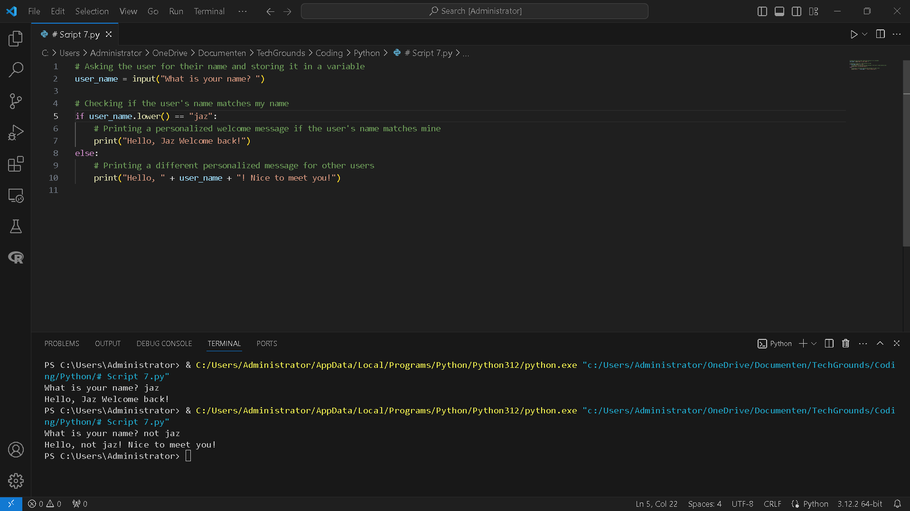
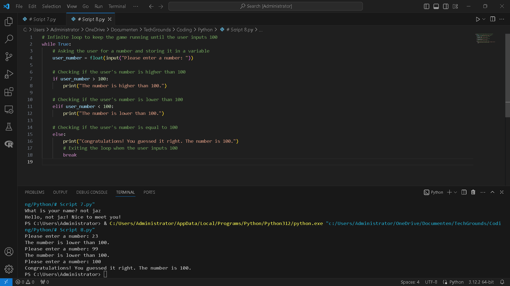

# [7/ Conditions]

Very often, you will want to run a piece of code only when certain conditions are met. For example, you might want to write something to an error log only if the reply you receive from a server contains an error.Python makes use of the *if*, *elif*, and *else* statements.

## Key-terms

[Schrijf hier een lijst met belangrijke termen met eventueel een korte uitleg.]

## Assignment

Exercise 1:

- Create a new script.
- Use the input() function to ask the user of your script for their name. If the name they input is your name, print a personalized welcome message. If not, print a different personalized message.  
  Example output:


 Exercise 2:

- Create a new script.
- Ask the user of your script for a number. Give them a response based on whether the number is higher than, lower than, or equal to 100.  
  Example output:


- Make the game repeat until the user inputs 100.

### Used sources

[Plaats hier de bronnen die je hebt gebruikt.]

### Encountered problems

[Geef een korte beschrijving van de problemen waar je tegenaan bent gelopen met je gevonden oplossing.]

### Result

Exercise 1:

- Create a new script.
- Use the input() function to ask the user of your script for their name. If the name they input is your name, print a personalized welcome message. If not, print a different personalized message.  
  Example output:


      -  My script: In this script, the `input()` function prompts the user to enter their name, which is stored in the variable `user_name`. Then, it checks if the user's name matches "jaz" (case-insensitive). If it does, a personalized welcome message is printed. If not, a different personalized message is printed addressing the user by their name.

```
#user_name = input("What is your name? ")

# Checking if the user's name matches my name

if user_name.lower() == "jaz":

    # Printing a personalized welcome message if the user's name matches mine

    print("Hello, Jaz Welcome back!")

else:

    # Printing a different personalized message for other users

    print("Hello, " + user_name + "! Nice to meet you!")
    ```



 Exercise 2:

- Create a new script.
- Ask the user of your script for a number. Give them a response based on whether the number is higher than, lower than, or equal to 100.  
  Example output:


- Make the game repeat until the user inputs 100.

  - My script : In this script, an infinite loop is used to keep the game running until the user inputs 100. Inside the loop, the user is asked to input a number, which is stored in the variable `user_number`. Then, the script checks if the user's number is higher than, lower than, or equal to 100, and provides an appropriate response. If the user inputs 100, a congratulatory message is printed, and the loop breaks, ending the game.
```

- Exercise 2:

- Ask the user of your script for a number. Give them a response based on whether the number is higher than, lower than, or equal to 100.  
  Example output:


- Make the game repeat until the user inputs 100. 
  
    

```
# Infinite loop to keep the game running until the user inputs 100

while True:
# Asking the user for a number and storing it in a variable

    user_number = float(input("Please enter a number: "))

    # Checking if the user's number is higher than 100

    if user_number > 100:

        print("The number is higher than 100.")

    # Checking if the user's number is lower than 100

    elif user_number < 100:

        print("The number is lower than 100.")

    # Checking if the user's number is equal to 100

    else:

        print("Congratulations! You guessed it right. The number is 100.")

        # Exiting the loop when the user inputs 100

        break
```

 