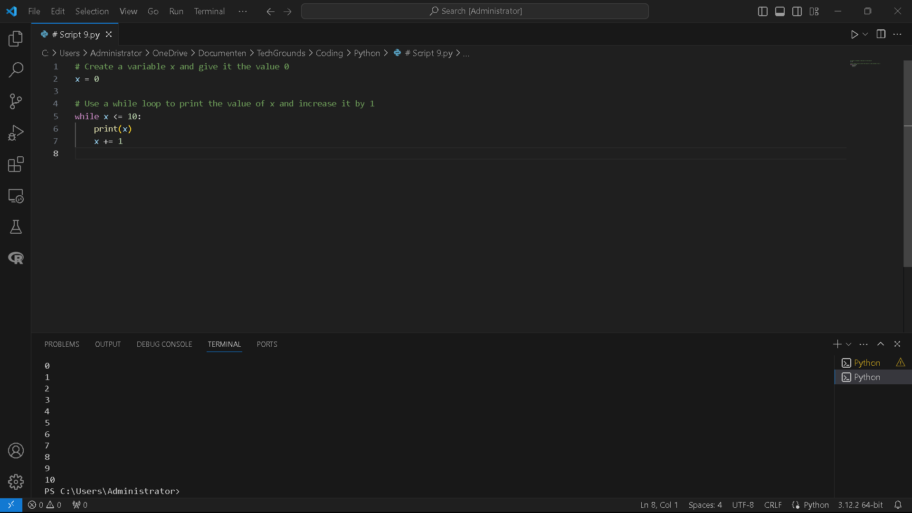
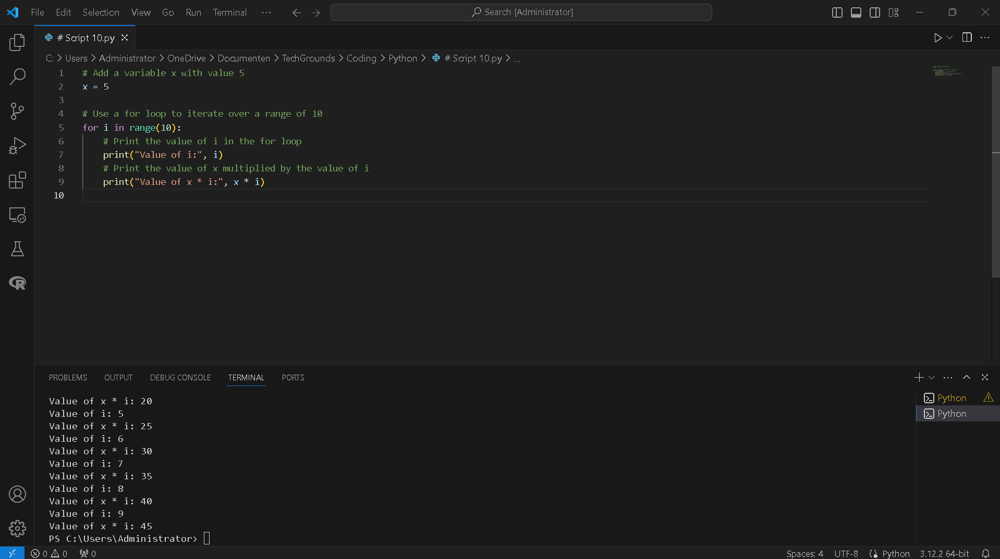
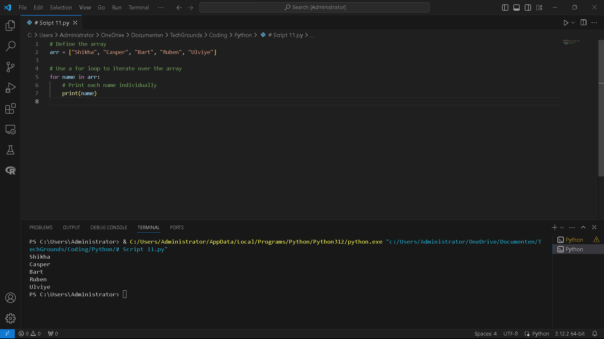

# [1/ Loops]

You can use loops when you want to run a block of code multiple times. For example, you might want to do an operation on every item in a (large) list, or you want to write an algorithm that follows the same set of instructions for multiple iterations.

There are two types of loops in Python: the *while* loop and the *for* loop.The *while* loop runs while a condition is true. They can run indefinitely if that condition never changes. If your code is stuck in an infinite loop, just press ctrl-c (or command-c on MacOS) to force quit the running code.The *for* loop runs for a predetermined number of iterations. This number can be hard coded using the *range()* function, or dynamically assigned (using a variable, the size of a list, or the number of lines in a document). It is also possible to accidentally create an infinite *for* loop. You can use the same command (ctrl/cmd+c) to exit your program.

## Key-terms

- **Loop**: A loop in Python allows you to repeatedly execute a block of code. Common types of loops include `for` loops and `while` loops.

- **IF**: The `if` statement in Python is used for conditional execution. It allows you to execute a block of code if a certain condition is true.

- **WHILE**: The `while` loop in Python is used to repeatedly execute a block of code as long as a specified condition is true.

- **FOR**: The `for` loop in Python is used to iterate over a sequence (such as a list, tuple, or string) or other iterable objects.

- **Algorithm**: In Python, an algorithm is a step-by-step procedure or a set of rules for solving a particular problem, often expressed in the form of functions or methods.

- **Array**: While Python does not have built-in support for arrays in the traditional sense, it has lists which are similar to arrays. Lists can hold multiple items of any data type in a single variable.

- **RANGE**: `range()` is a Python built-in function used to generate a sequence of numbers. It's often used with loops, particularly `for` loops, to iterate a specific number of times.

- **Variable**: In Python, a variable is a name that refers to a value. Variables can be assigned different values throughout the execution of a program. Python is dynamically typed, meaning you don't need to declare the type of a variable before using it.

- **Iterate**: In Python, iteration refers to the process of repeatedly executing a block of code or performing a set of operations on each item in a sequence, such as a list, tuple, dictionary, or string. Iteration allows you to go through each element of the sequence one by one, performing some action or checking some condition on each iteration.

- **String**: A string is a sequence of characters enclosed within either single quotes (''), double quotes ("), or triple quotes (''' or """). Strings are immutable, meaning they cannot be changed once created.

- **Tuple**: A tuple is an ordered collection of elements enclosed within parentheses (). Tuples are immutable, like strings, but can contain elements of different data types.

- **Sequence**: In Python, a sequence is an ordered collection of elements. Strings, lists, and tuples are examples of sequences. Sequences support various operations like indexing, slicing, and iteration.

- **Dictionary**: A dictionary is an unordered collection of key-value pairs enclosed within curly braces {}. Each key-value pair maps the key to its corresponding value. Dictionaries are mutable and can store elements of different data types.

- **Object**: Everything in Python is an object, including integers, strings, lists, functions, and classes. Objects have attributes (characteristics) and methods (functions associated with the object).

- **Script**: In Python, a script refers to a file containing Python code that can be executed. Scripts are typically used to perform specific tasks or implement functionalities.

- **Console**: The console refers to the interactive command-line interface where you can type Python code and see the results immediately. It's commonly used for testing snippets of code, debugging, or executing Python scripts directly.

- **Print Statement**: The `print()` statement in Python is used to display output on the screen or console. It can be used to print strings, variables, expressions, or a combination of these. In Python 2.x, `print` was a statement, while in Python 3.x, it's a function.
  
  Example:`print("Hello, World!")`

- **Expression**: An expression is a combination of values, variables, operators, and function calls that evaluates to a single value. Expressions can be simple, like `2 + 2`, or complex, involving multiple operators and function calls.
  
  Example:`x = 5 y = 2 result = x + y * 3`

- **Function**: A function is a block of reusable code that performs a specific task. Functions take input arguments, perform operations, and return a result. In Python, functions are defined using the `def` keyword.
  
  Example:`def add(a, b):     return a + b`

- **Statement**: A statement is a complete instruction that the Python interpreter can execute. Python supports several types of statements, including assignment statements, conditional statements, loop statements, and import statements. Statements typically end with a newline character, but they can also be terminated with a semicolon `;`.
  
  Example:`x = 5  # Assignment statement if x > 0:  # Conditional statement     print("Positive")  # Statement within the if block`

## Assignment

Exercise 1:

- Create a new script.
- Create a variable x and give it the value 0.
- Use a while loop to print the value of x in every iteration of the loop. After printing, the value of x should increase by 1. The loop should run as long as x is smaller than or equal to 10.Example output:


 Exercise 2:

- Create a new script.
- Copy the code below into your script.

`   for i in range(10):   # do something here   `

- Print the value of i in the for loop. You did not manually assign a value to i. Figure out how its value is determined.
- Add a variable x with value 5 at the top of your script.
- Using the for loop, print the value of x multiplied by the value of i, for up to 50 iterations.

 Exercise 3:

- Create a new script.
- Copy the array below into your script.

> `   arr = ["Shikha", "Casper", "Bart", "Ruben", "Ulviye"]   `

- Use a for loop to loop over the array. Print every name individually.  

### Used sources

[Plaats hier de bronnen die je hebt gebruikt.]

### Encountered problems

[Geef een korte beschrijving van de problemen waar je tegenaan bent gelopen met je gevonden oplossing.]

# Result

Exercise 1:

- Create a new script.
- Create a variable x and give it the value 0.
- Use a while loop to print the value of x in every iteration of the loop. After printing, the value of x should increase by 1. The loop should run as long as x is smaller than or equal to 10.Example output:


```
# Create a variable x and give it the value 0

x = 0

# Use a while loop to print the value of x and increase it by 1

while x <= 10:
    print(x)
    x += 1
```



 Exercise 2:

- Create a new script.
- Copy the code below into your script.

`for i in range(10): # do something here`

- Print the value of i in the for loop. You did not manually assign a value to i. Figure out how its value is determined.

- Add a variable x with value 5 at the top of your script.

- Using the for loop, print the value of x multiplied by the value of i, for up to 50 iterations.
  
  ```
  # Add a variable x with value 5
  x = 5
  
  # Use a for loop to iterate over a range of 10
  for i in range(10):
      # Print the value of i in the for loop
      print("Value of i:", i)
      # Print the value of x multiplied by the value of i
      print("Value of x * i:", x * i)
  ```
  
  In this script, the `for` loop iterates over a range of numbers from 0 to 9 (inclusive). The variable `i` is automatically assigned each value from the range in each iteration of the loop. Then, the value of `x` is multiplied by the current value of `i`, and the result is printed.
  
  

 Exercise 3:

- Create a new script.
- Copy the array below into your script.

> `arr = ["Shikha", "Casper", "Bart", "Ruben", "Ulviye"]`

- Use a for loop to loop over the array. Print every name individually.
  
  ```
  # Define the array
  arr = ["Shikha", "Casper", "Bart", "Ruben", "Ulviye"]
  
  # Use a for loop to iterate over the array
  for name in arr:
      # Print each name individually
      print(name)
  ```

