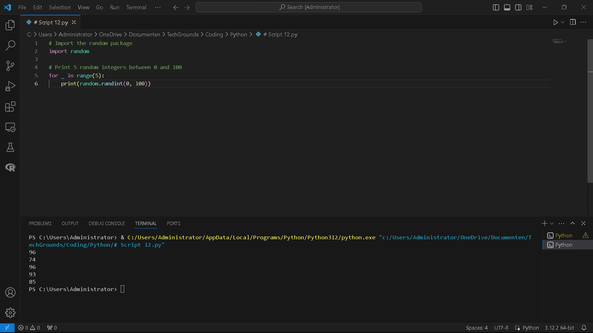
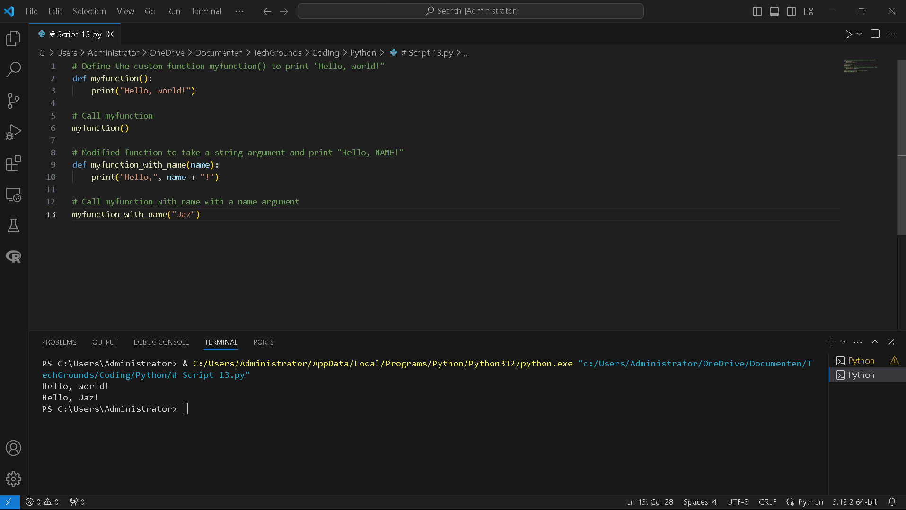
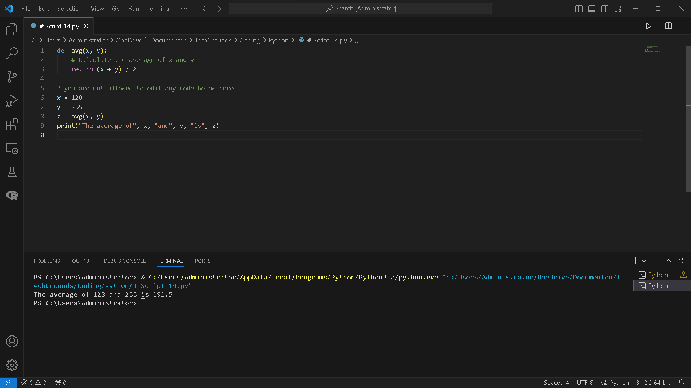

# [2/ Functions]

You’ve already seen and used a couple of functions, like *print()* and *input()*. A function is a block of code that only runs when it is called. Functions are recognizable by the brackets *()* next to the function name. These brackets serve as a place to input data into a function.Functions return data as a result.

Besides the built-in functions, you can also write custom functions, or import functions from a library or package.

## Key-terms

[Schrijf hier een lijst met belangrijke termen met eventueel een korte uitleg.]

## Assignment

Exercise 1:

- Create a new script.
- Import the random package.
- Print 5 random integers with a value between 0 and 100.  
  Example output:


 Exercise 2:

- Create a new script.
- Write a custom function myfunction() that prints “Hello, world!” to the terminal. Call myfunction.
- Rewrite your function so that it takes a string as an argument. Then, it should print “Hello, NAME!”.  
  Example output:


Image label

 Exercise 3:

- Create a new script.

Copy the code below into your script.

`   def avg():   # write your code here   # you are not allowed to edit any code below here      x = 128   y = 255   z = avg(x,y)      print("The average of",x,"and",y,"is",z)   `

- Write the custom function avg() so that it returns the average of the given parameters. You are not allowed to edit any code below the second comment.

### Used sources

[Plaats hier de bronnen die je hebt gebruikt.]

### Encountered problems

[Geef een korte beschrijving van de problemen waar je tegenaan bent gelopen met je gevonden oplossing.]

# Result

Exercise 1:

- Create a new script.
- Import the random package.
- Print 5 random integers with a value between 0 and 100.  
  Example output:


```
# Import the random package
import random

# Print 5 random integers between 0 and 100
for _ in range(5):
    print(random.randint(0, 100))
```



This script will generate and print 5 random integers, each between 0 and 100.

 Exercise 2:

- Create a new script.
- Write a custom function myfunction() that prints “Hello, world!” to the terminal. Call myfunction.
- Rewrite your function so that it takes a string as an argument. Then, it should print “Hello, NAME!”.  
  Example output:


```
# Define the custom function myfunction() to print "Hello, world!"
def myfunction():
    print("Hello, world!")

# Call myfunction
myfunction()

# Modified function to take a string argument and print "Hello, NAME!"
def myfunction_with_name(name):
    print("Hello,", name + "!")

# Call myfunction_with_name with a name argument
myfunction_with_name("Jaz")
```

The first part of the script calls `myfunction()`, which prints "Hello, world!" to the terminal. The second part defines a modified function `myfunction_with_name()` that takes a string argument `name` and prints "Hello, NAME!" using the provided name. Finally, it calls `myfunction_with_name("Jaz")` as an example.



 Exercise 3:

- Create a new script.

Copy the code below into your script.

`   def avg():   # write your code here   # you are not allowed to edit any code below here      x = 128   y = 255   z = avg(x,y)      print("The average of",x,"and",y,"is",z)   `

- Write the custom function avg() so that it returns the average of the given parameters. You are not allowed to edit any code below the second comment.
  
  ```
  def avg(x, y):
      # Calculate the average of x and y
      return (x + y) / 2
  
  # you are not allowed to edit any code below here
  x = 128
  y = 255
  z = avg(x, y)
  print("The average of", x, "and", y, "is", z)
  ```
  
  In this script, the avg() function takes two parameters x and y, calculates their average (x + y) / 2, and returns the result. The rest of the code remains unchanged, as per your instructions.

