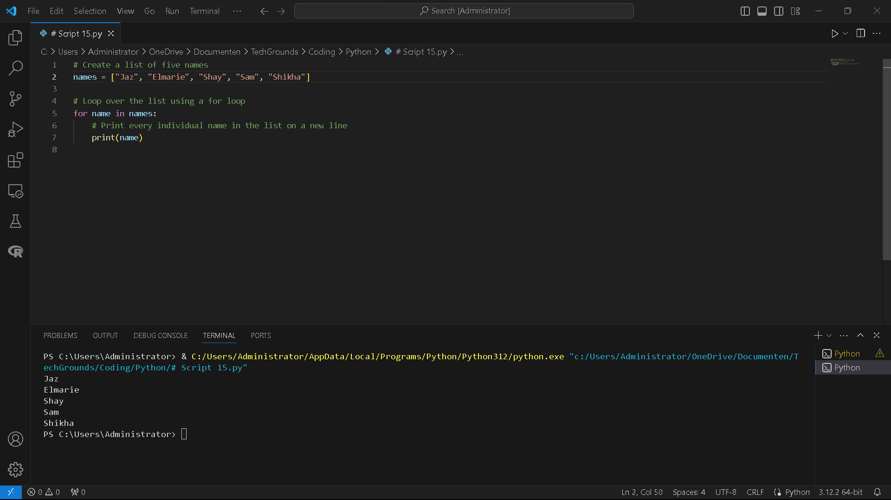
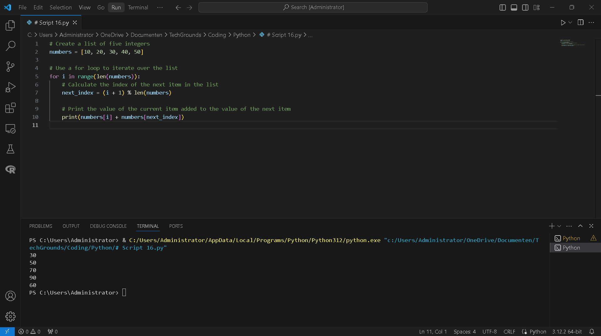

# [3/ Lists]

You can declare a list of values in a single variable. A list is represented by square brackets [ ], and each value is separated by a comma.

Each position in a list has a number associated with it called the index. Indexes start at 0, so the first item in a list will have the index 0. The second item will have index 1, etc. You can call individual items in a list by calling its index.

You can loop over a list using a for loop. Instead of a number within a range, *i* (or whatever you name the variable you declare) will have the value of an item in the list. You can still use range() to loop over a list. In this case, *i* will be used to call an index in a list.

## Key-terms

- **len**: `len()` is a built-in function used to determine the length of a sequence or collection, such as a string, list, tuple, or dictionary. It returns the number of items in the specified sequence.
  
  Example:
  
  `my_list = [1, 2, 3, 4, 5] length = len(my_list)`

- **next**: `next()` is a built-in function used with iterators to get the next item from the iterator. When called, it returns the next element from the iterator.
  
  Example:
  
  `my_iterator = iter([1, 2, 3]) next_element = next(my_iterator)`

- **index**: In Python, `index` typically refers to the position of an element in a sequence. For example, the index of the first element in a list is 0, the index of the second element is 1, and so on. You can use the `index()` method to find the index of a specific element in a sequence.
  
  Example:
  
  `my_list = ['a', 'b', 'c', 'd'] index_of_c = my_list.index('c')`

- **Square Brackets [ ]**: In Python, square brackets are used for various purposes, including:
  
  - Creating lists: `[1, 2, 3]`
  - Accessing elements of a sequence: `my_list[0]`
  - Slicing sequences: `my_list[1:3]`
  - List comprehensions: `[x**2 for x in range(5)]`

- **i**: In Python, `i` is often used as a variable name, especially as a loop counter or iterator variable. It's a common convention to use `i`, `j`, `k`, etc., as loop counters in `for` loops, especially when iterating over a range of numbers.
  
  Example:
  
  `for i in range(5):     print(i)`

## Assignment

Exercise 1:

- Create a new script.
- Create a variable that contains a list of five names.
- Loop over the list using a for loop. Print every individual name in the list on a new line.  
  Example output:


 Exercise 2:

- Create a new script.

- Create a list of five integers.

- Use a for loop to do the following for every item in the list:

- Print the value of that item added to the value of the next item in the list.

- If it is the last item, add it to the value of the first item instead (since there is no next item).  
  Example output:


The first result above is created by adding 9 and 80. The second result is created by adding 80 and 16, etc. The last result is created by adding 35 and 9.

### Used sources

[Plaats hier de bronnen die je hebt gebruikt.]

### Encountered problems

[Geef een korte beschrijving van de problemen waar je tegenaan bent gelopen met je gevonden oplossing.]

### Result

Exercise 1:

- Create a new script.
- Create a variable that contains a list of five names.
- Loop over the list using a for loop. Print every individual name in the list on a new line.  
  Example output:


```
# Create a list of five names
names = ["Jaz", "Elmarie", "Shay", "Sam", "Shikha"]

# Loop over the list using a for loop
for name in names:
    # Print every individual name in the list on a new line
    print(name)
```



 Exercise 2:

- Create a new script.

- Create a list of five integers.

- Use a for loop to do the following for every item in the list:

- Print the value of that item added to the value of the next item in the list.

- If it is the last item, add it to the value of the first item instead (since there is no next item).  
  Example output:


The first result above is created by adding 9 and 80. The second result is created by adding 80 and 16, etc. The last result is created by adding 35 and 9.

Result of excercise 2:

- We create a list of five integers named `numbers`.
- We use a for loop to iterate over the indices of the list using `range(len(numbers))`.
- For each index `i`, we calculate the index of the next item in the list using `(i + 1) % len(numbers)`. This ensures that when we reach the last item in the list, it wraps around to the first item.
- We print the sum of the current item and the next item using `numbers[i] + numbers[next_index]`.

```
# Create a list of five integers
numbers = [10, 20, 30, 40, 50]

# Use a for loop to iterate over the list
for i in range(len(numbers)):
    # Calculate the index of the next item in the list
    next_index = (i + 1) % len(numbers)

    # Print the value of the current item added to the value of the next item
    print(numbers[i] + numbers[next_index])
```

