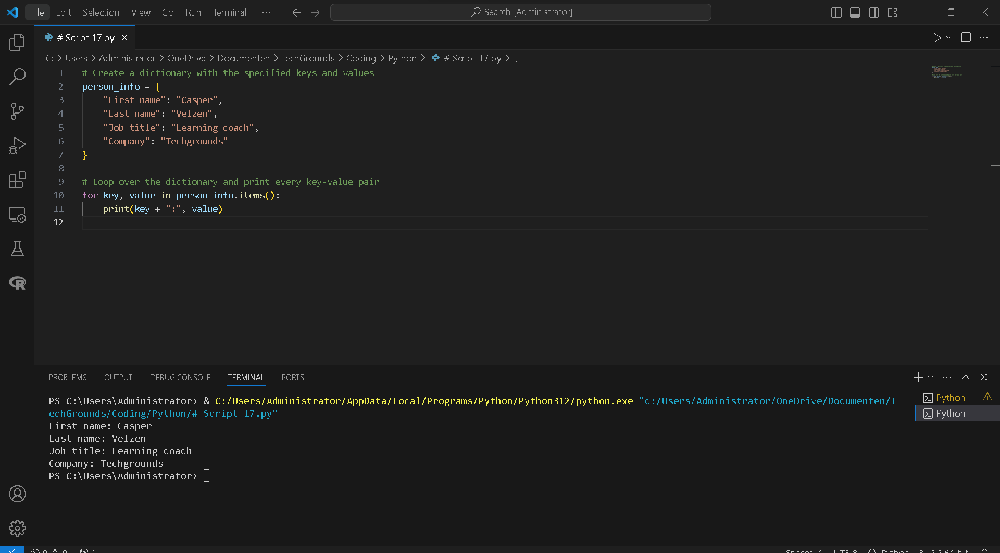
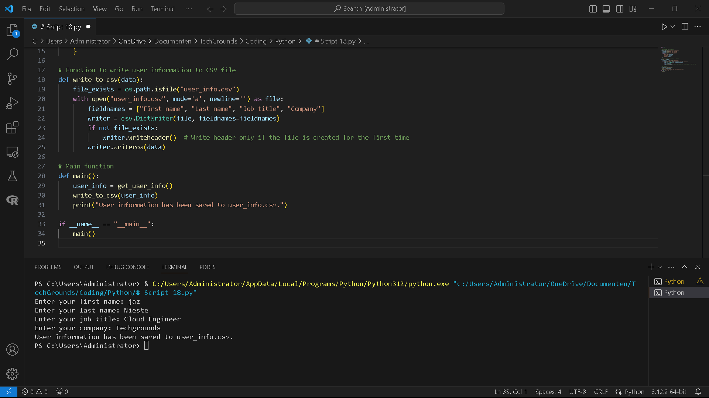

# [4/ Key-value pairs]

Key-value pairs are a general concept you will definitely encounter. Some examples of where you will find them are NoSQL databases or AWS/Azure resource tags. Dictionaries (dict) in Python also use key-value pairs to store information. Dicts in Python are written using curly brackets {}. You can get values from the dict by calling its key.

## Key-terms

- **Key-value pairs**: Key-value pairs are a fundamental data structure where each key is associated with a corresponding value. In Python, dictionaries (`dict`) are used to store key-value pairs, where keys are unique and immutable and values can be of any data type.
  
  Example:
  
  `my_dict = {'name': 'John', 'age': 30}`

- **NoSQL databases**: NoSQL databases are non-relational databases that provide a mechanism for storage and retrieval of data modeled in ways other than the tabular relations used in relational databases. Python has various libraries and frameworks for interacting with NoSQL databases, such as MongoDB, CouchDB, Redis, etc.

- **AWS/Azure resource tags**: AWS (Amazon Web Services) and Azure (Microsoft Azure) are cloud computing platforms that allow users to tag resources with metadata for organization, cost tracking, access control, and automation. Tags are key-value pairs associated with AWS or Azure resources.

- **Dictionaries (dict)**: A dictionary in Python is an unordered collection of key-value pairs enclosed within curly braces {}. Dictionaries are mutable, and the keys must be unique and immutable.
  
  Example:
  
  `my_dict = {'name': 'John', 'age': 30}`

- **Curly Brackets {}**: In Python, curly brackets are used to define dictionaries, sets, and also for dictionary and set comprehensions.

- **CSV file (Comma-Separated Values)**: A CSV file is a plain text file that stores tabular data in a plain text format, with each line representing a row and fields separated by commas. Python has built-in support for reading and writing CSV files using the `csv` module.

- **Import**: The `import` statement in Python is used to import modules or specific objects (functions, classes, variables) from modules into the current namespace. It allows you to reuse code from other Python files or libraries.
  
  Example:
  
  `import math`

- **Subsequent runs**: Subsequent runs refer to running a Python script or program multiple times, typically after making modifications or updates. Each run of the program starts fresh, and any changes made during previous runs are not retained unless explicitly saved or persisted.

- **def main()**: `def main()` is a common convention in Python for defining the entry point of a script or program. It typically contains the main logic of the program and is executed when the script is run.
  
  Example:
  
  `def main():     print("Hello, World!")  if __name__ == "__main__":     main()`

- **with**: The `with` statement in Python is used to simplify exception handling and resource management by ensuring that certain operations are properly cleaned up, even if exceptions occur. It's commonly used with file I/O operations to automatically close files after they are no longer needed.

- **open**: The `open()` function in Python is used to open files for reading, writing, or appending data. It returns a file object that provides methods and attributes for accessing and manipulating the file's contents.

## Assignment

Exercise 1:

- Create a new script.
- Create a dictionary with the following keys and values:

| **Key**    | **Value**      |
| ---------- | -------------- |
| First name | Casper         |
| Last name  | Velzen         |
| Job title  | Learning coach |
| Company    | Techgrounds    |

- Loop over the dictionary and print every key-value pair in the terminal.

 Exercise 2:

- Create a new script.
- Use user input to ask for their information (first name, last name, job title, company). Store the information in a dictionary.
- Write the information to a csv file (comma-separated values). The data should not be overwritten when you run the script multiple times.

### Used sources

[Plaats hier de bronnen die je hebt gebruikt.]

### Encountered problems

[Geef een korte beschrijving van de problemen waar je tegenaan bent gelopen met je gevonden oplossing.]

### Result

Exercise 1:

- Create a new script.
- Create a dictionary with the following keys and values:

| **Key**    | **Value**      |
| ---------- | -------------- |
| First name | Casper         |
| Last name  | Velzen         |
| Job title  | Learning coach |
| Company    | Techgrounds    |

- Loop over the dictionary and print every key-value pair in the terminal.
  
  Result of excercise 1:
  
  This script will output each key-value pair in the `person_info` dictionary in the terminal.

```
# Create a dictionary with the specified keys and values
person_info = {
    "First name": "Casper",
    "Last name": "Velzen",
    "Job title": "Learning coach",
    "Company": "Techgrounds"
}

# Loop over the dictionary and print every key-value pair
for key, value in person_info.items():
    print(key + ":", value)
```

  

 Exercise 2:

- Create a new script.

- Use user input to ask for their information (first name, last name, job title, company). Store the information in a dictionary.

- Write the information to a csv file (comma-separated values). The data should not be overwritten when you run the script multiple times.
  
  Result of Excercise 2:
  
  This script first defines two functions: `get_user_info()` to collect user information and `write_to_csv()` to append this information to a CSV file. The `main()` function orchestrates these actions. Each time you run the script, it prompts the user for their information, appends it to the CSV file, and prints a confirmation message. The CSV file is created if it doesn't exist, and subsequent runs of the script will append new entries without overwriting existing data.

```
import csv
import os

# Function to get user information
def get_user_info():
    first_name = input("Enter your first name: ")
    last_name = input("Enter your last name: ")
    job_title = input("Enter your job title: ")
    company = input("Enter your company: ")
    return {
        "First name": first_name,
        "Last name": last_name,
        "Job title": job_title,
        "Company": company
    }

# Function to write user information to CSV file
def write_to_csv(data):
    file_exists = os.path.isfile("user_info.csv")
    with open("user_info.csv", mode='a', newline='') as file:
        fieldnames = ["First name", "Last name", "Job title", "Company"]
        writer = csv.DictWriter(file, fieldnames=fieldnames)
        if not file_exists:
            writer.writeheader()  # Write header only if the file is created for the first time
        writer.writerow(data)

# Main function
def main():
    user_info = get_user_info()
    write_to_csv(user_info)
    print("User information has been saved to user_info.csv.")

if __name__ == "__main__":
    main()
```

