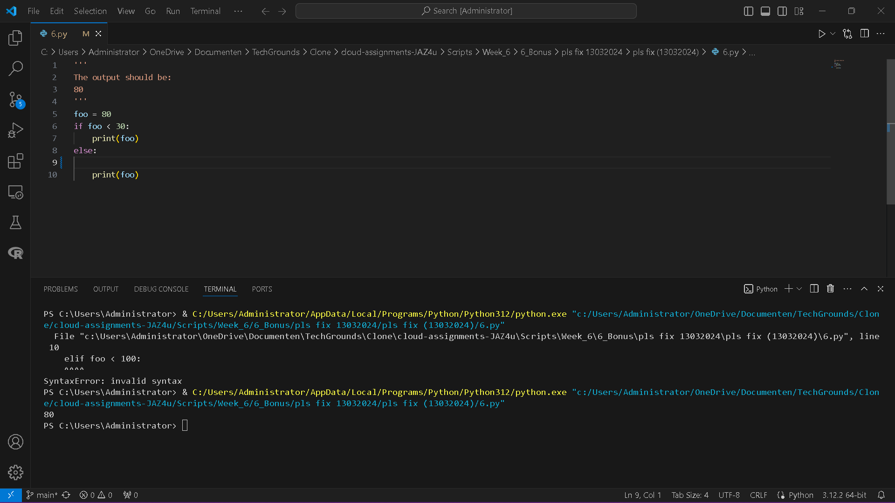

# [6/ Bonus]

You might have seen a folder in the drive named ‘Pls fix’. This folder contains 16 very small Python scripts that are somehow broken. Your job is to fix the mistake by changing only 1 or 2 small things within the script. The expected result for each script is written in the multi-line comment at the top of the script.

This exercise is meant as a little fun puzzle, but also to help you learn to troubleshoot existing code, so even though they are optional, they are recommended to do.

Of course, you can get to the expected results by simply deleting all the code and using a print function, but that would defeat the purpose of this exercise.

The exercises are approximately ordered based on difficulty level, but you might want to skip one if you get stuck and go back to that one later

## Key-terms

- **foo** and **bar**: `foo` and `bar` are commonly used as placeholder variable names in programming examples, tutorials, and documentation. They do not have any special meaning in Python but are used to represent generic variables or functions.

- **ls** and **ln**: These are typically commands used in Unix-like operating systems (such as Linux) rather than Python. `ls` is used to list directory contents, while `ln` is used to create links between files.

- 

- **random.randint**: `random.randint` is a function provided by the `random` module in Python. It's used to generate random integers within a specified range.
  
  Example:
  
  `import random x = random.randint(1, 100)`
  
  

- **+=** and **-=**: `+=` and `-=` are augmented assignment operators in Python. They are used to add or subtract a value from a variable and then assign the result back to the variable.
  
  Example:
  
  `x = 5 x += 2  # Equivalent to x = x + 2 x -= 3  # Equivalent to x = x - 3`

- **==**, **<**, and **>**: These are comparison operators in Python used for equality, less than, and greater than comparisons, respectively.
  
  - `==` checks if two values are equal.
  - `<` checks if the left operand is less than the right operand.
  - `>` checks if the left operand is greater than the right operand.
  
  Example:
  
  `x = 5 y = 10 result1 = (x == y)  # False result2 = (x < y)   # True result3 = (x > y)   # False`

## Assignment

Exercise:

- Fix the 16 broken Python scripts

- 1
  
  ```
  '''
  The output should be:
  hello Casper
  hello Floris
  hello Esther
  '''
  foo = 'hello'
  ls = ['Casper', 'Floris', 'Esther']
  for name in ls:
      print(loo,name)
  ```

- 2
  
  ```
  '''
  The output should be:
  100
  '''
  foo = 20
  bar = '80'
  print(foo + bar)
  ```

- 3
  
  ```
  '''
  The output should be:
  30
  '''
  foo = 20
  for i in range(10):
      foo -= 1
  
  print(foo)
  ```

- 4
  
  ```
  '''
  The output should be:
  there are 0 kids on the street
  there are 1 kids on the street
  there are 2 kids on the street
  there are 3 kids on the street
  there are 4 kids on the street
  '''
  foo = 0
  while foo <= 5:
      print('there are', foo, 'kids on the street')
      foo += 1
  ```

- 5
  
  ```
  '''
  The output should be:
  Star Wars
  '''
  ls = ['Lord of the rings', 'Star Trek', 'Iron Man', 'Star Wars']
  print(ls[4])
  ```

- 6
  
  ```
  '''
  The output should be:
  80
  '''
  foo = 80
  if foo < 30:
      print(foo)
  else:
      print('big number wow')
  elif foo < 100:
      print(foo)
  ```

- 7
  
  ```
  '''
  The output should be:
  ['Dog', 'Cat', 'Fly']
  '''
  ln = ['Dog', 'Cat', 'Elephant', 'Fly', 'Horse']
  short_names = []
  
  for animal in ln:
      if len(animal) == 3:
          short_names.append(animal)
      short_names = []
  
  print(short_names)
  ```

- 8
  
  ```
  '''
  The output should be:
  20
  '''
  foo = 10
  bar = 2
  print(foo**bar)
  ```

- 9
  
  ```
  '''
  The output should be:
  0
  1
  2
  3
  4
  8
  9
  '''
  for i in range(10):
      if i < 5:
          print(i)
      elif i < 8:
          break
      else:
          print(i)
  ```

- 10
  
  ```
  '''
  The output should be:
  the number is 20
  '''
  print('the number is' + 20)
  ```

- 11
  
  ```
  '''
  The output should be:
  IT LIVES!
  '''
  dev monster():
      print('IT LIVES!')
  
  monster()
  ```

- 12
  
  ```
  '''
  The output should be:
  4
  16129
  '''
  def square(x):
      return x**2
  
  nr = square(2)
  print(nr)
  
  big = square(foo)
  print(big)
  
  foo = 127
  ```

- 13
  
  ```
  '''
  The output should be:
  Your random number is: <insert random number here>
  '''
  import random
  
  random.randint(1,100)
  print("Your random number is:")
  ```

- 14
  
  ```
  '''
  The output should be:
  True
  '''
  def rtn(x):
      return(x)
  
  foo = rtn(3)
  
  if foo > rtn(4):
      print(True)
  else:
      print(False)
  ```

- 15
  
  ```
  '''
  The output should be:
  a5|||5|||5|||a5|||5|||5|||a5|||5|||5|||
  '''
  foo = ''
  for i in range(3):
      foo += 'a'
      for j in range(3):
          foo += '5'
      for k in range(3):
          foo += '|'
  
  print(foo)
  ```

- 16
  
  ```
  '''
  The output should be:
  A playable game 
  '''
  import random
  
  # generate random int
  goal = random.randint(1,100)
  
  win = False
  tries = 1
  
  while win == False and tries < 7:
      try:
          # ask for input
          inpt = int(input("Please input a number between 1 and 100: "))
          # count attempt as a try
          tries += 1
  
          # check for match
          if inpt == goal:
              win = True
              print("Congrats, you guessed the number!")
              print("It took you", tries, "tries")
          # give hints
          elif inpt < goal:
              print("The number should be higher")
          else:
              print("The number should be lower")
  
      except:
          print("Please type an integer")
  
  # 
  if win == False:
      print("Game over! You took more than seven tries")
  ```

- ### Used sources

- The Techgrounds ‘Pls fix’ folder ,which contains 16 very small Python scripts that are somehow broken.

- 

### Encountered problems

[Geef een korte beschrijving van de problemen waar je tegenaan bent gelopen met je gevonden oplossing.]

### Result

Exercise:

- Fix the 16 broken Python scripts

- 1
  
  

- 2
  
  

- 3
  
  

- 4
  
  

- 5
  
  

- 6
  
  

- 7
  
  

- 8
  
  

- 9

- 10

- 11

- 12

- 13

- 14

- 15

- 16

- 