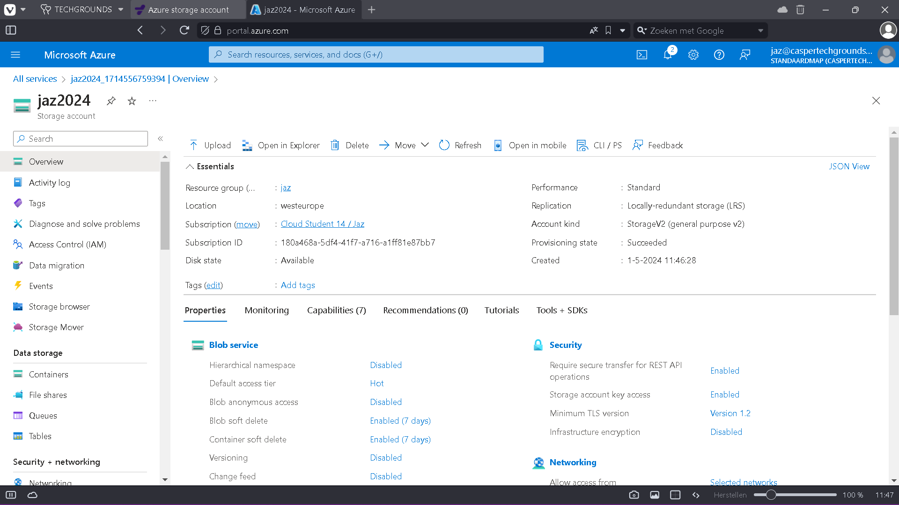

# [5/ Azure Storage Account]

To store data in Azure, you need an Azure Storage Account. Within a Storage Account, all Azure Storage data objects such as blobs, files, disks, and tables are stored.

Data in a Storage Account is secure, highly available, durable, and massively scalable. All data in a Storage Account is accessible via the internet using HTTP and HTTPS. Because it's easily accessible, it's important to ensure that only the appropriate identities have permissions to access the data. Azure Storage Explorer is a free GUI for managing your data in Azure. Many Azure IaaS and PaaS services also utilize Azure Storage Accounts. In addition to storing data, Blob Storage can also be used for hosting static websites.

Note: AWS has shared a static demo website with Techgrounds. Since it's nothing more than HTML, CSS, and JavaScript, it also works when hosted in Azure Blob Storage.

## Key-terms

1. **Azure Portal ([https://portal.azure.com/](https://portal.azure.com/))** : The Azure Portal is a web-based interface provided by Microsoft Azure for managing Azure resources and services. It offers a unified dashboard where users can create, manage, and monitor their Azure resources, access billing information, configure security settings, and more.

2. **AWS Demo Website**: This likely refers to a demonstration website hosted on Amazon Web Services (AWS), which is a competitor to Microsoft Azure. It's a website built to showcase various AWS services and features.

3. **Azure Storage Account**: An Azure Storage Account is a globally unique namespace in Azure that provides a secure and scalable cloud storage solution. It serves as a container for various types of data storage services offered by Azure, such as Blob Storage, File Storage, Queue Storage, and Table Storage.

4. **Azure Storage Data Objects**: Azure Storage Data Objects refer to the different types of data that can be stored within an Azure Storage Account. This includes blobs (unstructured binary data), files (file shares for use with the SMB protocol), queues (message queues for communication between application components), and tables (NoSQL data storage).

5. **Azure Storage Explorer**: Azure Storage Explorer is a standalone application provided by Microsoft for managing Azure Storage accounts. It allows users to easily browse and interact with their Azure Storage resources, including blobs, files, queues, and tables, through a graphical user interface (GUI).

6. **Azure IaaS and PaaS Services**: Azure offers both Infrastructure-as-a-Service (IaaS) and Platform-as-a-Service (PaaS) offerings. IaaS services provide virtualized computing resources such as virtual machines, storage, and networking, allowing users to manage and deploy virtualized infrastructure. PaaS services provide higher-level application development and deployment platforms, abstracting away much of the underlying infrastructure management.

7. **Blob Storage**: Blob (Binary Large Object) Storage is a type of Azure Storage service designed to store large amounts of unstructured data, such as text or binary data. It's commonly used for storing images, documents, backups, and other types of files. Blobs are organized into containers within a storage account and can be accessed via REST APIs, client libraries, or tools like Azure Storage Explorer.

8. **HTML, CSS, and JavaScript**: HTML (Hypertext Markup Language), CSS (Cascading Style Sheets), and JavaScript are core technologies used for building and designing web pages and web applications. HTML provides the structure of the page, CSS controls its appearance and layout, and JavaScript adds interactivity and dynamic behavior to the page. These technologies are commonly used in conjunction with Azure services to build and host web applications in the cloud.

## Assignment

Exercise 1:
Create an Azure Storage Account. Ensure that only you have access to the data. Place data in a storage service of your choice via the console (for example, a cat photo in Blob storage). Retrieve the data to your own computer using the Azure Storage Explorer.

Exercise 2:
Create a new container. Upload the 4 files that together form the AWS Demo Website. (note: this is an Azure task, but we are using the demo website from AWS. It is a simple combination of HTML, CSS, and JavaScript and does not have any cloud-specific features). Ensure that Static Website Hosting is enabled. Share the URL with a teammate. Ensure that your teammate can view the website.

### Used sources

- CHAT-GPT

- learn.techgrounds.nl

- [Introduction to Blob (object) Storage - Azure Storage | Microsoft Learn](https://learn.microsoft.com/en-us/azure/storage/blobs/storage-blobs-introduction)

- [https://portal.azure.com/](https://portal.azure.com/)

- [Introduction to Azure Blob Storage - YouTube](https://www.youtube.com/watch?v=fQwxPqYIUfI&ab_channel=MicrosoftAzure)

- What is blob storage? https://www.cloudflare.com/learning/cloud/what-is-blob-storage/#:~:text=Blob%20storage%20is%20a%20type,conform%20to%20any%20file%20format.

### Encountered problems

- no problems

### Result

**Exercise 1:**
Create an Azure Storage Account. Ensure that only you have access to the data. Place data in a storage service of your choice via the console (for example, a cat photo in Blob storage). Retrieve the data to your own computer using the Azure Storage Explorer.

    

1. **Create an Azure Storage Account:**
   
   - Log in to the Azure Portal ( [https://portal.azure.com/](https://portal.azure.com/) ).
   - Navigate to the Storage Accounts service.
   - Click on "Create" to create a new storage account.
   - Choose a subscription, resource group, storage account name, location, and performance tier.
   - Set the "Secure transfer required" option to enabled for enhanced security.
   - Set the "Allow access from" option to "Selected networks" and add your IP address for access restriction.
   - Review and create the storage account.

2. **Place data in Blob storage:**
   
   - Navigate to the created storage account.
   - Go to the Blob service.
   - Create a new container if one doesn't exist already.
   - Upload a cat photo or any desired data to the container.

3. **Retrieve data using Azure Storage Explorer:**
   
   - Download and install Azure Storage Explorer on your computer.
   - Open Azure Storage Explorer and sign in with your Azure account.
   - Connect to your Azure subscription and navigate to the storage account.
   - Locate the Blob container where you uploaded the data.
   - Download the desired data (cat photo) to your computer.

**Exercise 2:**
Create a new container. Upload the 4 files that together form the AWS Demo Website. (note: this is an Azure task, but we are using the demo website from AWS. It is a simple combination of HTML, CSS, and JavaScript and does not have any cloud-specific features). Ensure that Static Website Hosting is enabled. Share the URL with a teammate. Ensure that your teammate can view the website.

1. **Create a new container:**
   
   - Navigate to the Azure Storage Account created earlier.
   - Go to the Blob service.
   - Create a new container named "demo-website" or similar.

2. **Upload the 4 files for the AWS Demo Website:**
   
   - Upload the HTML, CSS, JavaScript, and any other necessary files to the "demo-website" container.

3. **Enable Static Website Hosting:**
   
   - Go to the "Static website" setting in the storage account.
   - Enable static website hosting and specify the default document name (e.g., index.html).
   - Note down the primary endpoint URL provided after enabling static website hosting.

4. **Share the URL with a teammate:**
   
   - Share the primary endpoint URL (e.g., https://yourstorageaccountname.z6.web.core.windows.net) with your teammate.

5. **Ensure teammate can view the website:**
   
   - Ask your teammate to open the shared URL in a web browser to verify that they can view the AWS Demo Website hosted on Azure Blob storage.