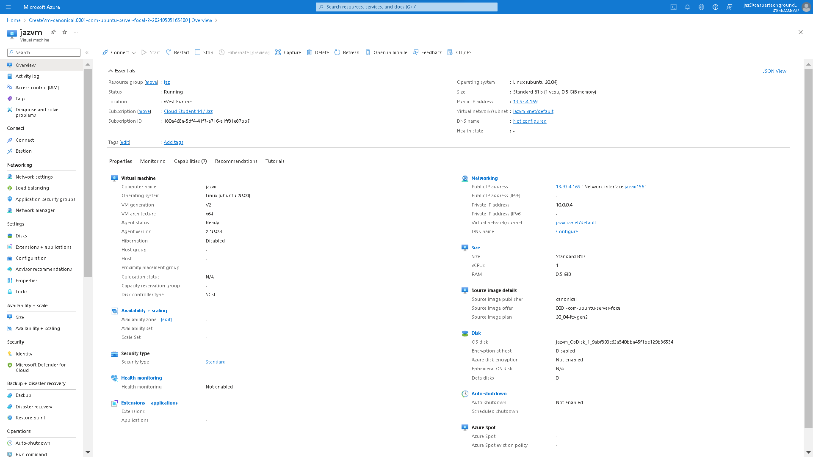
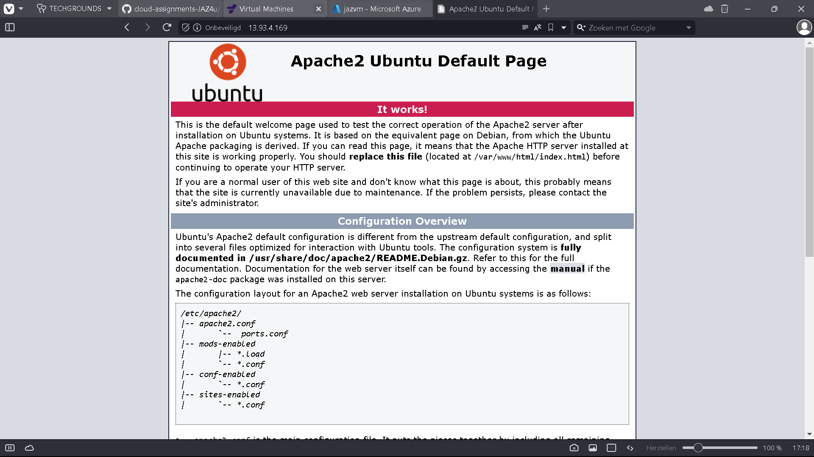
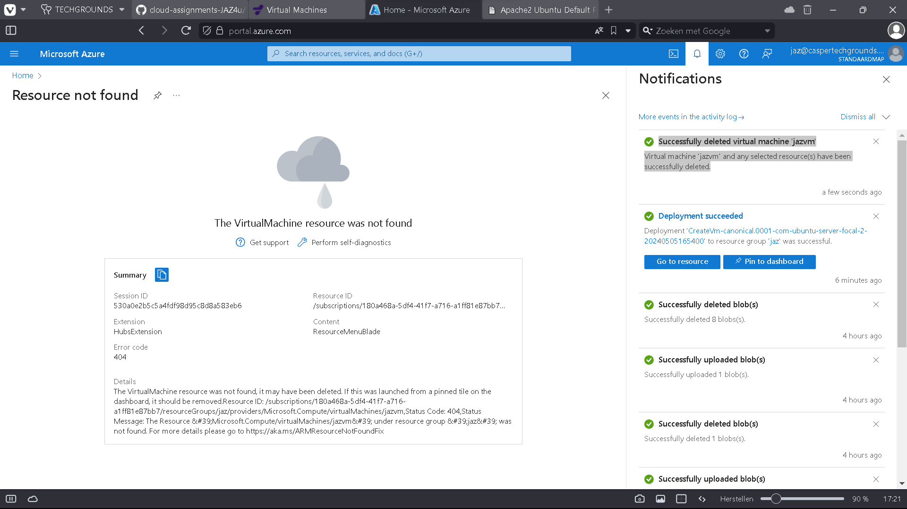

# [6/ Virtual Machines]

The service for creating VMs in Azure is aptly named Azure Virtual Machines. You can use these VMs for anything you would use a physical server for. Since they reside in a Microsoft data center, you can only connect to them via the internet. Connection to a remote Linux machine is made using the Secure Shell (SSH) protocol. For connecting to Windows machines, you use the Remote Desktop Protocol (RDP).

To create a VM, you must select an image. An image is a kind of blueprint for your machine. It includes, among other things, a template for the OS.

VMs come in various sizes. Each size has a different amount of vCPUs, RAM, data disks, Max IOPS, temp storage, premium disk support, and price.

For the OS disk (the root volume), you can choose from Premium SSD, Standard SSD, and Standard HDD. You also have the option to add additional data disks.

You can optionally secure your VM with a NIC network security group. It is recommended to configure network security groups at the subnet level (and thus not at the instance level) where possible, but sometimes you need an allow/deny rule on a specific instance, so the option is there. In any case, you can manage firewalls outside the instance, and you don't need to configure an additional firewall within the VM.

With Custom Data, you can pass a cloud-init script, config file, or other data during VM startup. This allows you to automatically configure servers without logging in yourself. User data is a newer version of Custom data. The main difference is that User Data remains available throughout the VM's entire lifespan.

The price of an Azure VM depends on the size, image, region it's located in, the number of minutes it's running, and the type of payment you choose.

- Pay-as-you-go is the most expensive option but also the most flexible.
- Reserved Instances are cheaper, but you're committed to a reservation for 1 or 3 years.
- Spot instances are generally the cheapest, but availability depends on the demand for VMs at that time, so they're not always reliable.

## Key-terms

- **Azure Virtual Machines:**
  
  ****Azure Virtual Machines (VMs) are scalable computing resources provided by Microsoft Azure, offering on-demand infrastructure for running a wide range of applications. Here are some key aspects of Azure Virtual Machines:
  
  1. **Scalability**: Azure VMs allow you to scale up or down based on your computing needs. You can choose from various VM sizes with different configurations of CPU, memory, storage, and network bandwidth to meet the requirements of your workloads.
  
  2. **Flexibility**: Azure VMs support multiple operating systems, including various versions of Windows Server, Linux distributions, and specialized OS images available from the Azure Marketplace. This flexibility enables you to deploy VMs tailored to your specific application requirements.
  
  3. **Infrastructure as a Service (IaaS)**: Azure VMs provide Infrastructure as a Service capabilities, allowing you to have full control over the virtualized computing resources. You're responsible for managing the operating system, applications, and data within the VM.
  
  4. **Integration with Azure Services**: Azure VMs seamlessly integrate with other Azure services, such as Azure Virtual Network for networking, Azure Storage for storing VM disks and data, Azure Backup for data protection, Azure Monitor for monitoring performance, and Azure Security Center for security management.
  
  5. **High Availability and Redundancy**: Azure offers features for ensuring high availability and redundancy of VMs, such as availability sets, which distribute VM instances across multiple fault domains and update domains to minimize downtime during planned and unplanned maintenance events.
  
  6. **Auto-scaling**: Azure VM Scale Sets enable you to automatically scale the number of VM instances based on demand. This feature is particularly useful for applications with variable workloads, allowing you to maintain performance while optimizing costs.
  
  7. **Security**: Azure provides built-in security features for VMs, including network security groups (NSGs) for controlling inbound and outbound traffic, Azure Security Center for threat detection and security management, and encryption options for data at rest and in transit.
  
  8. **Hybrid Connectivity**: Azure VMs can be seamlessly integrated with on-premises infrastructure using Azure Hybrid services, such as Azure Site Recovery for disaster recovery, Azure ExpressRoute for private network connectivity, and Azure VPN Gateway for secure site-to-site VPN connections.
  
  9. **Pay-As-You-Go Pricing**: Azure VMs follow a pay-as-you-go pricing model, where you only pay for the compute resources you consume on an hourly basis. This flexibility allows you to optimize costs by adjusting VM sizes, configurations, and deployment options based on your budget and requirements.
  
  Overall, Azure Virtual Machines offer a flexible and scalable platform for deploying and managing a wide range of applications, from development and testing environments to production workloads running critical business applications.

- **Remote Desktop Protocol (RDP):**
  Remote Desktop Protocol (RDP) is a proprietary protocol developed by Microsoft that enables users to remotely access and control a computer over a network connection. It allows users to connect to a remote desktop or server and interact with its graphical user interface (GUI) as if they were
  
  Overall, RDP is a powerful protocol for remote access and administration, widely used in enterprise environments, IT support scenarios, and for personal remote desktop access. However, it's important to ensure that RDP connections are properly secured to mitigate security risks, such as unauthorized access and potential exploits.

- **Premium SSD, Standard SSD, and Standard HDD:**
  
  Azure offers three types of storage options for Azure Virtual Machines (VMs): Premium SSD, Standard SSD, and Standard HDD. These options differ in terms of performance, durability, and price, allowing users to choose the storage option that best fits their workload requirements and budget.
  When choosing between Premium SSD, Standard SSD, and Standard HDD storage options for Azure VMs, it's essential to consider factors such as performance requirements, durability, budget constraints, and workload characteristics. By selecting the appropriate storage option, you can optimize performance, reliability, and cost-effectiveness for your Azure VM deployments.

- **VM with a NIC network security groups at the subnet level ,and/or at the instance level:**
  Azure allows you to enforce network security policies at both the subnet level and the NIC level. NSGs at the subnet level provide broad control over traffic within a subnet, while NSGs at the NIC level offer finer granularity for applying security policies to individual VM instances. Depending on your requirements, you can choose to implement NSGs at one or both levels to achieve the desired level of network security for your Azure VM deployments.Azure allows you to enforce network security policies at both the subnet level and the NIC level. NSGs at the subnet level provide broad control over traffic within a subnet, while NSGs at the NIC level offer finer granularity for applying security policies to individual VM instances. Depending on your requirements, you can choose to implement NSGs at one or both levels to achieve the desired level of network security for your Azure VM deployments.

- **Custom Data, pass a cloud-init script, config file, or other data during VM startup:**
  In Azure, you can pass custom data to a virtual machine (VM) during startup using the Azure Custom Script Extension or the Azure Instance Metadata Service (IMDS). This allows you to execute scripts, pass configuration files, or provide other data to the VM during initialization. Here's how you can achieve this:
  
  1. **Azure Custom Script Extension**:
     
     - The Custom Script Extension allows you to run custom scripts on a VM after it has been deployed but before it's put into production.
     - You can provide a script file (such as a cloud-init script) as part of the extension configuration, and Azure will execute it on the VM during provisioning.
     - This script can perform various initialization tasks, such as installing software, configuring settings, or pulling down additional files from external sources.
     - The Custom Script Extension can be added to an Azure VM either during deployment or after it's already running.
  
  2. **Azure Instance Metadata Service (IMDS)**:
     
     - Azure IMDS is a RESTful service provided to Azure VMs that allows them to access metadata about the instance they are running on.
     - You can use IMDS to retrieve custom data that was passed to the VM during startup.
     - The custom data can be in the form of a cloud-init script, configuration file, or any other data you want to pass to the VM.
     - The data is typically provided as part of the VM provisioning process, either through the Azure portal, Azure CLI, Azure Resource Manager templates, or other deployment methods.
  
  Here's a high-level overview of how you can use these approaches to pass custom data to an Azure VM during startup:
  
  1. **Prepare your custom data**: Create the cloud-init script, configuration file, or other data that you want to pass to the VM during startup.
  
  2. **Deploy the VM**: Use Azure Resource Manager templates, Azure CLI, Azure portal, or other deployment methods to create and provision the VM.
  
  3. **Use Custom Script Extension (optional)**: If you're using the Custom Script Extension, add it to the VM configuration during deployment or after the VM is running. Provide the path to your custom script file as part of the extension configuration.
  
  4. **Pass custom data (optional)**: If you're using Azure IMDS to pass custom data, include the data as part of the VM provisioning process. This can be done by specifying the custom data parameter when creating the VM or through other deployment methods.
  
  5. **Retrieve custom data (if using IMDS)**: Inside the VM, use the Azure Instance Metadata Service (IMDS) to retrieve the custom data passed during startup. You can then process this data as needed for initialization or configuration tasks.
  
  By leveraging these approaches, you can pass custom data to Azure VMs during startup, allowing you to automate initialization tasks and configure VMs according to your specific requirements.

- **Max IOPS:**
  Max IOPS, or Maximum Input/Output Operations Per Second, is a measure of the maximum rate at which a storage device or system can perform read or write operations. It's a critical metric for assessing the performance and scalability of storage solutions, especially in scenarios where high I/O throughput is required, such as databases, virtual machines, or high-traffic websites.
  To determine the maximum IOPS for your specific Azure storage configuration, you should consult the official Azure documentation for the storage service you're using and review the performance and scalability targets provided by Microsoft. Additionally, performance testing and benchmarking your workload on Azure can help you understand the achievable IOPS in your specific deployment scenario.

- **User Data, pass a cloud-init script, config file, or other data during VM startup:**
  In Azure, you can pass custom data to a virtual machine (VM) during startup using the User Data feature. User Data allows you to provide a script or other data that will be executed or processed by the VM during initialization. This feature is commonly used to pass cloud-init scripts, configuration files, or other initialization tasks to the VM.
  
  Here's how you can use User Data to pass custom data to an Azure VM during startup:
  
  1. **Prepare your custom data**: Create the cloud-init script, configuration file, or other data that you want to pass to the VM during startup. This data can include any initialization tasks you want the VM to perform, such as installing software, configuring settings, or pulling down additional files from external sources.
  
  2. **Encode the custom data**: User Data in Azure VMs must be provided as base64-encoded text. You'll need to encode your custom data in base64 format before passing it to the VM.
  
  3. **Pass User Data during VM creation**: When creating the VM, include the base64-encoded User Data as part of the VM configuration. You can specify User Data using the `--custom-data` parameter when using Azure CLI or Azure Resource Manager templates, or through the appropriate field in the Azure portal when deploying the VM.
  
  4. **Process User Data inside the VM**: During VM initialization, Azure will automatically decode and execute the User Data provided during startup. If you provided a cloud-init script, it will be executed, allowing you to perform any necessary initialization tasks. If you provided other data, you can process it as needed within the VM.
     
     Here's a basic example of how you can use Azure CLI to create a VM with User Data:
     
     ```
     # Base64 encode your custom data (e.g., cloud-init script)
     custom_data=$(cat cloud-init-script.txt | base64)
     
     # Create the VM with User Data
     az vm create \
         --resource-group <resource-group-name> \
         --name <vm-name> \
         --image <image-name> \
         --admin-username <username> \
         --admin-password <password> \
         --custom-data "$custom_data"
     ```
     
     In this example, cloud-init-script.txt contains the cloud-init script you want to pass to the VM. The script is base64-encoded and passed to the VM using the --custom-data parameter.
     
     By leveraging User Data, you can automate initialization tasks and configure Azure VMs according to your specific requirements during startup.

## Assignment

Exercise:

- Log in to your Azure Console.

- Create a VM with the following requirements:
  
  - Ubuntu Server 20.04 LTS - Gen1
  
  - Size: Standard_B1ls
  
  - Allowed inbound ports:
    
    - HTTP (80)
    
    - SSH (22)
  
  - OS Disk type: Standard SSD
  
  - Networking: defaults
  
  - Boot diagnostics are not needed
  
  - Custom data:

> > `#!/bin/bash`
> 
> > `sudo su`
> 
> > `apt update`
> 
> > `apt install apache2 -y`
> 
> > `ufw allow 'Apache'`
> 
> > `systemctl enable apache2`
> 
> > `systemctl restart apache2`

- Check if your server is working.
- Note! Don't forget to delete everything after completing the task. You can delete each component individually, or you can delete the entire resource group at once.

### Used sources

- learn.techgrounds.nl

- CHAT-GPT

### Encountered problems

- no problems

### Result

Exercise:

- Log in to your Azure Console.

- Create a VM with the following requirements:
  
  - Ubuntu Server 20.04 LTS - Gen1
  
  - Size: Standard_B1ls
  
  - Allowed inbound ports:
    
    - HTTP (80)
    
    - SSH (22)
  
  - OS Disk type: Standard SSD
  
  - Networking: defaults
  
  - Boot diagnostics are not needed
  
  - Custom data:

> > `#!/bin/bash`
> 
> > `sudo su`
> 
> > `apt update`
> 
> > `apt install apache2 -y`
> 
> > `ufw allow 'Apache'`
> 
> > `systemctl enable apache2`
> 
> > `systemctl restart apache2`

- Check if your server is working.

- Note! Don't forget to delete everything after completing the task. You can delete each component individually, or you can delete the entire resource group at once.
  
  SOLUTION:
  
  To solve the exercise, follow these steps:
  
  1. **Log in to your Azure Console:**
     
     - Open a web browser and navigate to the Azure Portal ( https://portal.azure.com ).
     - Sign in with your Azure account credentials.
  
  2. **Create a Virtual Machine with the specified requirements:**
     
     - In the Azure Portal, click on the "Create a resource" button (+) in the upper-left corner.
     - Search for "Virtual machine" in the search bar and select "Virtual machine" from the search results.
     - Fill in the required details:
       - Subscription: Choose your subscription.
       - Resource group: Create a new resource group or select an existing one.
       - Virtual machine name: Enter a name for your VM.
       - Region: Choose the desired Azure region.
       - Image: Select "Ubuntu Server 20.04 LTS - Gen1" from the list of available images.
       - Size: Choose "Standard_B1ls" from the available sizes.
       - Authentication type: Select "SSH public key" and provide the necessary SSH public key for authentication.
     - In the Networking tab, ensure that ports 80 (HTTP) and 22 (SSH) are allowed.
     - Leave other settings at their defaults.
  
  3. **Custom data:**
     
     - In the "Management" tab, scroll down to the "Custom data" section.
     
     - Enter the provided custom data script:
       
       ```bash
       #!/bin/bash
       sudo su
       apt update
       apt install apache2 -y
       ufw allow 'Apache'
       systemctl enable apache2
       systemctl restart apache2
       ```
     
     - This script will install Apache web server on the VM.
  
  4. **Create the VM:**
     
     - Review the configurations to ensure they match the exercise requirements.
     
     - Click on the "Review + create" button.
     
     - After validation passes, click on the "Create" button to deploy the VM.
       
       
  
  5. **Check if your server is working:**
     
     - Once the VM deployment is complete, navigate to its public IP address using a web browser.
     
     - If Apache is installed and running correctly, you should see the default Apache welcome page.
       
       
  
  6. **Delete Resources:**
     
     - After completing the task, ensure to delete all resources to avoid unnecessary charges.
     
     - You can delete each component individually or delete the entire resource group at once.

