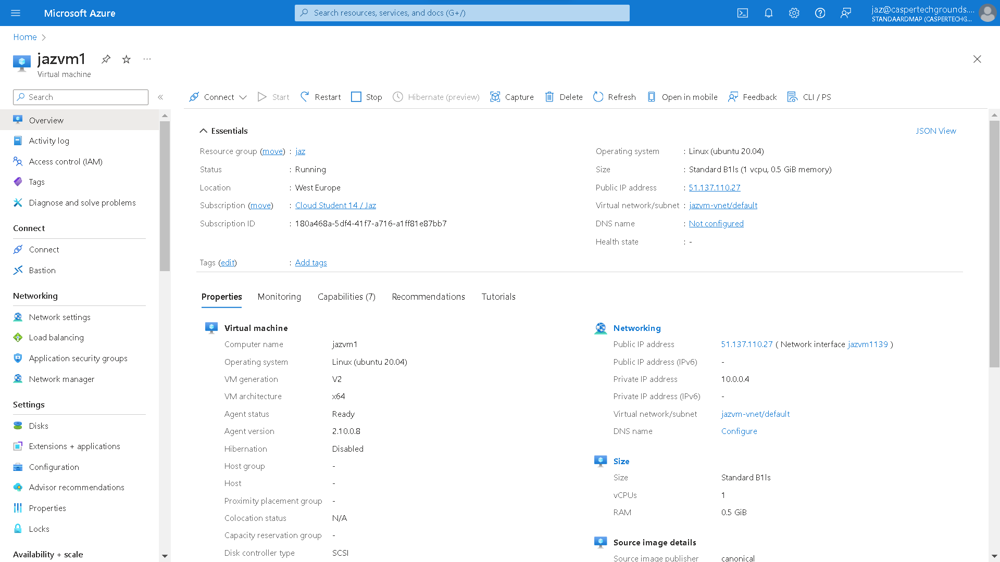
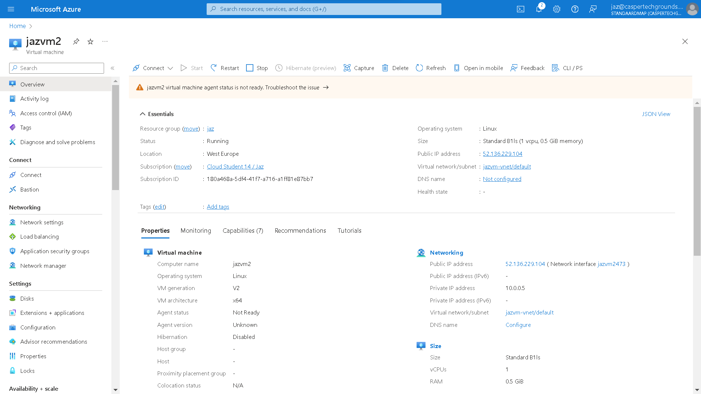

# [7/ Azure Disk Storage]

Azure Disk Storage can be seen as a virtual hard drive in the cloud. A disk can be an OS disk (where the OS is located) or a Data Disk (comparable to an external hard drive). You have a choice between Managed Disks and Unmanaged Disks. Unmanaged Disks are cheaper, but you need a Storage Account for them (and you have to manage the disk yourself). Managed Data Disks can be shared between multiple VMs, but that's a relatively new feature and there are some caveats to it. Backups of a Managed Disk can be made with Incremental Snapshots that only store the changes since the last snapshot. For an Unmanaged Disk, you can only take a 'regular' snapshot.

There are 5 managed disk types. Generally, more performance results in higher costs. See https://learn.microsoft.com/en-us/azure/virtual-machines/disks-types for an up-to-date overview of the available disk types.

A disk can be encrypted for security. Disks can be enlarged, but not reduced in size.

If you want to use an external device (including a Data Disk) on Linux, you must first mount it.

## Key-terms

- **Azure Disk Storage:**
  Azure Disk Storage refers to the storage service in Microsoft Azure specifically designed for hosting disk resources used by virtual machines (VMs), containers, and other Azure services. It provides highly available and durable storage solutions for various types of workloads, including both standard and high-performance disk options.
  
  Here are some key aspects of Azure Disk Storage:
  
  1. **Managed Disks**: Azure Disk Storage offers Managed Disks, which are fully integrated with Azure Virtual Machines. Managed Disks abstract the underlying storage infrastructure, simplifying disk management tasks such as provisioning, resizing, and backup. They also provide built-in redundancy and availability options.
  
  2. **Disk Types**: Azure Disk Storage provides different types of disks to support various performance and cost requirements:
     
     - **Standard Disks**: Suitable for most workloads with balanced performance and cost.
     - **Premium Disks**: Designed for I/O-intensive workloads requiring low latency and high throughput, such as databases and virtual desktops.
  
  3. **Disk Snapshots**: Azure Disk Storage allows users to create point-in-time snapshots of disks, capturing the disk's state at a specific moment. Snapshots can be used for data backup, disaster recovery, and creating new disks without affecting the original data.
  
  4. **Disk Encryption**: Azure Disk Storage supports encryption at rest to help protect data confidentiality. Data on disks is encrypted using platform-managed keys or customer-managed keys, providing an additional layer of security.
  
  5. **Performance Tiers**: Premium Disks offer different performance tiers, such as Premium SSDs and Ultra Disks, allowing users to choose the appropriate level of performance for their workloads.
  
  6. **Availability Options**: Azure Disk Storage provides redundancy options to ensure high availability and durability of data. Managed Disks can be configured with availability zones or availability sets to protect against datacenter failures and ensure business continuity.

- **Managed Disks**: Managed Disks are a type of virtual hard disk (VHD) that are stored as managed resources in Azure. With Managed Disks, Azure takes care of managing the storage accounts associated with the disks, including handling redundancy and availability. This simplifies disk management tasks for users, as they don't have to worry about managing the underlying storage infrastructure.

- **Unmanaged Disks**: Unmanaged Disks, on the other hand, are traditional VHDs that are stored in Azure Storage accounts as page blobs. With Unmanaged Disks, users are responsible for managing the storage accounts and ensuring redundancy and availability of the disks. This gives users more control over the storage configuration but requires additional management overhead.

- **Incremental Snapshots**: Incremental snapshots are a feature in Azure that allows users to take snapshots of Managed Disks. These snapshots capture the changes made to the disk since the last snapshot was taken, making them efficient in terms of storage space and time. Incremental snapshots are useful for creating point-in-time backups of disks and for disaster recovery purposes.

- **Snapshot**: A snapshot is a read-only copy of a disk at a specific point in time. Snapshots can be created for both Managed Disks and Unmanaged Disks in Azure. They are useful for creating backups, cloning disks, and creating new disks from existing data without impacting the original disk. Snapshots can also be used to create virtual machine images for rapid deployment.

### Assignment

Task:

- Start 2 Linux VMs. Ensure that you have SSH access to both.
- Create an Azure Managed Disk and attach it to both VMs simultaneously.
- On your first machine, create a file and place it on the Shared Disk.
- Check on the second machine if you can read the file. (Note: you may need to remount the disk on your 2nd VM)
- Take a snapshot of the disk and try creating a new Disk from it.
- Mount this new Disk and view the file.

### Used sources

- learn.techgrounds.nl

- CHAT-GPT

- [Een beheerde Azure-schijf delen tussen VM's - Azure Virtual Machines | Microsoft Learn](https://learn.microsoft.com/nl-nl/azure/virtual-machines/disks-shared)

- [Select a disk type for Azure IaaS VMs - managed disks - Azure Virtual Machines | Microsoft Learn](https://learn.microsoft.com/en-us/azure/virtual-machines/disks-types)

- 

### Encountered problems

- no problems

### Result

Task:

- Start 2 Linux VMs. Ensure that you have SSH access to both.

- Create an Azure Managed Disk and attach it to both VMs simultaneously.

- On your first machine, create a file and place it on the Shared Disk.

- Check on the second machine if you can read the file. (Note: you may need to remount the disk on your 2nd VM)

- Take a snapshot of the disk and try creating a new Disk from it.

- Mount this new Disk and view the file.
  
  SOLUTION:
  
  To solve the task, follow these steps:
1. **Start 2 Linux VMs and ensure SSH access:**
   
   - In the Azure Portal, create two Linux VMs.
   
   - Make sure to configure SSH access during VM creation or after provisioning.
   
   - Note down the public IP addresses or hostnames of both VMs.
     
     
     
     

2. **Create an Azure Managed Disk and attach it to both VMs:**
   
   - In the Azure Portal, navigate to the Disks service.
   - Create a new Managed Disk with the desired specifications.
   - Once the disk is created, attach it to both VMs. Ensure that both VMs are running when attaching the disk.

3. **Create a file on the Shared Disk from the first machine:**
   
   - SSH into the first VM.
   - Mount the Shared Disk to a directory on the first VM.
   - Create a file and place it on the Shared Disk.

4. **Check if you can read the file from the second machine:**
   
   - SSH into the second VM.
   - If necessary, mount the Shared Disk to a directory on the second VM.
   - Check if you can read the file placed on the Shared Disk from the second VM.

5. **Take a snapshot of the disk and create a new Disk:**
   
   - In the Azure Portal, navigate to the Disks service.
   - Select the Shared Disk and create a snapshot.
   - Once the snapshot is created, use it to create a new Managed Disk.

6. **Mount the new Disk and view the file:**
   
   - Attach the new Disk to one of the VMs.
   - SSH into the VM where the new Disk is attached.
   - Mount the new Disk to a directory on the VM.
   - View the file placed on the Shared Disk from the first VM to verify that it is accessible from the new Disk.
   
   By following these steps, you'll be able to complete the task and verify that the file placed on the Shared Disk can be accessed from both VMs, as well as from the new Disk created from the snapshot.