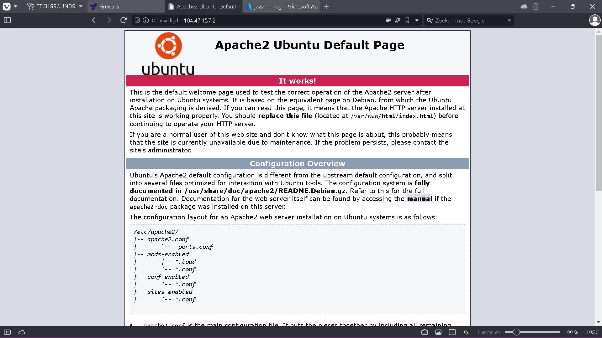
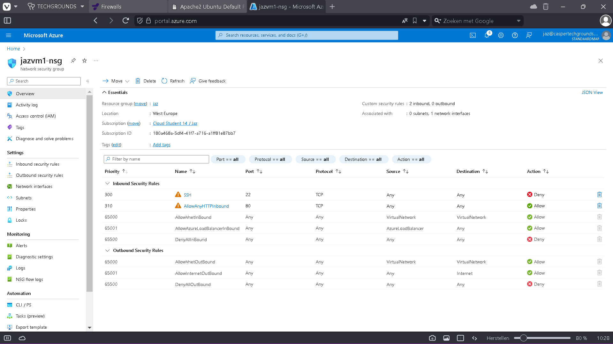

# [1/ Firewalls]

Since all resources in the cloud are always online, it's important to secure them against both intentional and unintentional harmful traffic. Azure Firewall can protect VNets against this traffic.

You can use the Firewall in different configurations within a subnet, or in a hub-and-spoke network. A Firewall always has a public IP address where all incoming traffic should be directed. And a private IP address where all outgoing traffic should be directed.

As you learned earlier, there are two types of firewalls: stateless and stateful. Azure Firewall is a stateful firewall.

Because Azure Firewall monitors all traffic in detail, it is a relatively expensive service. During the training, we won't use Azure Firewall, but the cheaper alternative: Network Security Group (NSG).

## Key-terms

1. **Azure Firewall**:
   Azure Firewall is a managed, cloud-based network security service provided by Microsoft Azure. It acts as a barrier between your Azure Virtual Network (VNet) and the internet, controlling inbound and outbound traffic based on predefined rules and policies. Key features of Azure Firewall include:
   
   - Application FQDN filtering: Allows or denies traffic based on fully qualified domain names (FQDN).
   - Network traffic filtering: Controls traffic based on source and destination IP addresses, ports, and protocols.
   - Threat intelligence-based filtering: Protects against known malicious IPs and domains using Microsoft threat intelligence.

2. **Network Security Group (NSG)**:
   NSG is a fundamental component of Azure networking that acts as a basic, distributed firewall for controlling traffic within VNets, between VNets, and to the internet. It operates at the network layer (Layer 3) of the OSI model and filters traffic based on source and destination IP addresses, ports, and protocols. Key points about NSGs include:
   
   - Rules: NSGs contain inbound and outbound security rules that allow or deny traffic based on specified criteria.
   - Association: NSGs can be associated with subnets, individual network interfaces, or both, allowing granular control over network traffic.
   - Default rules: NSGs have default rules that allow outbound traffic and deny all inbound traffic unless explicitly allowed.

3. **VNets (Virtual Networks)**:
   VNets are isolated virtual networks within Azure that allow you to securely connect and run your Azure resources. Key features of VNets include:
   
   - Isolation: VNets provide network isolation for Azure resources deployed within them, preventing unauthorized access from external networks.
   - Subnets: VNets can be divided into one or more subnets to organize and segment resources logically.
   - Connectivity: VNets can be connected to other VNets, on-premises networks, or the internet using Azure networking features like VPN Gateway, ExpressRoute, and Azure Firewall.

4. **Firewalls: Stateless and Stateful**:
   
   - **Stateless Firewall**: A stateless firewall filters packets based solely on the criteria such as source and destination IP addresses, ports, and protocols, without considering the state of the connection. Each packet is evaluated independently, without any context of previous packets. Stateless firewalls are generally simpler and faster but offer less security as they cannot track the state of connections.
   - **Stateful Firewall**: A stateful firewall, on the other hand, maintains the state of active connections and makes decisions based on the context of the entire conversation. It keeps track of the state of each connection, including session information such as source and destination IP addresses, ports, and sequence numbers. Stateful firewalls offer better security as they can make more informed decisions based on the complete context of traffic flows. They can also perform tasks like packet inspection, NAT (Network Address Translation), and application layer filtering. Azure Firewall is an example of a stateful firewall service provided by Azure.

## Assignment

Study:

- The difference between Basic and Premium Firewall.

- The difference between a Firewall and a Firewall Policy.

- That Azure Firewall is much more than just a firewall.

- The difference between Azure Firewall and NSG.
  
  Task:

- Turn on a web server. Ensure that the ports for both SSH and HTTP are open.

- Create an NSG in your VNET. Ensure that your web server is still accessible via HTTP, but that SSH is blocked.

- Test if your NSG works.

### Used sources

- chat_gpt

### Encountered problems

- no problems

### Result

Study:

- 1. **Difference between Basic and Premium Firewall**:
     
     - **Basic Firewall**: The Basic Firewall in Azure provides essential network security features for simple security requirements. It includes features like stateful packet inspection, NAT (Network Address Translation), and support for static and dynamic public IP addresses. However, it lacks advanced features such as threat intelligence-based filtering and TLS (Transport Layer Security) inspection.
     - **Premium Firewall**: The Premium Firewall offers advanced capabilities beyond what the Basic Firewall provides. It includes features like threat intelligence-based filtering, TLS inspection, application FQDN (Fully Qualified Domain Name) filtering, and integration with Azure Sentinel for advanced threat detection and response. Premium Firewall is suitable for organizations with more complex security needs and higher levels of traffic.
  
  2. **Difference between a Firewall and a Firewall Policy**:
     
     - **Firewall**: A firewall is a network security device or software that monitors and controls incoming and outgoing network traffic based on predetermined security rules. It acts as a barrier between a trusted internal network and untrusted external networks (like the internet), filtering traffic to prevent unauthorized access and malicious activities.
     - **Firewall Policy**: A firewall policy is a set of rules and configurations that dictate how a firewall should handle network traffic. It defines criteria such as which types of traffic are allowed or denied, what actions to take for specific types of traffic, and how to handle traffic based on its source, destination, port, protocol, etc. Firewall policies help organizations enforce security requirements and maintain network integrity.
  
  3. **Azure Firewall is much more than just a firewall**:
     
     - While Azure Firewall provides traditional firewall capabilities such as packet filtering and network address translation, it also offers additional features that extend its functionality beyond just basic firewalling.
     - Azure Firewall includes advanced threat protection features such as application-level filtering, URL filtering, threat intelligence-based filtering, and integration with Azure Security Center and Azure Sentinel for enhanced threat detection and response.
     - It also supports high availability configurations, centralized management through Azure Policy, and integration with other Azure services for comprehensive network security.
  
  4. **Difference between Azure Firewall and NSG (Network Security Group)**:
     
     - **Azure Firewall**: Azure Firewall is a fully managed, cloud-based network security service that operates at the application and network layer to protect Azure VNets (Virtual Networks) from threats. It provides centralized network security policy enforcement, threat intelligence, and advanced features like application-level filtering and TLS inspection.
     - **NSG (Network Security Group)**: NSG is a basic network security feature in Azure that acts as a distributed firewall for controlling traffic to and from Azure resources within a VNet. NSGs allow you to define inbound and outbound security rules based on source/destination IP address, port, and protocol. However, NSGs primarily operate at the network layer (Layer 3/4) and provide basic traffic filtering capabilities compared to the more advanced features offered by Azure Firewall.
  
  **Task**:

- Turn on a web server. Ensure that the ports for both SSH and HTTP are open.

- Create an NSG in your VNET. Ensure that your web server is still accessible via HTTP, but that SSH is blocked.

- Test if your NSG works. 
  
  **Step 1: Provision a Virtual Machine**
  
  1. Log in to the Azure portal (https://portal.azure.com).
  
  2. Navigate to the "Virtual Machines" section.
  
  3. Click on "Add" to create a new virtual machine.
  
  4. Follow the prompts to configure the virtual machine. Make sure to select a Linux distribution that supports a web server (e.g., Ubuntu Server).
  
  5. During the configuration, ensure that you allow SSH and HTTP traffic. Azure will automatically configure the network security group (NSG) rules accordingly.
  
  6. Complete the setup process and wait for the virtual machine to be provisioned.
  
  **Step 2: Verify Web Server Accessibility**
  
  1. Once the virtual machine is deployed, note down its public IP address.
  
  2. Open a web browser and enter the public IP address of the virtual machine. You should see the default web page if the web server is running correctly.
     
     
  
  **Step 3: Create a Network Security Group (NSG)**
  
  1. In the Azure portal, navigate to the "Network Security Groups" section.
  
  2. Click on "Add" to create a new NSG.
  
  3. Configure the NSG with the following rules:
     
     - Allow inbound traffic on port 80 (HTTP) from any source.
     - Deny inbound traffic on port 22 (SSH) from any source.
  
  4. Associate the NSG with the virtual network (VNET) that contains your virtual machine.
  
  
  
  **Step 4: Test NSG Rules**
  
  1. Try accessing the web server using its public IP address again. The web page should load successfully since HTTP traffic is allowed.
  
  2. Attempt to SSH into the virtual machine using a tool like PuTTY or the terminal on your local machine. You should receive an error indicating that the connection is refused or times out since SSH traffic is blocked.
  
  **Conclusion**
  
  By following these steps, you have successfully configured a web server on Azure, created a network security group to control traffic, and tested its functionality by ensuring that HTTP traffic is allowed while SSH traffic is blocked. This setup helps secure your virtual machine and ensures that only necessary services are accessible from the internet.